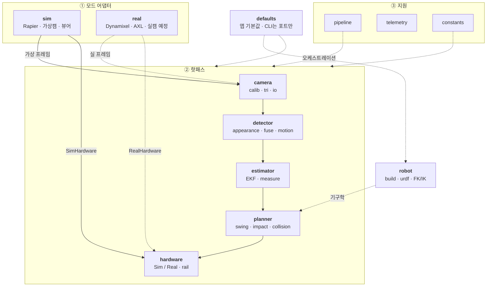
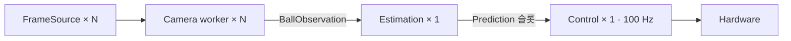
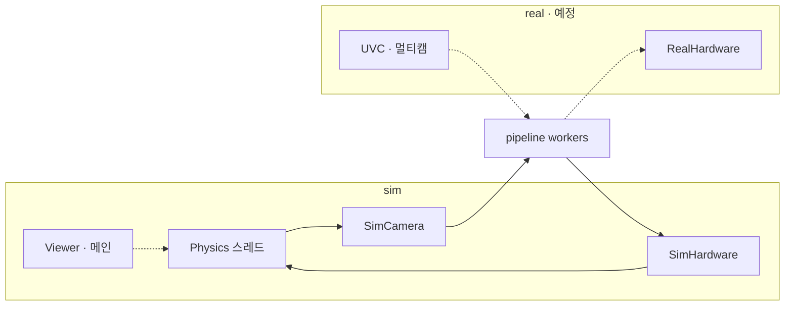
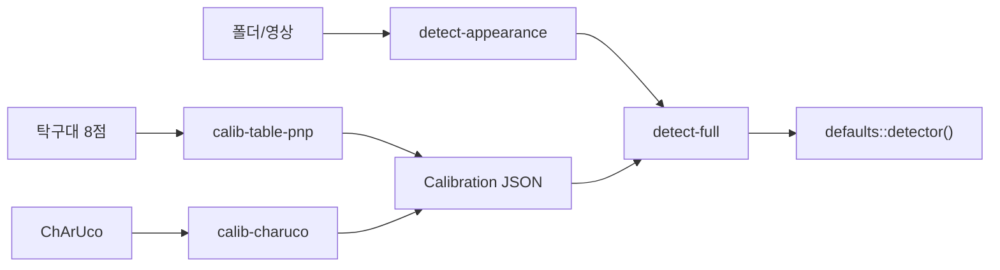

# pingpong-bot

사람과 오래 협력 랠리를 이어가는 핑퐁 로봇 런타임.  
Rust 경연용 단일 애플리케이션 크레이트다. 카메라·검출·추정·로봇·시뮬레이션·
계획을 `src/` 아래 기능별 모듈로 나눈다. OpenCV는 필수 의존성이며,
Rapier·실물 하드웨어 경계는 feature와 모듈로 격리한다.

상세 설계는 [`plan.md`](plan.md). 결정은 [`docs/decisions.md`](docs/decisions.md).

---

## 요구 사항

- [Rust](https://rustup.rs/) (edition 2024)
- 시스템 **OpenCV 4.x** + `libclang` (`opencv` crate **0.98.2+**)
- sim: macOS/Linux. real(카메라·모터): Windows — 2단계

**주의:** OpenCV **5.x** 금지. Homebrew는 `opencv@4`. crate 0.98.2 미만이면 LLVM 22에서 바인딩이 깨진다.

### OpenCV · libclang

환경 변수는 [`.envrc`](.envrc)에 두고 `direnv allow .` (권장). `~/.zshrc`에 넣지 않는다.

**macOS**

```bash
brew install llvm opencv@4 pkgconf direnv
# OpenCV 5가 있으면: brew uninstall opencv && brew install opencv@4
# ~/.zshrc: eval "$(direnv hook zsh)"  →  cd 프로젝트  →  direnv allow .
pkg-config --modversion opencv4   # 4.x
cargo check --workspace
```

수동 export는 `.envrc`와 동일 (`LIBCLANG_PATH`, `PKG_CONFIG_PATH`, `DYLD_FALLBACK_LIBRARY_PATH`).

**Windows**

```bash
# VS C++ Build Tools + LLVM + opencv4 (contrib 불필요, Charuco는 메인 objdetect)
choco install llvm
choco install opencv --version=4.13.0
cargo check --workspace
```

```toml
# mise.local.toml — OpenCV 링크용 환경 (앱 설정 아님)
[env]
OPENCV_LINK_LIBS = "opencv_world4130"
OPENCV_LINK_PATHS = "C:\\tools\\opencv\\build\\x64\\vc16\\lib"
OPENCV_INCLUDE_PATHS = "C:\\tools\\opencv\\build\\include"
_.path = [
   "C:\\tools\\opencv\\build\\x64\\vc16\\bin",
   "<path to AXL library>"
]
```

---

## 빠른 시작

```bash
cargo check --workspace
cargo test -p pingpong-bot --lib

# GUI sim (기본) — 기본값은 src/defaults
cargo run -p pingpong-bot

# 로그
RUST_LOG=debug cargo run -p pingpong-bot
```

실행하면 Rapier 디지털 트윈(탁구대·공·로봇) + kiss3d/egui 뷰어가 뜬다.  
슈터 GUI로 발사하고, 기본은 월드 ground-truth로 스윙을 커밋한다.

---

## 앱 기본값 — [`src/defaults/`](src/defaults/)

런타임 숫자·조립은 **여기만** 고친다 (SSOT). TOML 설정 파일은 없다.  
규격·치수(ITTF, CAD, G)는 [`src/constants/`](src/constants/).

| 모듈 | 팩토리 | 내용 |
|------|--------|------|
| `physics` | `physics()` | 반발·마찰·항력 |
| `control` | `control()` | 스윙·관절 추종 |
| `impact` | `impact()` | 랠리 리턴 휴리스틱 |
| `estimator` | `estimator()` | EKF·탄도 |
| `planner` | `intercept()` | 인터셉트 y 창 |
| `vision` | `detector()` / `scorer()` / `colormask()` / `roi()` | fuse 조립 |
| `hardware` | `dynamixel()` / `rail()` | 실기 버스·레일 |
| `robot` | `robot()` | **지금 쓰는** `Robot` (바꾸려면 이 함수 본문만) |

CLI 덮어쓰기는 포트 정도만:

```bash
cargo run -p pingpong-bot -- --mode sim
cargo run -p pingpong-bot --features real -- --mode real --dxl-port COM8
```

물리계수 측정 툴은 stdout에 `defaults::physics()` 붙여넣기용 스니펫을 낸다  
([measure_restitution](tools/measure_restitution/README.md) · [measure_friction](tools/measure_friction/README.md)).  
무엇을 재고 `e_eff`가 뭔지는 [docs/measure-physics.md](docs/measure-physics.md).

### Dynamixel · AXL (Windows)

값은 `defaults::dynamixel()` / `rail()`. 포트 기본은 `dynamixel().port`, 덮어쓰기는 `--dxl-port`.  
각도는 모터 절대각이 아니라 **URDF 관절각**. 상세·REPL은 [jog](tools/jog/README.md).

```bash
cargo run -p jog -- --dry-run
cargo run -p jog -- --port COM8
cargo run -p pingpong-bot --features real -- --mode real --dxl-port COM8
```

`real` 모드는 현재 Dynamixel·AXL **pose 스모크**까지다. 실캠 풀 파이프라인은 다음 단계.

---

## 아키텍처

도메인 핫패스는 모드 공통. `sim`/`real`은 **프레임·하드웨어만** 갈아 끼우고,
`pipeline`이 스레드·채널로 돌린다. GUI sim 엔트리(`main`)는 뷰어 + `SimSession`이고,
월드 안 ground-truth 스윙이 기본이다.

### 도메인



### 파이프라인 스레드

`pipeline` 공통 워커: 카메라당 1 + 추정 1 + 제어 1.





---

## 프로젝트 구조

```
src/
  defaults/     앱 기본값 SSOT (physics · vision · robot · hardware · …)
  constants/    ITTF · 기하 · 제어 상수
  camera/       calib/ · tri/ · io/
  detector/     appearance/ · fuse_layer/ · motion/
  estimator/    ekf · ballistics · measure/
  planner/      swing/ · impact · collision
  robot/        build/ · urdf/ · Arm · state
  sim/          physics/ · session/ · gui/
  hardware/     rail/ · SimHardware · RealHardware
  pipeline/     카메라→추정→제어 오케스트레이션
  telemetry/
  main.rs       CLI · sim 뷰어 / real 스모크

tools/          실험·캘리브·검증 바이너리 (각 README)
assets/         로봇 URDF · 폰트
plan.md · TODO.md · docs/
```

### 로봇

- 기구학은 `src/robot/`. 런타임이 쓰는 모델은 **`defaults::robot()`** (`Robot` = Arm + 선택 URDF).
- 프리셋 후보: `primitive_4dof()` · `urdf_4dof()` · `urdf_test()`. 활성만 `robot()` 본문에서 고른다.
- 지금 기본은 `urdf_4dof()` (`assets/robots/4-dof/...`).

| 팩토리 | 메시 | 용도 |
|--------|------|------|
| `primitive_4dof()` | 없음 | 경연용 단순 4-dof 체인 |
| `urdf_4dof()` | `all-4-export.urdf` | 기본 활성 |
| `urdf_test()` | urdf-test | 진단 |

### sim

```bash
cargo run -p pingpong-bot
```

- 좌표계: **Z-up**, 원점 = 탁구대 로봇쪽 꼭짓점. +X 너비 · +Y 길이 · 테이블면 `z ≈ 0.76 m`
- 로봇 `y ≈ 0`, 슈터 `+y`. 공은 주차 → GUI 발사 → 이탈 시 회수
- 기본 `use_ground_truth = true` (월드가 타격 계획). EKF control은 라이브러리·테스트 경로
- 뷰어: kiss3d 3D + egui 슈터 패널 (단일 창)

구현 디테일은 `src/sim/` · 회귀는 `cargo test -p pingpong-bot --lib sim::`.

---

## 실험 도구 (`tools/`)

사용법·플래그는 **각 툴 README**만 본다.

| crate | README |
|-------|--------|
| `cam-preview` | [cam_preview](tools/cam_preview/README.md) |
| `calib-charuco` | [calib_charuco](tools/calib_charuco/README.md) |
| `calib-table-pnp` | [calib_table_pnp](tools/calib_table_pnp/README.md) — 탁구대 8점 → solvePnP |
| `detect-appearance` | [detect_appearance](tools/detect_appearance/README.md) |
| `tune-colormask` | [tune_colormask](tools/tune_colormask/README.md) |
| `detect-full` | [detect_full](tools/detect_full/README.md) — fuse + ROI |
| `measure-restitution` | [measure_restitution](tools/measure_restitution/README.md) |
| `measure-friction` | [measure_friction](tools/measure_friction/README.md) |
| `jog` | [jog](tools/jog/README.md) — 관절·레일 REPL |

### 비전 오프라인 흐름

보정·검출은 툴에서 JSON/프리뷰로 검증하고, 런타임 조립은 `defaults::detector()`.



- 외참(권장): [calib_table_pnp](tools/calib_table_pnp/README.md)
- 인트린식(선택): [calib_charuco](tools/calib_charuco/README.md)
- 설계: [비전 스펙](docs/superpowers/specs/2026-07-18-vision-pipeline-design.md) · [decisions J](docs/decisions.md)

---

## 개발

```bash
cargo check -p pingpong-bot --lib
cargo test -p pingpong-bot --lib
cargo build -p pingpong-bot --release
```

---

## 현재 구현 상태

| 영역 | 상태 |
|------|------|
| workspace · Rapier 트윈 · kiss3d/egui | ✅ |
| `src/defaults` 앱 기본값 SSOT (TOML 없음) | ✅ |
| `Robot` / URDF · `defaults::robot()` | ✅ |
| Z-up · 동적 인터셉트 · quintic 스윙 | ✅ |
| 삼각측량 · ChArUco · 탁구대 8점 PnP | ✅ |
| fuse 검출 · measure_* → defaults 스니펫 | ✅ |
| EKF (sim 기본은 ground truth) | ✅ |
| Dynamixel 4축 · AXL 레일 · `jog` | ✅ (Windows 재검증) |
| real 풀 비전 파이프라인 | 🔲 pose 스모크만 |

**로드맵:** [`docs/phase2.md`](docs/phase2.md) · [`TODO.md`](TODO.md) · [`docs/decisions.md`](docs/decisions.md)

---

## 라이선스

(미정)
