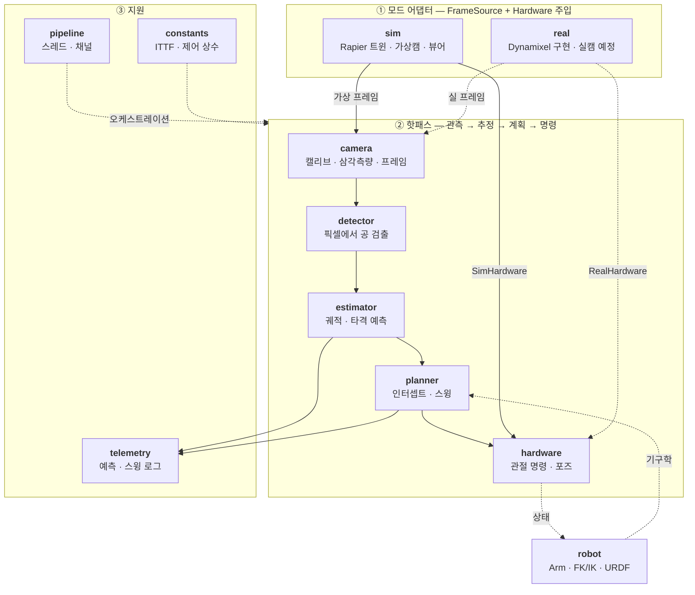
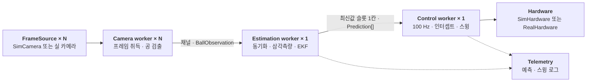
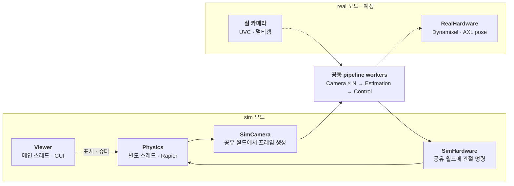
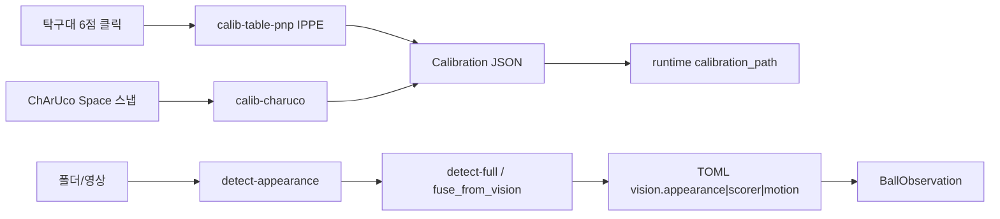

# pingpong-bot

사람과 오래 협력 랠리를 이어가는 핑퐁 로봇 런타임.  
Rust 경연용 단일 애플리케이션 크레이트다. 카메라·검출·추정·로봇·시뮬레이션·
계획을 `src/` 아래 기능별 모듈로 나눈다. OpenCV는 필수 의존성이며,
Rapier·실물 하드웨어 경계는 feature와 모듈로 격리한다.

상세 설계는 [`plan.md`](plan.md)를 본다.

---

## 요구 사항

- [Rust](https://rustup.rs/) (edition 2024)
- 시스템 **OpenCV 4.x** + `libclang` (`opencv` crate **0.98.2+**)
- sim: macOS/Linux. real(카메라·모터): Windows — 2단계

**주의:** OpenCV **5.x** 금지. Homebrew는 `opencv@4`. crate 0.98.2 미만이면 LLVM 22에서 바인딩이 깨진다.

### OpenCV · libclang

환경 변수는 [`.envrc`](.envrc)에 두고 `direnv allow .` (권장). `~/.zshrc`에 넣지 않는다.

**macOS**

```bash
brew install llvm opencv@4 pkgconf direnv
# OpenCV 5가 있으면: brew uninstall opencv && brew install opencv@4
# ~/.zshrc: eval "$(direnv hook zsh)"  →  cd 프로젝트  →  direnv allow .
pkg-config --modversion opencv4   # 4.x
cargo check --workspace
```

수동 export는 `.envrc`와 동일 (`LIBCLANG_PATH`, `PKG_CONFIG_PATH`, `DYLD_FALLBACK_LIBRARY_PATH`).

**Windows**

```powershell
# VS C++ Build Tools + LLVM + opencv4 (contrib 불필요, Charuco는 메인 objdetect)
choco install llvm
choco install opencv --version=4.13.0
cargo check --workspace
```

```toml
# mise.local.toml
[env]
OPENCV_LINK_LIBS = "opencv_world4130"
OPENCV_LINK_PATHS = "C:\\tools\\opencv\\build\\x64\\vc16\\lib"
OPENCV_INCLUDE_PATHS = "C:\\tools\\opencv\\build\\include"
_.path = [
   "C:\\tools\\opencv\\build\\x64\\vc16\\bin",
   "<path to AXL library>"
]
```

---

## 빠른 시작

```bash
# 전체 workspace 빌드·검증
cargo check --workspace
cargo test --workspace

# sim 파이프라인 실행 (`src/defaults` SSOT)
cargo run -p pingpong-bot

# 다른 실험 설정
cargo run -p pingpong-bot -- config/experiment.toml
```

실행하면 **Rapier3d 디지털 트윈**(탁구대·공·로봇 팔) 위에서 가상 카메라가 공을 촬영하고, 제어 루프가 라켓을 구동한다.  
로그는 `tracing`으로 stdout에 출력된다.

---

## 런타임 설정 (`pingpong-bot`)

배선·숫자·검출·미러·토크·포트는 [`src/defaults.rs`](src/defaults.rs)가 SSOT다.
덮어쓰기는 CLI만:

```bash
cargo run -p pingpong-bot
cargo run -p pingpong-bot -- --mode sim
cargo run -p pingpong-bot --features real -- --mode real --dxl-port COM8
```

`InterceptWindow`는 defaults에서 y 구간을 샘플해 타격점을 고른다.

### 예시

```bash
# GUI sim (기본)
cargo run -p pingpong-bot

# 로그 레벨 조정
RUST_LOG=debug cargo run -p pingpong-bot
RUST_LOG=pingpong_bot=debug,info cargo run -p pingpong-bot
```

### Dynamixel 4축 · AXL 레일 (Windows)

배선 숫자는 [`src/defaults.rs`](src/defaults.rs) `dynamixel()` / `rail()` (예전
`real-hardware.toml` 값). 포트 기본은 `dynamixel().port`(`COM8`), 덮어쓰기는
`--dxl-port` / `--port`. 각도는 모터 절대각이 아니라 **URDF 관절각**이다.

```powershell
# 관절·레일 인터랙티브 REPL (dry-run)
cargo run -p jog -- --dry-run

# 실기
cargo run -p jog -- --port COM8
cargo run -p jog -- --port COM8 --dll-path "C:/path/to/AXL.dll"

# 포트 연결 + 현재 4축·레일 pose 읽기 스모크
cargo run -p pingpong-bot --features real -- --mode real --dxl-port COM8
```

**AXL 리니어 레일** (`defaults::rail()`, 단위 m):

- `enabled = true`일 때만 `AxlRail`이 열리며, `read_pose().rail_x`는 실측(또는 dry-run 메모리) 값을 반환한다.
- 오픈은 `AxlOpenNoReset` — 칩 리셋 없이 보드에 기록된 엔코더/명령 위치를 유지한다.
- `dll_path`는 `AXL.dll` 절대 경로. PATH에 DLL 디렉터리를 넣거나 `--dll-path`로 덮어쓴다.
- `pulses_per_meter`, `reverse`, `x_min_m`/`x_max_m`, `vel`/`accel`/`decel` 등은 defaults SSOT — **`AxmMotLoadParaAll` / `.mot` 파일은 사용하지 않는다.**
- `reverse = true`: 앱 도메인 절대좌표는 `board = x_min + x_max - domain` (min↔max). 상대 Δ만 `-1`. cmd/act는 보드 값, `read_x_m`은 도메인 해석값.
- 소프트 리밋: 앱 클램프 + `AxmSignalSetSoftLimit`(보드 물리 `x_min`/`x_max`).
- `RealHardware::command`는 관절과 레일을 같은 `stream_hz`로 샘플링한다 (논블로킹 `command_abs_m`).

상세: [`tools/jog/README.md`](tools/jog/README.md) · `defaults::rail()` / `dynamixel()` / `robot()`.

실카메라 pipeline은 다음 단계다.

---

## 아키텍처

도메인 핫패스는 모드 공통. `sim`/`real`은 **프레임·하드웨어만** 갈아 끼우고,
`pipeline`이 스레드·채널로 돌린다.

### 도메인



### 파이프라인 스레드

`pipeline`의 공통 워커는 카메라당 1 + 추정 1 + 제어 1이다.



모드에 따라 공통 워커 바깥의 구현과 추가 스레드만 달라진다.



GUI sim에서는 `Viewer`가 메인 스레드이고 `pipeline` 전체가 백그라운드에서 돈다.
`use_ground_truth`면 `Physics`가 타격까지 처리하고, 아니면 `Control` 명령을 사용한다.

결정은 [`docs/decisions.md`](docs/decisions.md).

---

## 프로젝트 구조

```
src/
  camera/     캡처·캘리브레이션·삼각측량·가상 카메라
  detector/   공 검출
  estimator/  EKF·탄도·물리계수 식별
  robot/      Arm·FK/IK·URDF·프리셋
  sim/        Rapier 월드·슈터·뷰어·sim 어댑터
  planner/    충돌·임팩트·스윙 궤적
  pipeline/   카메라→추정→제어 오케스트레이션
  hardware/   SimHardware / RealHardware
  constants/  공·탁구대·로봇·제어 상수
  config.rs   TOML 런타임 설정
  main.rs     CLI와 sim/real 조립

tools/      실험·캘리브·검증용 독립 바이너리
plan.md     기술 마스터 플랜
TODO.md     실행 체크리스트
```

**로봇**
- 기구학·제어 `Arm`은 `src/robot/`에만 있다. 부팅 시 `Arc<Arm>`으로 공유한다.
- **프리셋**은 [`src/robot/catalog.rs`](src/robot/catalog.rs) `ROBOTS`.
- URDF 프리셋은 origin·축·한계·EE를 보존한 직렬 체인으로 변환한다. 실패 시 시작 오류.
- `competition`만 메시 없음 — `4-dof`와 같은 단순화 체인.

| id | 모델 | 제어·FK·IK |
|----|------|------------|
| `competition` | 없음 (빌더만) | `4-dof` URDF의 축·offset·한계를 보존한 단순화 체인 |
| `urdf-test` | `assets/robots/urdf-test/.../urdf-test.urdf` | 해당 URDF |
| `4-dof` | `assets/robots/4-dof/urdf/all-4-export.urdf` | 해당 URDF |

```toml
# src/defaults (SSOT)
robot = "competition"
```

### sim 모드 — Rapier3d 디지털 트윈 (plan §9)

```
SimSession (물리 스레드 @ physics-hz, CCD)
  ├─ SimWorld: ITTF 탁구대 + 슈터(+y) + 로봇 라켓(y≈0) + 공
  ├─ SimCamera × N: 공 3D 위치 → 핀홀 픽셀 투영
  └─ SimHardware: plan_swing → 관절 목표 → 라켓 이동

슈터(+y) ──발사──► 테이블 ──► 로봇(y≈0) 라켓
         ▲ GUI 「발사」 버튼으로 트리거
```

```bash
cargo run -p pingpong-bot
cargo run -p pingpong-bot -- config/experiment.toml
```

- 좌표계: **Z-up**, 원점 = 탁구대 로봇 쪽 꼭짓점 (바닥)
  - **+X** = 너비 1.525 m, **+Y** = 길이 2.74 m, **+Z** = 고도 (테이블 면 `z = 0.76 m`)
- **로봇** `y ≈ 0` 쪽, **슈터** `+y` 끝 (상대편)
- 공: 슈터에 **주차** → GUI 「발사」 시에만 비행, 이탈 시 자동 회수
- 타격: 동적 인터셉트 → 레일+관절 pose IK(라켓 중심·면법선) → 임팩트 knot
  → 팔로스루 순으로 실행하며, 실제 Rapier 접촉·네트 통과·상대 코트 중앙
  바운스를 회귀 테스트한다.
- GUI: yaw/pitch/roll 조준·속도·top/side/drill spin·시간배율 + 발사/회수 버튼
- **kiss3d 3D + egui 패널** (단일 창 — macOS EventLoop 제약)

제어 루프는 100 Hz. `Prediction` 슬롯은 1칸(최신 예측만 유지).

---

## 실험 도구 (`tools/`)

라이브러리와 타입을 공유한다. 사용법은 각 툴 README.

| crate | 상태 | README |
|-------|------|--------|
| `cam-preview` | ✅ | [cam_preview](tools/cam_preview/README.md) |
| `calib-charuco` | ✅ | [calib_charuco](tools/calib_charuco/README.md) |
| `calib-table-pnp` | ✅ | [calib_table_pnp](tools/calib_table_pnp/README.md) — 탁구대 6점 → solvePnP |
| `detect-appearance` | ✅ | [detect_appearance](tools/detect_appearance/README.md) — colormask\|contour 좌우 |
| `tune-colormask` | ✅ | [tune_colormask](tools/tune_colormask/README.md) — 픽커로 YCrCb/HSV 범위 |
| `detect-full` | ✅ | [detect_full](tools/detect_full/README.md) — fuse + ROI `r` 토글 |
| `measure-restitution` | ✅ | [measure_restitution](tools/measure_restitution/README.md) |
| `measure-friction` | ✅ | [measure_friction](tools/measure_friction/README.md) |
| `jog` | ✅ | [jog](tools/jog/README.md) — 관절·레일 REPL (IK/스윙) |

### 실물 관측

보정은 오프라인 **인터랙티브** 툴 → JSON. 런타임은 JSON 로드 + 웹캠(`device`)만.



- 외참(권장): [calib_table_pnp](tools/calib_table_pnp/README.md) — 탁구대 랜드마크 + FOV `K`
- 인트린식(선택): [calib_charuco](tools/calib_charuco/README.md)
- appearance 비교: [detect-appearance](tools/detect_appearance/README.md)
- 색 범위 픽커: [tune-colormask](tools/tune_colormask/README.md)
- fuse 본선 (+ROI): [detect-full](tools/detect_full/README.md) · [decisions J](docs/decisions.md)
- 배선 SSOT: [`src/defaults.rs`](src/defaults.rs)
- 설계: [비전 스펙](docs/superpowers/specs/2026-07-18-vision-pipeline-design.md)

### 물리 계수 측정 (`measure_*`)

멀티캠 영상/장치 + 캘리브로 $e$/$\mu$를 재고, 프리뷰에 $v_\mathrm{in}$/$v_\mathrm{out}$·전후 프레임 원을 그린다.
수동 숫자·sim도 유지. 결과는 `[physics]`에 merge (`--dry-run` 미리보기).
상세: [measure_restitution](tools/measure_restitution/README.md) · [measure_friction](tools/measure_friction/README.md)

```bash
cargo run -p measure-restitution -- --calibration calib.json --video a.mp4 --video b.mp4
cargo run -p measure-friction -- --calibration calib.json --device 0 --device 1 --dry-run
cargo run -p measure-restitution -- --heights 0.40,0.29,0.21
cargo run -p measure-friction -- --vt-pairs 2.0:1.4,1.5:1.05
```

런타임 필드는 TOML에서 명시한다. 누락되거나 타입이 틀리면 시작 전에 실패한다.
---

## 개발

```bash
# 특정 crate만
cargo check -p pingpong-bot --lib
cargo test -p pingpong-bot --lib

# 릴리스 빌드
cargo build -p pingpong-bot --release
# → target/release/pingpong-bot
```

---

## 현재 구현 상태

| 영역 | 상태 |
|------|------|
| workspace 스캐폴딩, sim E2E 파이프라인 | ✅ |
| **Rapier3d 디지털 트윈** (탁구대·슈터·로봇·공·SimCamera) | ✅ |
| **egui 슈터 GUI** (발사 트리거·파라미터) | ✅ |
| **kiss3d 3D 뷰** (탁구대·로봇·슈터·공) | ✅ |
| **로봇 프리셋** (TOML `robot`, `robot/catalog.rs` `ROBOTS`) | ✅ |
| **URDF mesh** (TOML `urdf_path` 또는 프리셋 `urdf_rel`) + 제어→URDF 관절 매핑 | ✅ |
| Z-up 좌표계 + `HitPlane { y }` 접수 평면 | ✅ |
| **Shoot / Random / Park** (슈터 GUI) | ✅ |
| **RobotBuilder** (URDF mesh + sim 마운트) | ✅ |
| `sample_at` 타임스탬프 보간 | ✅ |
| DLT/OpenCV 삼각측량 (`camera`, 2뷰는 `triangulatePoints`) | ✅ |
| ChArUco (`calib_charuco` — 인터랙티브 선별 + 인트린식/dist) | ✅ |
| 탁구대 PnP (`calib_table_pnp` — 6점 클릭 + IPPE 외참) | ✅ |
| EKF / 궤적 추정 | ✅ (sim; 기본은 `sim.use_ground_truth=true`) |
| `measure_restitution` / `measure_friction` (e·μ·k) | ✅ |
| entry 배선 SSOT (`src/defaults`) | ✅ |
| OpenCV fuse(appearance→Scorer→motion) · `VideoCapture` · `[vision]` | ✅ |
| Dynamixel 4축 `RealHardware` · `jog` REPL | ✅ (Windows 실기 재검증 필요) |
| AXL 레일 동기 `command` · `read_pose` | ✅ |
| TOML `mode = "real"` | ✅ 모터 스모크 / `[vision]` 있으면 실캠 pipeline |

sim에서는 **실제 3D 물리**로 공이 날고, ground truth 또는 EKF control로 라켓이 움직인다.

**로드맵:** [`docs/phase2.md`](docs/phase2.md) · 잔여 작업 [`TODO.md`](TODO.md) · 결정 [`docs/decisions.md`](docs/decisions.md)

---

## 라이선스

(미정)
