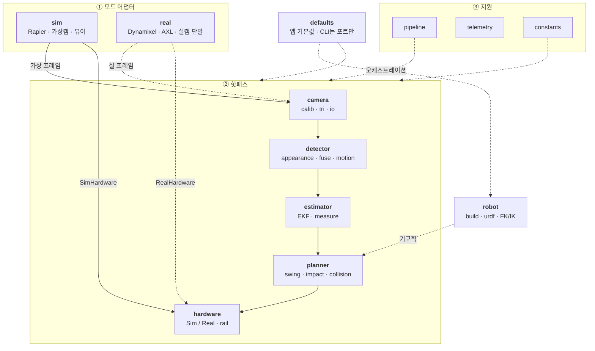
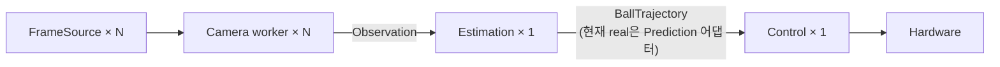
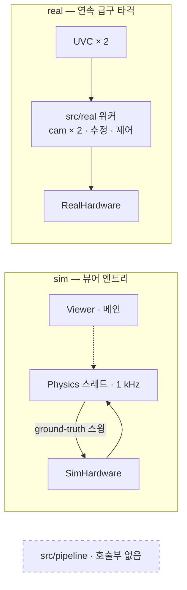
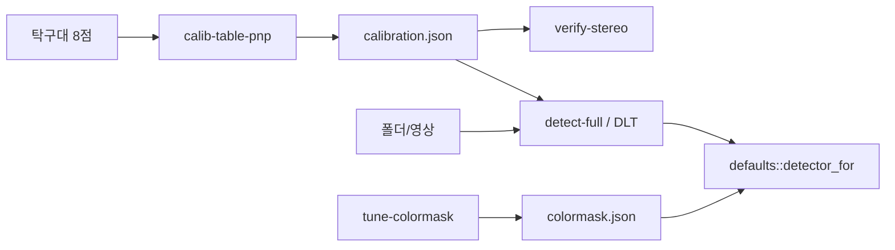

# pingpong-bot

사람과 오래 협력 랠리를 이어가는 핑퐁 로봇 런타임.  
Rust 경연용 단일 애플리케이션 크레이트다. 카메라·검출·추정·로봇·시뮬레이션·
계획을 `src/` 아래 기능별 모듈로 나눈다. OpenCV는 필수 의존성이며,
Rapier·실물 하드웨어 경계는 feature와 모듈로 격리한다.

확정된 설계와 이유는 [`docs/decisions.md`](docs/decisions.md), 남은 작업은
[`TODO.md`](TODO.md)를 기준으로 본다.

## 현재 개발 상태

`Estimator` 계층은 검출·삼각측량·EKF 결과를 다음 형식으로 반환할 수 있다.

```text
BallTrajectory {
    observed:  N×7  [x, y, z, vx, vy, vz, t],  t ≤ 0
    predicted: M×7  [x, y, z, vx, vy, vz, t],  t > 0
    reference_time
}
```

단, real 모션 제어는 아직 `CommitRequest { predictions: Vec<Prediction> }` → 기존 스윙
플래너를 사용한다. 현재 연결은 과도기적으로
`BallTrajectory → hit-plane 교차 어댑터 → Prediction`이다.
`HitTargetSelector`와 `Target { position, arrival_time_secs }` 기반 위치 이동은
[`TODO.md`](TODO.md) 2번의 다음 작업이다.

---

## 요구 사항

- [Rust](https://rustup.rs/) (edition 2024)
- 시스템 **OpenCV 4.x** + `libclang` (`opencv` crate **0.98.2+**)
- sim: macOS/Linux. real(카메라·모터): Windows — 2단계

**주의:** OpenCV **5.x** 금지. Homebrew는 `opencv@4`. crate 0.98.2 미만이면 LLVM 22에서 바인딩이 깨진다.

### OpenCV · libclang

환경 변수는 [`.envrc`](.envrc)에 두고 `direnv allow .` (권장). `~/.zshrc`에 넣지 않는다.

**macOS**

```bash
brew install llvm opencv@4 pkgconf direnv
# OpenCV 5가 있으면: brew uninstall opencv && brew install opencv@4
# ~/.zshrc: eval "$(direnv hook zsh)"  →  cd 프로젝트  →  direnv allow .
pkg-config --modversion opencv4   # 4.x
cargo check --workspace
```

수동 export는 `.envrc`와 동일 (`LIBCLANG_PATH`, `PKG_CONFIG_PATH`, `DYLD_FALLBACK_LIBRARY_PATH`).

**Windows**

```bash
# VS C++ Build Tools + LLVM + opencv4 (contrib 불필요, Charuco는 메인 objdetect)
choco install llvm
choco install opencv --version=4.13.0
cargo check --workspace
```

```toml
# mise.local.toml — OpenCV 링크용 환경 (앱 설정 아님)
[env]
OPENCV_LINK_LIBS = "opencv_world4130"
OPENCV_LINK_PATHS = "C:\\tools\\opencv\\build\\x64\\vc16\\lib"
OPENCV_INCLUDE_PATHS = "C:\\tools\\opencv\\build\\include"
_.path = [
   "C:\\tools\\opencv\\build\\x64\\vc16\\bin",
   "<path to AXL library>"
]
```

---

## 빠른 시작

```bash
cargo check --workspace
cargo test -p pingpong-bot --lib

# GUI sim (기본) — 기본값은 src/defaults
cargo run -p pingpong-bot

# 로그
cargo run -p pingpong-bot -- --debug
```

실행하면 Rapier 디지털 트윈(탁구대·공·로봇) + kiss3d/egui 뷰어가 뜬다.  
슈터 GUI로 발사하고, 기본은 월드 ground-truth로 스윙을 커밋한다.

### 시뮬레이션 사용법

```bash
# 기본 GUI sim
cargo run -p pingpong-bot

# macOS에서 Homebrew opencv@4를 확실히 선택해 실행
./run-sim-macos.sh

# 스윙 계획·포기 사유까지 자세한 로그
cargo run -p pingpong-bot -- --mode sim --debug

# 시작 치수를 명령행에서 고정 (GUI에서도 다시 조절 가능)
cargo run -p pingpong-bot -- --mode sim \
  --table-distance-m 0.15 --rail-bottom-z-m 0.88 \
  --hit-y-min-m 0.00 --hit-y-max-m 0.70 --hit-y-step-m 0.025 \
  --ball-launch-x-m 0.76 --ball-launch-y-m 2.55 --ball-launch-z-m 1.05
```

1. 좌측 **Shooter → 공 발사 위치**에서 공 중심의 절대 X/Y/Z와 조준·속도·스핀을 조정한다.
2. 좌측 **Rig**에서 탁구대 끝선–레일 거리, 레일 하단 높이, 타격 후보 Y 범위를 조정한다. 공이 **Parked**일 때만 적용된다.
3. **Shoot**로 현재 조건을 발사하거나 **Random**으로 무작위 조건을 만든다. Random도 설정한 공 발사 위치는 유지한다.
4. 우측 **Status**에서 스윙 커밋·포기 사유를 확인한다. **View → Debug overlays**에서 예측 탄도, 타점, 관절 한계, 토크 HUD를 켤 수 있다.
5. **Park**는 공을 회수한다. 마우스 드래그/스크롤은 시점 회전/줌이다.

자동 회귀 평가는 **Eval**에서 `Block` 또는 `Alternating`을 고른 뒤 **Run 30**으로 실행한다. 기본 sim은 카메라 추정값이 아닌 월드 ground-truth로 스윙을 커밋한다.

### 실기 실행 순서

실기는 **Windows 2단계** 환경을 기준으로 한다. 현재는 공을 한 번 친 뒤 센터 자세로 복귀해 다음 급구를 받는 방식이며, 결선 랠리는 아직 지원하지 않는다.

실행 전 체크리스트:

- `data/calibration.json`과 `data/colormask.json`에 left/right 값이 모두 있다.
- `src/defaults/calib.rs`의 `LEFT_DEVICE` / `RIGHT_DEVICE`가 실제 USB 배치와 같다.
- `src/defaults/hardware.rs`의 Dynamixel ID·관절 부호·제한과 AXL DLL 경로가 벤치와 맞다.
- 로봇 가동 범위에 사람·장애물이 없고 비상 정지 수단을 바로 쓸 수 있다.

하드웨어를 처음 연결했거나 영점·부호를 바꿘다면 메인 런타임 전에 jog로 작은 이동부터 검증한다.

```bash
cargo run -p jog -- --dry-run
cargo run -p jog -- --port COM8 --debug
```

jog 창에서 **Sync → Preview → Apply** 순서를 지킨다. 다음으로 실제 카메라와 런타임을 쓰되 모터만 정지한 리허설을 한다.

```bash
# 실캠·검출·삼각측량·EKF·플래너, 모터/레일만 정지
cargo run -p pingpong-bot -- --mode real --dry-run --debug

# 현장에서 잰 설치 치수와 타격 탐색 범위를 실기 FK/IK 모델에 적용
cargo run -p pingpong-bot -- --mode real --dry-run --debug \
  --table-distance-m 0.15 --rail-bottom-z-m 0.88 \
  --hit-y-min-m 0.00 --hit-y-max-m 0.70 --hit-y-step-m 0.025

# 녹화 클립으로 재현
cargo run -p pingpong-bot -- --mode real --dry-run --clip fly_02 --debug
```

검출점·재투영점이 안정적으로 공을 따라가고, 로그에 예측·커밋 또는 합리적인 포기 사유가 나오는지 확인한 뒤 실기를 실행한다.

```bash
cargo run -p pingpong-bot -- --mode real --dxl-port COM8 --debug
```

기본으로 ready 자세로 이동하고 좌/우 프리뷰와 관전용 3D 창을 연다. 프리뷰에서 `q`/`ESC`로 종료한다. `--preview=false`면 `Ctrl+C`로 종료한다.

> **토크 주의:** 기본은 종료 후에도 팔이 주저앉지 않게 토크를 유지한다. 토크를 끌 때만 `--release-torque`를 붙이고, 이때는 팔을 받칠 준비를 한다.

### 카메라·비전 캘리브레이션

카메라를 탁구대에 고정한 뒤 아래 순서를 따른다. 위치·각도, 렌즈 초점, 해상도, 캡처 프리셋을 바꾸면 다시 보정해야 한다. 운영 산출물은 `data/calibration.json`과 `data/colormask.json`이다.

#### 1. left/right 장치 번호

```bash
cargo run -p cam-list -- --preview
cargo run -p cam-list -- --all-backends  # Windows에서 백엔드별 확인
```

출력과 프리뷰로 left/right를 확인하고 `src/defaults/calib.rs`의 `LEFT_DEVICE`, `RIGHT_DEVICE`를 맞춘다. 두 카메라가 동시에 열리는지도 확인한다.

```bash
cargo run -p cam-preview
# USB 대역폭이 부족하면 보정·실행 모두 같은 프리셋 사용
cargo run -p cam-preview -- --preset mid
```

#### 2. 탁구대 기준 카메라 자세

운영 기본 방법은 탁구대 규격 랜드마크 8점 PnP다. left/right를 한 대씩 실행하면 같은 JSON의 `cameras[]`에 추가·갱신된다.

```bash
cargo run -p calib-table-pnp -- --cam left
cargo run -p calib-table-pnp -- --cam right
```

`Space`로 화면을 고정하고 화면 안내 순서대로 8점을 클릭한다. 마젠타 평면·무지개 격자가 실제 탁구대와 맞는지 확인한 뒤 `s`로 저장한다. 잔차가 큰 점은 `1`–`8`로 고르고 방향키로 미세 조정할 수 있다. `q`로 나가도 pending은 남지만 **본 파일 반영은 `s`**다.

RMSE는 기본 허용치 `7 px` 이하여야 한다. 숫자만 낮추기보다 격자가 영상 속 탁구대 평면과 일치하는지가 더 중요하다. 상세 키는 [calib-table-pnp](tools/calib_table_pnp/README.md)를 본다.

#### 3. 탁구공 색 마스크

실제 경기 조명·노출을 유지하고 공의 밝은 부분과 어두운 부분을 고루 찍는다.

```bash
cargo run -p tune-colormask -- --cam left
cargo run -p tune-colormask -- --cam right
```

`Space`로 멈춘 뒤 마우스 좌클릭으로 공 픽셀을 추가한다. 마스크가 공은 유지하고 배경은 제거하면 `p`로 저장한다. `s`로 YCrCb/HSV를 바꿔 비교할 수 있다.

#### 4. 검출·스테레오 3D 검증

```bash
cargo run -p detect-full -- --cam left
cargo run -p detect-full -- --cam right
cargo run -p verify-stereo
```

`verify-stereo`에서 격자가 양쪽 탁구대와 맞고, 초록 검출점과 마젠타 재투영점 사이가 작아야 한다. 3D 공이 실제 움직임과 같은 방향·높이로 부드럽게 움직이면 완료다. 재투영점이 벌어지면 카메라 동기·PnP·장치 흔들림을 재확인한다.

녹화본으로 반복 검증하려면:

```bash
cargo run -p record-stereo -- --scene fly
cargo run -p verify-stereo -- --clip fly_01
```

#### 선택: ChArUco 렌즈 보정

ChArUco는 카메라 내부 파라미터·왜곡을 정밀하게 측정하는 보조/레거시 경로다. 현재 운영 table-PnP는 FOV로 `K`를 근사하고 외부 자세를 구한다.

```bash
cargo run -p calib-charuco -- --cam left --images-dir ./boards/left --min-frames 12 -o left-charuco.json
cargo run -p calib-charuco -- --cam right --images-dir ./boards/right --min-frames 12 -o right-charuco.json
```

`Space` → 코너 오버레이 확인 → `s` 저장을 반복하고 `q`로 보정한다. ChArUco는 멀티캄 외부 `R|t`를 자동으로 합치지 않으므로 운영용 `data/calibration.json`에 바로 덮어쓰지 않는다. 상세 방법은 [calib-charuco](tools/calib_charuco/README.md)를 본다.

툴용으로 같은 탁구대 씬을 **레이어로 조립**한다 (`feature = "gui"`, [`src/sim/gui/`](src/sim/gui/)):

| 폴더 | 역할 |
|------|------|
| `host/` | `SimScene` 빌더 + `run` |
| `layers/` | `BallHandle` / `RobotHandle` / `ShooterHandle` 원시 R/W |
| `scene/` | `build_table_scene` · `BallVisual` |
| `viewer/` | 풀 sim egui (panel · mesh) |
| `debug/` | overlays · snap |

```rust
let scene = SimScene::builder().with_ball().build();
scene.ball().unwrap().set_position(Some(xyz)); // 같은 핸들
scene.run(shutdown)?;
```

| 조합 | 빌더 |
|------|------|
| verify | `.with_ball()` |
| jog | `.with_robot(world)` |
| 메인 | `.with_ball_from_world(w).with_robot(w).with_shooter(c, Some(w)).enable_panel(true)` |

jog의 `ik`/`pose`/`swing` 등은 툴이 궤적·포즈로 만든 뒤 `scene.robot().unwrap().play(...)` 에 넣는다.

---

## 앱 기본값 — [`src/defaults/`](src/defaults/)

런타임 숫자·조립은 **여기만** 고친다 (SSOT). TOML 설정 파일은 없다.  
규격·치수(ITTF, CAD, G)는 [`src/constants/`](src/constants/).

| 모듈 | Default / 팩토리 | 내용 |
|------|----------------|------|
| `physics` | `PhysicsParams::default()` | 반발·마찰·항력 |
| `control` | `ControlParams::default()` | 스윙·관절 추종 |
| `impact` | `ImpactParams::default()` | 랠리 리턴 휴리스틱 |
| `estimator` | `EstimatorParams::default()` | EKF·탄도 |
| `planner` | `InterceptWindow::default()` | 인터셉트 y 창 |
| `vision` | `*Params::default()` / `detector_for` | fuse 조립 |
| `hardware` | `DynamixelConfig` / `RailConfig::default()` | 실기 버스·레일 |
| `robot` | `robot()` | **지금 쓰는** `Robot` (바꾸려면 이 함수 본문만) |

CLI 덮어쓰기는 포트 정도만:

```bash
cargo run -p pingpong-bot -- --mode sim
cargo run -p pingpong-bot -- --mode real --dxl-port COM8
```

물리계수 측정 툴은 stdout에 `PhysicsParams::default()` 붙여넣기용 스니펫을 낸다  
([measure_restitution](tools/measure_restitution/README.md) · [measure_friction](tools/measure_friction/README.md)).  
무엇을 재고 `e_eff`가 뭔지는 [docs/measure-physics.md](docs/measure-physics.md).

### Dynamixel · AXL (Windows)

값은 `DynamixelConfig::default()` / `RailConfig::default()`. 포트 기본은 `DynamixelConfig::default().port`, 덮어쓰기는 `--dxl-port`.  
각도는 모터 절대각이 아니라 **URDF 관절각**. 상세·REPL은 [jog](tools/jog/README.md).

```bash
cargo run -p jog -- --dry-run
cargo run -p jog -- --port COM8 --debug
cargo run -p pingpong-bot -- --mode real --dxl-port COM8 --debug
```

### `--mode real` — 연속 급구 타격

공 하나를 받아 **스윙 한 번**을 커밋하고 센터로 복귀한 뒤 다음 급구를 받는다
(결선 랠리는 아직).
이벤트·결정·스레드 상세는 [`src/real/README.md`](src/real/README.md).

```bash
# 리허설 — 실캠·검출·EKF·플래너까지 다 돌리고 모터·레일만 안 움직인다 (macOS에서도 됨)
cargo run -p pingpong-bot -- --mode real --dry-run

# 실기
cargo run -p pingpong-bot -- --mode real --dxl-port COM8 --debug
```

| 플래그 | 기본 | 뜻 |
|--------|------|-----|
| `--dry-run` | off | 모터·레일 정지. 나머지 체인은 그대로 |
| `--preview` | on | 좌/우 검출 오버레이 창 (ESC·`q` 종료) |
| `--sim` | on | 관전용 3D 창 (로봇·예측 도달점·스윙 재생) |
| `--home` | on | 시작 시 센터(ready) 자세로 이동 |
| `--release-torque` | off | 종료 시 토크 해제. 기본은 켠 채로 둬서 팔이 안 주저앉게 한다 |
| `--timeout-secs` | 60 | 공 대기 경고 간격. 초과해도 세션은 계속 |

샷이 끝나면 ready 자세로 복귀해 다음 공을 기다린다. ESC·`q`로 세션을 종료한다.

카메라 2대(`data/calibration.json`)와 `data/colormask.json`이 있어야 한다.
`Ekf`·`Calibration`·`Hardware`를 스레드별로 단독 소유하고 crossbeam 채널로만 잇는다 —
`read_pose → plan_best → command`가 한 스레드 안에서만 일어나 계획과 전송 사이에 포즈가
바뀔 수 없다.

---

## 아키텍처

도메인 핫패스는 모드 공통. `sim`/`real`은 **프레임·하드웨어만** 갈아 끼우고,
`pipeline`이 스레드·채널로 돌린다. GUI sim 엔트리(`main`)는 뷰어 + `SimSession`이고,
월드 안 ground-truth 스윙이 기본이다.

### 도메인


```mermaid
flowchart TB
  defaults["<b>defaults</b><br/>앱 기본값 · CLI는 포트만"]

  subgraph adapters ["① 모드 어댑터"]
    direction LR
    sim["<b>sim</b><br/>Rapier · 가상캠 · 뷰어"]
    real["<b>real</b><br/>Dynamixel · AXL · 실캠 단발"]
  end

  subgraph hot ["② 핫패스"]
    direction LR
    camera["<b>camera</b><br/>calib · tri · io"]
    detector["<b>detector</b><br/>appearance · fuse · motion"]
    estimator["<b>estimator</b><br/>EKF · measure"]
    planner["<b>planner</b><br/>swing · impact · collision"]
    hardware["<b>hardware</b><br/>Sim / Real · rail"]
    camera --> detector --> estimator --> planner --> hardware
  end

  robot["<b>robot</b><br/>build · urdf · FK/IK"]
  defaults -.-> hot
  defaults -.-> robot
  robot -.->|기구학| planner

  sim -->|가상 프레임| camera
  sim -->|SimHardware| hardware
  real -.->|실 프레임| camera
  real -.->|RealHardware| hardware

  subgraph support ["③ 지원"]
    direction LR
    pipeline["pipeline"]
    telemetry["telemetry"]
    constants["constants"]
  end

  pipeline -.->|오케스트레이션| hot
  constants -.-> hot
```

### 파이프라인 스레드

워커 구성은 어느 쪽이든 같다: 카메라당 1 + 추정 1 + 제어 1.


```mermaid
flowchart LR
  frames["FrameSource × N"]
  camT["Camera worker × N"]
  estT["Estimation × 1"]
  ctrlT["Control × 1"]
  actuator["Hardware"]

  frames --> camT -->|"Observation"| estT -->|"BallTrajectory<br/>(현재 real은 Prediction 어댑터)"| ctrlT --> actuator
```

실기(`--mode real`)는 [`src/real/`](src/real/)이 돌린다 — 연속 급구 타격 전용이고,
상태를 스레드별로 단독 소유하며 crossbeam 채널로만 잇는다
([`src/real/README.md`](src/real/README.md)).
[`src/pipeline/`](src/pipeline/)은 랠리를 전제로 먼저 써 둔 골격이라 **아직 호출부가 없다**.


```mermaid
flowchart LR
  subgraph simSide ["sim — 뷰어 엔트리"]
    viewer["Viewer · 메인"]
    physics["Physics 스레드 · 1 kHz"]
    simHw["SimHardware"]
    viewer -.-> physics
    physics -->|"ground-truth 스윙"| simHw
    simHw --> physics
  end

  subgraph realSide ["real — 연속 급구 타격"]
    realCamera["UVC × 2"]
    realWorkers["src/real 워커<br/>cam × 2 · 추정 · 제어"]
    realHw["RealHardware"]
    realCamera --> realWorkers --> realHw
  end

  dead["src/pipeline · 호출부 없음"]
  style dead stroke-dasharray: 5 5
```

---

## 프로젝트 구조

```
src/
  defaults/     앱 기본값 SSOT (physics · vision · robot · hardware · …)
  constants/    ITTF · 기하 · 제어 상수
  camera/       calib/ · tri/ · io/
  detector/     appearance/ · scoring/ · motion/ · spatial/
  estimator/    ekf · ballistics · measure/
  planner/      swing/ · impact · collision
  robot/        build/ · urdf/ · Arm · state
  sim/          physics/ · session/ · gui/
  real/         실기 연속 급구 타격 런타임 (bin 전용 · README.md)
  hardware/     rail/ · SimHardware · RealHardware
  pipeline/     카메라→추정→제어 오케스트레이션 (랠리 전제 · 호출부 없음)
  telemetry/
  main.rs       CLI · sim 뷰어 / real 스모크

tools/          실험·캘리브·검증 바이너리 (각 README)
assets/         로봇 URDF · 폰트
plan.md · TODO.md · docs/
```

### 로봇

- 기구학은 `src/robot/`. 런타임이 쓰는 모델은 **`defaults::robot()`** (`Robot` = Arm + 선택 URDF).
- 프리셋 후보: `primitive_4dof()` · `urdf_4dof()` · `urdf_test()`. 활성만 `robot()` 본문에서 고른다.
- 지금 기본은 `urdf_4dof()` (`assets/robots/4-dof/...`).

| 팩토리 | 메시 | 용도 |
|--------|------|------|
| `primitive_4dof()` | 없음 | 경연용 단순 4-dof 체인 |
| `urdf_4dof()` | `all-4-export.urdf` | 기본 활성 |
| `urdf_test()` | urdf-test | 진단 |

### sim

```bash
cargo run -p pingpong-bot
```

- 좌표계: **Z-up**, 원점 = 탁구대 로봇쪽 꼭짓점. +X 너비 · +Y 길이 · 테이블면 `z ≈ 0.76 m`
- 로봇 `y ≈ 0`, 슈터 `+y`. 공은 주차 → GUI 발사 → 이탈 시 회수
- 기본 `use_ground_truth = true` (월드가 타격 계획). EKF control은 라이브러리·테스트 경로
- 뷰어: kiss3d 3D + egui 슈터 패널 (단일 창)

구현 디테일은 `src/sim/` · 회귀는 `cargo test -p pingpong-bot --lib sim::`.

---

## 실험 도구 (`tools/`)

사용법·플래그는 **각 툴 README**만 본다.

| crate | README |
|-------|--------|
| `cam-list` | [cam_list](tools/cam_list/README.md) — OpenCV device 인덱스 프로브 |
| `cam-preview` | [cam_preview](tools/cam_preview/README.md) |
| `record-stereo` | [record_stereo](tools/record_stereo/README.md) — 프리롤 스테레오 → `data/clips/` (LFS) |
| `calib-charuco` | [calib_charuco](tools/calib_charuco/README.md) |
| `calib-table-pnp` | [calib_table_pnp](tools/calib_table_pnp/README.md) — 8점 PnP + 월드 격자 검증 |
| `verify-stereo` | [verify_stereo](tools/verify_stereo/README.md) — 스테레오 격자·공 3D·sim |
| `tune-colormask` | [tune_colormask](tools/tune_colormask/README.md) |
| `detect-full` | [detect_full](tools/detect_full/README.md) — fuse + ROI |
| `measure-restitution` | [measure_restitution](tools/measure_restitution/README.md) |
| `measure-friction` | [measure_friction](tools/measure_friction/README.md) |
| `jog` | [jog](tools/jog/README.md) — 관절·레일 REPL |

### 비전 오프라인 흐름

보정·검출은 툴에서 JSON/프리뷰로 검증하고, 런타임 조립은 `defaults::detector_for(cam_id)` (`data/calibration.json` · `data/colormask.json`).


```mermaid
flowchart LR
  table["탁구대 8점"] --> pnp["calib-table-pnp"] --> json["calibration.json"]
  json --> verify["verify-stereo"]
  json --> full["detect-full / DLT"]
  frames["폴더/영상"] --> full
  full --> defaults["defaults::detector_for"]
  tune["tune-colormask"] --> cm["colormask.json"] --> defaults
```

- 외참(운영): [calib_table_pnp](tools/calib_table_pnp/README.md) (클릭 → 자동 PnP → 무지개 격자 → 저장) → [verify-stereo](tools/verify_stereo/README.md) / DLT
- Charuco 인트린식: [calib_charuco](tools/calib_charuco/README.md) (비운영·레거시)
- 설계: [decisions J](docs/decisions.md)

---

## 개발

```bash
cargo check -p pingpong-bot --lib
cargo test -p pingpong-bot --lib
cargo build -p pingpong-bot --release
```

---

## 현재 구현 상태

| 영역 | 상태 |
|------|------|
| workspace · Rapier 트윈 · kiss3d/egui | ✅ |
| `src/defaults` 앱 기본값 SSOT (TOML 없음) | ✅ |
| `Robot` / URDF · `defaults::robot()` | ✅ |
| Z-up · 동적 인터셉트 · quintic 스윙 | ✅ |
| 삼각측량 · ChArUco · 탁구대 8점 PnP | ✅ |
| fuse 검출 · measure_* → defaults 스니펫 | ✅ |
| EKF (sim 기본은 ground truth) | ✅ |
| Dynamixel 4축 · AXL 레일 · `jog` | ✅ (Windows 재검증) |
| real 풀 비전 파이프라인 | ✅ 연속 급구 (결선 랠리는 미지원) |

**로드맵:** [`TODO.md`](TODO.md) · [`docs/decisions.md`](docs/decisions.md)

---

## 라이선스

(미정)
