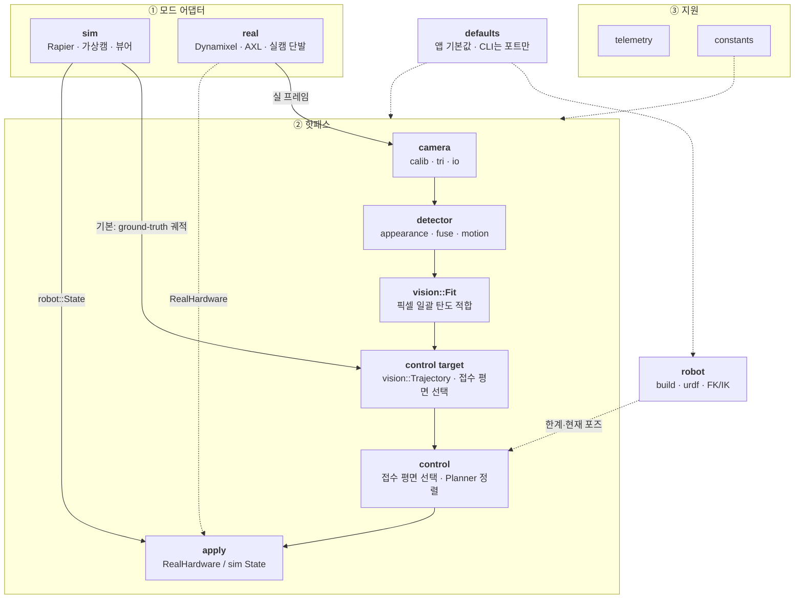
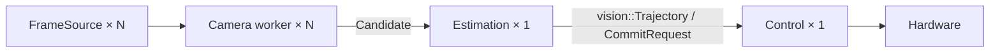
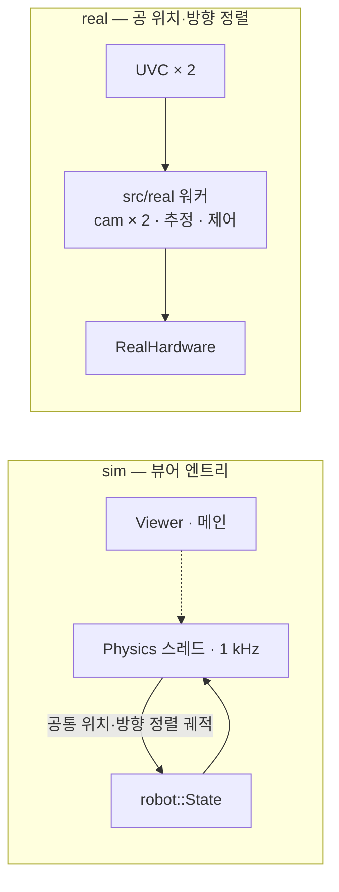
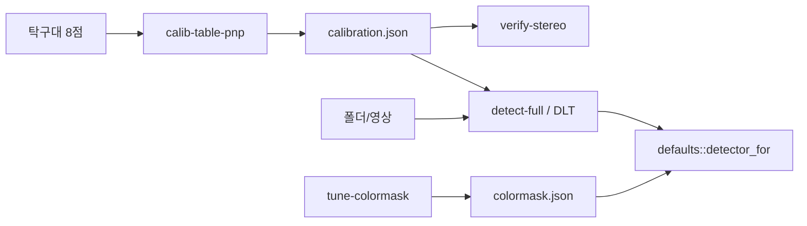

# pingpong-bot

사람과 오래 협력 랠리를 이어가는 핑퐁 로봇 런타임.  
Rust 경연용 단일 애플리케이션 크레이트다. 카메라·검출·추정·로봇·시뮬레이션·
계획을 `src/` 아래 기능별 모듈로 나눈다. OpenCV는 필수 의존성이며,
Rapier·실물 하드웨어 경계는 feature와 모듈로 격리한다.

확정된 설계와 이유는 [`docs/decisions.md`](docs/decisions.md), 남은 작업은
[`TODO.md`](TODO.md)를 기준으로 본다.

## 현재 개발 상태

새 실기 비전 계층은 카메라별 픽셀 관측 전체를 일괄 적합해 다음 계약을 반환한다.

```text
vision::Trajectory {
    seq,
    origin,
    measured: Track<State>,
    predicted: Track<State>,
}
```

real 제어는 `vision::Trajectory → CommitRequest → control 접수 평면 선택 →
Planner::ball_alignment` 경로로 본 예측의 레일·팔 정렬 궤적을 계산한다. 이후 갱신은 이미
계산된 레일 위치에서 팔만 미세 보정해
보정된 공 접촉점을 라켓 블레이드에 맞추고, 라켓 면은 네트 너머 상대편
탁구대 반코트의 무게중심을 향한다. 예상 타격 0.25초 전에 백스윙 없이
정렬 자세에서 q2=-6°·q3=-12° 고정 관절 스윙을 시작한다. 임팩트 후에도
0.12초 동안 같은 방향으로 팔로스루한 뒤 준비 자세로 복귀한다.

---

## 요구 사항

- [Rust](https://rustup.rs/) (edition 2024)
- 시스템 **OpenCV 4.x** + `libclang` (`opencv` crate **0.98.2+**)
- sim: macOS/Linux. real(카메라·Dynamixel·AXL): Windows

**주의:** OpenCV **5.x** 금지. Homebrew는 `opencv@4`. crate 0.98.2 미만이면 LLVM 22에서 바인딩이 깨진다.

### OpenCV · libclang

환경 변수는 [`.envrc`](.envrc)에 두고 `direnv allow .` (권장). `~/.zshrc`에 넣지 않는다.

**macOS**

```bash
brew install llvm opencv@4 pkgconf direnv
# OpenCV 5가 있으면: brew uninstall opencv && brew install opencv@4
# ~/.zshrc: eval "$(direnv hook zsh)"  →  cd 프로젝트  →  direnv allow .
pkg-config --modversion opencv4   # 4.x
cargo check --workspace
```

수동 export는 `.envrc`와 동일 (`LIBCLANG_PATH`, `PKG_CONFIG_PATH`, `DYLD_FALLBACK_LIBRARY_PATH`).

**Windows**

```bash
# VS C++ Build Tools + LLVM + opencv4 (contrib 불필요, Charuco는 메인 objdetect)
choco install llvm
choco install opencv --version=4.13.0
cargo check --workspace
```

```toml
# mise.local.toml — OpenCV 링크용 환경 (앱 설정 아님)
[env]
OPENCV_LINK_LIBS = "opencv_world4130"
OPENCV_LINK_PATHS = "C:\\tools\\opencv\\build\\x64\\vc16\\lib"
OPENCV_INCLUDE_PATHS = "C:\\tools\\opencv\\build\\include"
_.path = [
   "C:\\tools\\opencv\\build\\x64\\vc16\\bin",
   "<path to AXL library>"
]
```

---

## 빠른 시작

```bash
cargo check --workspace
cargo test -p pingpong-bot --lib

# GUI sim (기본) — 기본값은 src/defaults
cargo run -p pingpong-bot

# 로그
cargo run -p pingpong-bot -- --debug
```

실행하면 Rapier 디지털 트윈(탁구대·공·로봇) + kiss3d/egui 뷰어가 뜬다.  
로봇은 실기 안전 범위(0.0100~1.3395 m) 안에서 탁구대 실측 중앙 준비 위치(0.675 m)와 준비 관절 자세로 바로 이동한다.
슈터 GUI로 발사하면 기본 경로는 월드 ground-truth 궤적에서 목표를 고른 뒤
실기와 같은 `Planner::ball_alignment`로 레일·팔을 함께 움직인다.
예측 위치에 정지 정렬하고 타격 0.25초 전에 백스윙 없는 고정 관절 스윙을 시작한 뒤 중립 자세로 복귀한다.
GUI `Random`은 로봇 접수 회귀를 통과한 좌우 위치·yaw·속도 범위만 무작위화한다.
높이·스핀 극단값은 도달 시간을 보장하지 않으므로 각각의 슬라이더로 시험한다.

### 시뮬레이션 사용법

```bash
# 기본 GUI sim
cargo run -p pingpong-bot

# 목표 선택·단계 판정·명령 실패까지 자세한 로그
cargo run -p pingpong-bot -- --mode sim --debug
```

1. 좌측 **Shooter** 패널에서 위치·조준·속도·스핀을 조정한다.
2. **Shoot**로 현재 조건을 발사하거나 **Random**으로 무작위 조건을 만든다.
3. 우측 **Status**에서 직접 제어 명령과 실패 사유를 확인한다. **View → Debug overlays**는 예측 탄도와 보존 중인 계획기 진단값을 표시한다.
4. **Park**는 공을 회수한다. 마우스 드래그/스크롤은 시점 회전/줌이다.

기본 sim은 카메라 추정값이 아닌 월드 ground-truth로 `BallTrajectory`를 만든다.
목표 선택 정책은 real과 다르지만, 선택 후 위치·방향 정렬은 실기와 같은
`Planner::ball_alignment`을 쓴다.
**Eval**과 bang-bang 스윙 토글은 보존 중인 시뮬레이션 진단 기능이며 현재 실기
직접 제어 경로에는 대응하지 않는다.

### 실기 실행 순서

실기는 **Windows 실캄·Dynamixel·AXL** 환경을 기준으로 한다. 카메라와 공 추적을 시작하기 전에
시작 시 레일 0.675m와 기본 관절각의 중립 자세를 만든다. 공 검출 시
비전이 계속 궤적을 갱신하더라도 제어 워커의 위치·속도 불확실성 기준을 통과한
본 예측에서만 정렬을 시작한다. 첫 본 예측에서
리니어 레일과 Dynamixel 팔을 함께 계산·이동한다. 같은 공의 후속 갱신은 도착한 레일 위치를
기준으로 Dynamixel 관절만 최신 타격점으로 미세 보정한다. 목표 x는 발사기 기준 오른쪽
6cm를 보정하고 테이블·관절·토크·레일 한계를 통과한 IK 해만 실행한다.
안전한 경로가 없으면 해당 공만
건너뛰고 사유를 로그로 남기며 다음 공을 계속 처리한다.

실행 전 체크리스트:

- `data/calibration.json`과 `data/colormask.json`에 left/right 값이 모두 있다.
- `src/defaults/calib.rs`의 `LEFT_DEVICE` / `RIGHT_DEVICE`가 실제 USB 배치와 같다.
- `src/defaults/hardware.rs`의 Dynamixel ID·관절 부호·제한과 AXL DLL 경로가 벤치와 맞다.
- 로봇 가동 범위에 사람·장애물이 없고 비상 정지 수단을 바로 쓸 수 있다.

하드웨어를 처음 연결했거나 영점·부호를 바꿘다면 메인 런타임 전에 jog로 작은 이동부터 검증한다.

프리뷰 창의 숫자 키는 안전 제어 범위 `0.0100~1.3395m`를 기준으로 공 접수 구간을 선택한다.
판정에는 발사기 정렬 보정이 반영된 실제 제어 목표 x를 사용한다.

| 키 | 제어하는 공 구간 | x 범위 | 시작·타격 후 대기 위치 |
|---|---|---:|---:|
| `1` | 0~45% | `0.0100 ≤ x ≤ 0.6083m` | 16% = `0.2227m` |
| `2` | 20~60% | `0.2759 ≤ x ≤ 0.8077m` | 50% = `0.6748m` |
| `3` | 55~100% | `0.7412 ≤ x ≤ 1.3395m` | 83% = `1.1135m` |
| `4` | 전체 구간(기본) | 구간 필터 없음 | 중앙 `0.6750m` |

선택한 구간 밖의 공은 레일·팔 명령을 보내지 않고, 같은 공에 대해 생략 로그를 한 번만 남긴다.
모드와 관계없이 라켓 면은 네트 너머 상대편 탁구대 반쪽의 무게중심을 향한다.
라켓 면은 수평 기준 25° 위를 우선 목표로 삼고, 예측 공 높이보다 1.5cm 높은 지점을 타격 목표로 삼는다. 그 자세를 만들 수 없으면 명령을 버리지 않고 기존 수평 법선 자세로 복귀하며, 기존 해가 아래를 보는 경우에만 수직으로 다시 맞춘다.

```bash
cargo run -p jog -- --dry-run
cargo run -p jog -- --port COM8 --debug
```

jog 창에서 **Sync → Preview → Apply** 순서를 지킨다. 다음으로 실제 카메라와 런타임을 쓰되 모터만 정지한 리허설을 한다.

```bash
# 실캠·새 검출 캐스케이드·일괄 탄도 적합·플래너, 모터/레일만 정지
cargo run -p pingpong-bot -- --mode real --dry-run --debug

# 녹화 클립으로 재현
cargo run -p pingpong-bot -- --mode real --dry-run --clip fly_02 --debug
```

검출점·재투영점이 안정적으로 공을 따라가고, 로그에 예측·커밋 또는 합리적인 포기 사유가 나오는지 확인한 뒤 실기를 실행한다.

```bash
cargo run -p pingpong-bot -- --mode real --dxl-port COM8 --debug
```

기본으로 ready 자세로 이동하고 좌/우 프리뷰와 관전용 3D 창을 연다. 프리뷰에서 `q`/`ESC`로 종료한다. `--preview=false`면 `Ctrl+C`로 종료한다.

> **토크 주의:** 기본은 종료 후에도 팔이 주저앉지 않게 토크를 유지한다. 토크를 끌 때만 `--release-torque`를 붙이고, 이때는 팔을 받칠 준비를 한다.

### 카메라·비전 캘리브레이션

카메라를 탁구대에 고정한 뒤 아래 순서를 따른다. 위치·각도, 렌즈 초점, 해상도, 캡처 프리셋을 바꾸면 다시 보정해야 한다. 운영 산출물은 `data/calibration.json`과 `data/colormask.json`이다.

#### 1. left/right 장치 번호

```bash
cargo run -p cam-list -- --preview
cargo run -p cam-list -- --all-backends  # Windows에서 백엔드별 확인
```

출력과 프리뷰로 left/right를 확인하고 `src/defaults/calib.rs`의 `LEFT_DEVICE`, `RIGHT_DEVICE`를 맞춘다. 두 카메라가 동시에 열리는지도 확인한다.

```bash
cargo run -p cam-preview
# USB 대역폭이 부족하면 보정·실행 모두 같은 프리셋 사용
cargo run -p cam-preview -- --preset mid
```

#### 2. 탁구대 기준 카메라 자세

운영 기본 방법은 탁구대 규격 랜드마크 8점 PnP다. left/right를 한 대씩 실행하면 같은 JSON의 `cameras[]`에 추가·갱신된다.

```bash
cargo run -p calib-table-pnp -- --cam left
cargo run -p calib-table-pnp -- --cam right
```

`Space`로 화면을 고정하고 화면 안내 순서대로 8점을 클릭한다. 마젠타 평면·무지개 격자가 실제 탁구대와 맞는지 확인한 뒤 `s`로 저장한다. 잔차가 큰 점은 `1`–`8`로 고르고 방향키로 미세 조정할 수 있다. `q`로 나가도 pending은 남지만 **본 파일 반영은 `s`**다.

RMSE는 기본 허용치 `7 px` 이하여야 한다. 숫자만 낮추기보다 격자가 영상 속 탁구대 평면과 일치하는지가 더 중요하다. 상세 키는 [calib-table-pnp](tools/calib_table_pnp/README.md)를 본다.

#### 3. 탁구공 색 마스크

실제 경기 조명·노출을 유지하고 공의 밝은 부분과 어두운 부분을 고루 찍는다.

```bash
cargo run -p tune-colormask -- --cam left
cargo run -p tune-colormask -- --cam right
```

`Space`로 멈춘 뒤 마우스 좌클릭으로 공 픽셀을 추가한다. 마스크가 공은 유지하고 배경은 제거하면 `p`로 저장한다. `s`로 YCrCb/HSV를 바꿔 비교할 수 있다.

#### 4. 검출·스테레오 3D 검증

```bash
cargo run -p detect-full -- --cam left
cargo run -p detect-full -- --cam right
cargo run -p verify-stereo
```

`verify-stereo`에서 격자가 양쪽 탁구대와 맞고, 초록 검출점과 마젠타 재투영점 사이가 작아야 한다. 3D 공이 실제 움직임과 같은 방향·높이로 부드럽게 움직이면 완료다. 재투영점이 벌어지면 카메라 동기·PnP·장치 흔들림을 재확인한다.

녹화본으로 반복 검증하려면:

```bash
cargo run -p record-stereo -- --scene fly
cargo run -p verify-stereo -- --clip fly_01
```

#### 선택: ChArUco 렌즈 보정

ChArUco는 카메라 내부 파라미터·왜곡을 정밀하게 측정하는 보조/레거시 경로다. 현재 운영 table-PnP는 FOV로 `K`를 근사하고 외부 자세를 구한다.

```bash
cargo run -p calib-charuco -- --cam left --images-dir ./boards/left --min-frames 12 -o left-charuco.json
cargo run -p calib-charuco -- --cam right --images-dir ./boards/right --min-frames 12 -o right-charuco.json
```

`Space` → 코너 오버레이 확인 → `s` 저장을 반복하고 `q`로 보정한다. ChArUco는 멀티캄 외부 `R|t`를 자동으로 합치지 않으므로 운영용 `data/calibration.json`에 바로 덮어쓰지 않는다. 상세 방법은 [calib-charuco](tools/calib_charuco/README.md)를 본다.

툴용으로 같은 탁구대 씬을 **레이어로 조립**한다 (`feature = "gui"`, [`src/sim/gui/`](src/sim/gui/)):

| 폴더 | 역할 |
|------|------|
| `host/` | `SimScene` 빌더 + `run` |
| `layers/` | `BallHandle` / `RobotHandle` / `ShooterHandle` 원시 R/W |
| `scene/` | `build_table_scene` · `BallVisual` |
| `viewer/` | 풀 sim egui (panel · mesh) |
| `debug/` | overlays · snap |

```rust
let scene = SimScene::builder().with_ball().build();
scene.ball().unwrap().set_position(Some(xyz)); // 같은 핸들
scene.run(shutdown)?;
```

| 조합 | 빌더 |
|------|------|
| verify | `.with_ball()` |
| jog | `.with_robot(world)` |
| 메인 | `.with_ball_from_world(w).with_robot(w).with_shooter(c, Some(w)).enable_panel(true)` |

jog의 `ik`/`pose`/`swing` 등은 툴이 궤적·포즈로 만든 뒤 `scene.robot().unwrap().play(...)` 에 넣는다.

---

## 앱 기본값 — [`src/defaults/`](src/defaults/)

런타임 숫자·조립은 **여기만** 고친다 (SSOT). TOML 설정 파일은 없다.  
규격·치수(ITTF, CAD, G)는 [`src/constants/`](src/constants/).

| 모듈 | Default / 팩토리 | 내용 |
|------|----------------|------|
| `physics` | `PhysicsParams::default()` | 반발·마찰·항력 |
| `control` | `ControlParams::default()` | 스윙·관절 추종 |
| `impact` | `ImpactParams::default()` | 랠리 리턴 휴리스틱 |
| `estimator` | `EstimatorParams::default()` | EKF·탄도 |
| `motion` | `InterceptWindow::default()` | 인터셉트 y 창·정렬·스윙 계획 |
| `vision` | `*Params::default()` / `detector_for` | fuse 조립 |
| `hardware` | `DynamixelConfig` / `RailConfig::default()` | 실기 버스·레일 |
| `robot` | `robot()` | **지금 쓰는** `Robot` (바꾸려면 이 함수 본문만) |

CLI 덮어쓰기는 포트 정도만:

```bash
cargo run -p pingpong-bot -- --mode sim
cargo run -p pingpong-bot -- --mode real --dxl-port COM8
```

물리계수 측정 툴은 stdout에 `PhysicsParams::default()` 붙여넣기용 스니펫을 낸다  
([measure_restitution](tools/measure_restitution/README.md) · [measure_friction](tools/measure_friction/README.md)).  
무엇을 재고 `e_eff`가 뭔지는 [docs/measure-physics.md](docs/measure-physics.md).

### Dynamixel · AXL (Windows)

값은 `DynamixelConfig::default()` / `RailConfig::default()`. 포트 기본은 `DynamixelConfig::default().port`, 덮어쓰기는 `--dxl-port`.  
각도는 모터 절대각이 아니라 **URDF 관절각**. 상세·REPL은 [jog](tools/jog/README.md).

```bash
cargo run -p jog -- --dry-run
cargo run -p jog -- --port COM8 --debug
cargo run -p pingpong-bot -- --mode real --dxl-port COM8 --debug
```

### `--mode real` — 공 위치·방향 정렬 제어

공 궤적에서 선택한 목표 x·y·z를 임팩트 지점으로 사용한다. 본 예측 첫 명령에서 레일과
Dynamixel을 함께 움직이고, 후속 갱신은 팔 관절만 반복 보정한다.
타격 0.25초 전에 정렬 자세에서 q2=-6°·q3=-12° 고정 관절 스윙을 시작하고, 임팩트 후 0.12초 팔로스루 후 현재 모드의 준비 자세로 복귀한다.
스윙 시각에 정렬 중이거나 관절·토크·테이블 한계를 통과하지 못하면 스윙만 생략한다.
스레드와 하드웨어 경계는 [`src/real/README.md`](src/real/README.md)에 정리돼 있다.

```bash
# 리허설 — 실캠·새 비전 Fit·플래너까지 다 돌리고 모터·레일만 안 움직인다 (macOS에서도 됨)
cargo run -p pingpong-bot -- --mode real --dry-run

# 실기
cargo run -p pingpong-bot -- --mode real --dxl-port COM8 --debug
```

| 플래그 | 기본 | 뜻 |
|--------|------|-----|
| `--dry-run` | off | 모터·레일 정지. 나머지 체인은 그대로 |
| `--preview` | on | 좌/우 검출 오버레이 창 (ESC·`q` 종료) |
| `--sim` | off | 관전용 3D 창 (공·선택 목표·시작 포즈 표시). 켜면 별도 렌더링 프로세스가 뜬다 |
| `--home` | on | 시작 시 센터(ready) 자세로 이동 |
| `--release-torque` | off | 종료 시 토크 해제. 기본은 켠 채로 둬서 팔이 안 주저앉게 한다 |
| `--timeout-secs` | 60 | 공 대기 경고 간격. 초과해도 세션은 계속 |

새 공은 `track_seq`로 구분한다. 추정 결과가 기존 본 예측 유효 기준을 통과하기 전에는
구동하지 않고, 통과한 첫 궤적으로 레일·팔을 함께 이동한 뒤 최신 궤적마다 팔 자세를 보정한다.
직전 보정 중 도착한 요청은 최신 하나만 보관해 이동 완료 직후 적용하며, 정렬·복귀 중 생긴
다른 잡음 트랙은 현재 제어 상태를 덮어쓰지 못한다.
명령 후 레일과 전체 관절을 다시 읽어 명령값·실측값·차이를 로그로 남긴다.
전체 Dynamixel SyncRead가 일시적 timeout/checksum 오류로 실패하면 8회 재시도 후
관절 ID별 읽기로 자동 복구하고, 해당 실행에서는 이후 묶음 읽기를 반복하지 않는다.
시작 자세의 관절 편차가 2°를 넘으면 편차를 허용하지 않고, 직전 모터 목표에
`commanded - measured`를 누적해 최대 6회까지 다시 이동·실측한다.
전원이 꺼진 동안 손으로 움직여 시작 실측각이 모터 소프트 한계 밖이어도 첫 명령에서
한계값으로 즉시 잘라 급회전시키지 않는다. 현재 실측각을 임시 경계로 유지한 뒤 정상
범위 방향의 명령만 허용하고, 정상 범위에 들어오면 기존 소프트 한계를 다시 적용한다.
듀얼 MX-64(ID 1·2)는 시작 전과 중립 복귀 직후 두 모터의 Present Position을
각각 읽는다. `ID2 = 2*zero-ID1`과 40tick 이상 어긋나면 방향·혼 영점·체결
문제로 보고 팔 구동을 차단한다.
또한 전역 IK가 다른 팔 접힘 가지를 골라 듀얼 축이 한 번에 25° 넘게
튀는 목표는 모터로 보내지 않고 다음 예측을 기다린다.
ESC·`q`로 세션을 종료한다.

AXL 시작 로그는 원시 보드 위치와 앱 위치를 함께 기록한다. 기본 `reverse=true`에서는
AXL 앱 안전 범위는 `0.0100~1.3395 m`이다. `reverse=true`라 도메인
좌표 증가와 보드 이동 방향이 반대이다. 보드 원점은 기하학적 원점
`0.705 m`에 발사기 기준 오른쪽 정렬 보정 `0.025 m`를 더한 제어 좌표
`0.730 m`에 고정된다. 준비 위치 `0.675 m`는 보드 `+0.055 m`에 대응한다.
AXL의 `ActPos`와 `CmdPos` 원점이 다르면 시작 로그에 두 값과 차이를 기록하고,
모든 절대 목표와 CmdPos 기준 소프트 리밋에 그 차이를 자동 보정한다.

카메라 2대(`data/calibration.json`)와 `data/colormask.json`이 있어야 한다.
`vision::Fit`·`Calibration`·`Hardware`를 스레드별로 단독 소유하고 crossbeam 채널로만 잇는다.
추정 워커는 최신 목표를 보내고 제어 워커만 하드웨어를 소유한다.

---

## 아키텍처

현재 활성 실기 제어의 첫 본 예측 경계는 `vision::Trajectory → control 접수 평면 선택 →
Planner::ball_alignment → Hardware::command`다. 후속 팔 보정은 `ball_alignment_fixed_rail → command_joints`를 쓴다. GUI sim은 월드 궤적에서
`Planner::ball_alignment`를 사용하는 독립 진단 경로다. GUI sim 엔트리(`main`)는
뷰어와 `SimSession`을 함께 실행한다.

### 도메인


```mermaid
flowchart TB
  defaults["<b>defaults</b><br/>앱 기본값 · CLI는 포트만"]

  subgraph adapters ["① 모드 어댑터"]
    direction LR
    sim["<b>sim</b><br/>Rapier · 가상캠 · 뷰어"]
    real["<b>real</b><br/>Dynamixel · AXL · 실캠 단발"]
  end

  subgraph hot ["② 핫패스"]
    direction LR
    camera["<b>camera</b><br/>calib · tri · io"]
    detector["<b>detector</b><br/>appearance · fuse · motion"]
    estimator["<b>vision::Fit</b><br/>픽셀 일괄 탄도 적합"]
    target["<b>control target</b><br/>vision::Trajectory · 접수 평면 선택"]
    control["<b>control</b><br/>접수 평면 선택 · Planner 정렬"]
    hardware["<b>apply</b><br/>RealHardware / sim State"]
    camera --> detector --> estimator --> target --> control --> hardware
  end

  robot["<b>robot</b><br/>build · urdf · FK/IK"]
  defaults -.-> hot
  defaults -.-> robot
  robot -.->|한계·현재 포즈| control

  sim -->|기본: ground-truth 궤적| target
  sim -->|robot::State| hardware
  real -->|실 프레임| camera
  real -.->|RealHardware| hardware

  subgraph support ["③ 지원"]
    direction LR
    telemetry["telemetry"]
    constants["constants"]
  end

  constants -.-> hot
```

### 파이프라인 스레드

아래 워커 구성은 real 런타임의 구조다.
기본 GUI sim은 이 카메라 워커 체인을 거치지 않고 물리 월드 상태로 궤적을 만든다.


```mermaid
flowchart LR
  frames["FrameSource × N"]
  camT["Camera worker × N"]
  estT["Estimation × 1"]
  ctrlT["Control × 1"]
  actuator["Hardware"]

  frames --> camT -->|"Candidate"| estT -->|"vision::Trajectory / CommitRequest"| ctrlT --> actuator
```

실기(`--mode real`)는 [`src/real/`](src/real/)이 돌린다. 첫 본 예측으로 레일·팔을 함께 정렬하고,
이후 갱신은 전체 Dynamixel 관절의 위치·높이 미세 보정에 사용하는 제어 경로다.
상태를 스레드별로 단독 소유하며 crossbeam 채널로만 잇는다
([`src/real/README.md`](src/real/README.md)).


```mermaid
flowchart LR
  subgraph simSide ["sim — 뷰어 엔트리"]
    viewer["Viewer · 메인"]
    physics["Physics 스레드 · 1 kHz"]
    simHw["robot::State"]
    viewer -.-> physics
    physics -->|"공통 위치·방향 정렬 궤적"| simHw
    simHw --> physics
  end

  subgraph realSide ["real — 공 위치·방향 정렬"]
    realCamera["UVC × 2"]
    realWorkers["src/real 워커<br/>cam × 2 · 추정 · 제어"]
    realHw["RealHardware"]
    realCamera --> realWorkers --> realHw
  end

```

---

## 프로젝트 구조

```
src/
  defaults/     앱 기본값 SSOT (physics · vision · robot · hardware · …)
  constants/    ITTF · 기하 · 제어 상수
  camera/       calib/ · tri/ · io/
  detector/     appearance/ · scoring/ · motion/ · spatial/
  estimator/    ekf · ballistics · measure/
  robot/        build/ · urdf/ · motion/ · Arm · state
  sim/          physics/ · session/ · gui/
  real/         실기 공 위치·방향 정렬 제어 런타임 (bin 전용 · README.md)
  hardware/     rail/ · SimHardware · RealHardware
  telemetry/
  vision/       픽셀 일괄 적합 · 관측/예측 궤적 계약
  main.rs       CLI · sim 뷰어 / real 런타임

tools/          실험·캘리브·검증 바이너리 (각 README)
assets/         로봇 URDF · 폰트
plan.md · TODO.md · docs/
```

### 로봇

- 기구학은 `src/robot/`. 런타임이 쓰는 모델은 **`defaults::robot()`** (`Robot` = Arm + 선택 URDF).
- 프리셋 후보: `primitive_4dof()` · `urdf_4dof()` · `urdf_test()`. 활성만 `robot()` 본문에서 고른다.
- 지금 기본은 `urdf_4dof()` (`assets/robots/4-dof/...`).

| 팩토리 | 메시 | 용도 |
|--------|------|------|
| `primitive_4dof()` | 없음 | 경연용 단순 4-dof 체인 |
| `urdf_4dof()` | `all-4-export.urdf` | 기본 활성 |
| `urdf_test()` | urdf-test | 진단 |

### sim

```bash
cargo run -p pingpong-bot
```

- 좌표계: **Z-up**, 원점 = 탁구대 로봇쪽 꼭짓점. +X 너비 · +Y 길이 · 테이블면 `z ≈ 0.76 m`
- 로봇 `y ≈ 0`, 슈터 `+y`. 공은 주차 → GUI 발사 → 이탈 시 회수
- 기본 `use_ground_truth = true` (월드 상태로 궤적 생성 후 공통 위치 정렬 계획 실행)
- `use_ground_truth = false`인 EKF 제어와 기존 전체 스윙 계획기는 라이브러리·진단 경로
- 뷰어: kiss3d 3D + egui 슈터 패널 (단일 창)

구현 디테일은 `src/sim/` · 회귀는 `cargo test -p pingpong-bot --lib sim::`.

---

## 실험 도구 (`tools/`)

사용법·플래그는 **각 툴 README**만 본다.

| crate | README |
|-------|--------|
| `cam-list` | [cam_list](tools/cam_list/README.md) — OpenCV device 인덱스 프로브 |
| `cam-preview` | [cam_preview](tools/cam_preview/README.md) |
| `record-stereo` | [record_stereo](tools/record_stereo/README.md) — 프리롤 스테레오 → `data/clips/` (LFS) |
| `calib-charuco` | [calib_charuco](tools/calib_charuco/README.md) |
| `calib-table-pnp` | [calib_table_pnp](tools/calib_table_pnp/README.md) — 8점 PnP + 월드 격자 검증 |
| `verify-stereo` | [verify_stereo](tools/verify_stereo/README.md) — 스테레오 격자·공 3D·sim |
| `tune-colormask` | [tune_colormask](tools/tune_colormask/README.md) |
| `detect-full` | [detect_full](tools/detect_full/README.md) — fuse + ROI |
| `clip-review` | [clip_review](tools/clip_review/README.md) — 0.1x 재생, 실제 궤적 vs 예측 궤적 |
| `measure-restitution` | [measure_restitution](tools/measure_restitution/README.md) |
| `measure-friction` | [measure_friction](tools/measure_friction/README.md) |
| `jog` | [jog](tools/jog/README.md) — 관절·레일 REPL |

### 비전 오프라인 흐름

보정·검출은 툴에서 JSON/프리뷰로 검증하고, 런타임 조립은 `defaults::detector_for(cam_id)` (`data/calibration.json` · `data/colormask.json`).


```mermaid
flowchart LR
  table["탁구대 8점"] --> pnp["calib-table-pnp"] --> json["calibration.json"]
  json --> verify["verify-stereo"]
  json --> full["detect-full / DLT"]
  frames["폴더/영상"] --> full
  full --> defaults["defaults::detector_for"]
  tune["tune-colormask"] --> cm["colormask.json"] --> defaults
```

- 외참(운영): [calib_table_pnp](tools/calib_table_pnp/README.md) (클릭 → 자동 PnP → 무지개 격자 → 저장) → [verify-stereo](tools/verify_stereo/README.md) / DLT
- Charuco 인트린식: [calib_charuco](tools/calib_charuco/README.md) (비운영·레거시)
- 설계: [decisions J](docs/decisions.md)

---

## 개발

```bash
cargo check -p pingpong-bot --lib
cargo test -p pingpong-bot --lib
cargo build -p pingpong-bot --release
```

---

## 현재 구현 상태

| 영역 | 상태 |
|------|------|
| workspace · Rapier 트윈 · kiss3d/egui | ✅ |
| `src/defaults` 앱 기본값 SSOT (TOML 없음) | ✅ |
| `Robot` / URDF · `defaults::robot()` | ✅ |
| Z-up · 동적 인터셉트 · quintic 스윙 라이브러리 | ✅ 보존 중(현재 직접 제어에서 미사용) |
| 삼각측량 · ChArUco · 탁구대 8점 PnP | ✅ |
| fuse 검출 · measure_* → defaults 스니펫 | ✅ |
| EKF (sim 기본은 ground truth) | ✅ |
| Dynamixel 4축 · AXL 레일 · `jog` | ✅ (Windows 재검증) |
| real 비전→공 위치·방향 정렬·후속 팔 보정 | ✅ 코드 완료, Windows 실물 재검증 필요 |

**로드맵:** [`TODO.md`](TODO.md) · [`docs/decisions.md`](docs/decisions.md)

---

## 라이선스

(미정)
