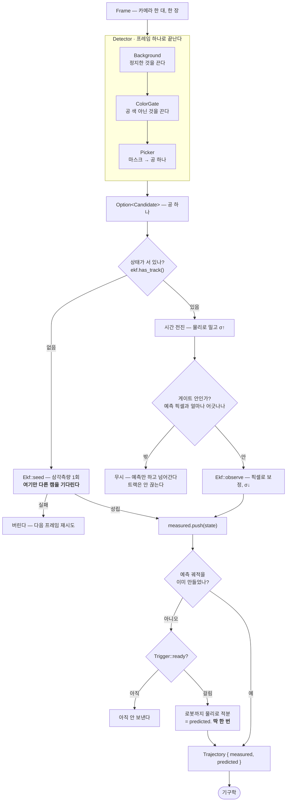

# Better Vision

> detector → estimator를 **지우고 다시 짠다.** 이 문서가 SSOT다.
>
> 담당: 비전(detector→estimator). 하드웨어·기구학은 별도 담당.

---

## 0. 프레임 한 장 → `Trajectory`



읽는 법:

- **`HAS`가 갈리는 이유:** 예측을 카메라로 투영하려면 상태가 이미 있어야 한다. 맨 처음엔
  없으므로 `SEED`가 만들어 준다.
- **`BG`가 떨어진 공을 죽인다.** 바닥에 떨어진 공은 색·모양·크기가 진짜와 **완전히 같아서**
  색으로도 원형도로도 못 가른다. 갈리는 건 **정지해 있다**는 것뿐이고, 배경 차분이 그걸 본다.
- **`Picker`가 팔을 죽인다.** 캘리브에서 나온 기대 반지름과 비교한다 — 지금처럼 "가장 큰 것"을
  고르면 팔이 공을 이긴다.
- **`PICK`은 선택이 아니라 게이트다.** 검출이 한 프레임 튀어도 트랙이 안 끊기게 무시할 뿐.
- **`SEED`만 다른 캠을 기다린다.** 추적이 시작되면 `UPD`는 프레임이 오는 대로 돈다.
- **`ROLL`은 한 번만 지난다.** 이후 프레임은 바로 `OUT`으로 간다 — `measured`만 자라고
  `predicted`는 처음 만든 그대로다.

---

## 1. 계약이 먼저다

비전이 기구학에 넘기는 것은 **7차원 상태의 궤적 두 개**다. 궤적이므로 시퀀스 축이 하나 더
붙어 8차원이다.

**둘은 이어지지 않는다. 겹친다.**

```text
measured   ●─●─●─●─●─●─●─●─●   공 시작 → 로봇
predicted        ╭─────────○   트리거 → 로봇
                 ↑ 예측 시작 기준 (지금은 네트 통과)
```

겹치는 구간의 **벌어짐이 그대로 예측 오차**다. 이어 붙여 놨으면 비교할 게 없다.

```rust
/// 한 시점의 공 상태.
#[derive(Clone, Copy, Debug)]
pub struct State {
    /// [`Trajectory::origin`] 기준 경과. 벽시계는 `origin + t`.
    pub t: Duration,
    pub position: Point3,
    pub velocity: Vector3,
    /// 축별 1σ [m] · [m/s]. **스칼라로 뭉치지 않는다** — §2.2.
    pub sigma_position: Vector3,
    pub sigma_velocity: Vector3,
    /// 각속도 [rad/s]. Stage 6 전까지 `None`.
    pub spin: Option<Vector3>,
}

/// 비전이 기구학에 넘기는 **유일한** 타입.
#[derive(Clone, Debug)]
pub struct Trajectory {
    /// 샷 일련번호 — "같은 공인가"의 근거.
    pub seq: u64,
    /// `t = 0`의 벽시계.
    pub origin: Instant,
    /// 관측 궤적 — 공 시작부터. 검출이 실패한 프레임엔 점이 없다.
    pub measured: Vec<State>,
    /// 예측 궤적 — 트리거부터 로봇까지. **트리거 순간에 한 번 만들고 고정**한다.
    pub predicted: Vec<State>,
}

impl Trajectory {
    /// 둘 다 **`predicted`를 본다.** 범위 밖이면 `None`.
    ///
    /// 시간으로 묻기 — 선형 보간.
    pub fn at_time(&self, t: Duration) -> Option<State>;

    /// 공간으로 묻기 — `y` 평면을 로봇 쪽으로 지나는 첫 상태. 타점 후보다.
    pub fn at_plane(&self, y: f64) -> Option<State>;
}
```

### 예측은 한 번만 굴린다

트리거가 걸리면 그 순간의 상태에서 로봇까지 물리로 적분해 궤적을 만들고 **거기서 고정**한다.
매 프레임 다시 만들지 않는다 —
하드웨어가 스윙 궤적을 짜기 시작하면 도중에 못 바꾸므로 갱신분은 버려진다.

그래서 **트리거가 이 설계의 유일한 손잡이다.**

| 트리거 | 대가 |
| --- | --- |
| 이르다 | 필터가 아직 확신 못 함 → §2.2의 15 cm |
| 늦다 | 하드웨어에 남는 시간이 준다 |

어디가 최적인지는 추측할 게 아니라 재야 한다. 그래서 갈아끼울 수 있게 둔다.

#### 트레잇

```rust
/// 예측 궤적을 만들어도 되는 순간인가.
///
/// 구현이 각자 자기 파일에 산다 — 새 기준을 끼울 때 중앙 enum과 match를 안 건드린다.
/// 기준을 바꿔가며 재는 게 이 프로젝트의 주 실험이라 그 마찰이 없는 편이 낫다.
///
/// **레벨 조건이다 — 엣지가 아니다.** "지금 조건이 만족되는가"만 답하고, 처음 참이 된
/// 순간을 잡아 **한 번만** 발동시키는 건 [`Ekf`]가 한다 (위 세 줄이 전부다). 그래야 [`All`]·[`Any`]로 조합이
/// 된다 (엣지끼리는 동시에 안 걸려서 `All`이 영영 참이 안 될 수 있다).
pub trait Trigger: Send {
    /// 스윕 결과표 라벨. 짧게.
    fn name(&self) -> &'static str;

    /// 지금까지의 관측 궤적으로 판단한다.
    ///
    /// 궤적을 통째로 받는 이유는 [`FirstBounce`]처럼 **이력이 있어야 아는** 조건이 있기
    /// 때문이다. 나머지는 `measured.last()`만 본다.
    fn ready(&self, measured: &[State]) -> bool;
}
```

#### 구현

```rust
/// `y` 평면을 **로봇 쪽으로** 지났다 (네트 = `LENGTH_Y / 2`). 지금 기준.
///
/// `velocity.y < 0`을 같이 보는 이유: 없으면 로봇 뒤로 지나간 공이나 되돌아가는 공에도
/// 참이 된다.
pub struct PlaneCrossing { pub y: f64 }

/// 필터가 충분히 좁혔다. **축별로 전부** 넘어야 한다.
///
/// 스칼라 하나로 재면 잘 관측되는 y축이 값을 지배해서, x축 속도가 아직 쓰레기인 채로
/// 통과한다. 그게 15 cm였다 (§2.2).
pub struct SigmaThreshold { pub position: Vector3, pub velocity: Vector3 }

/// 첫 바운스가 지났다 — `vz` 부호가 한 번이라도 뒤집혔는가.
/// 미지수를 하나 없애 주지만 늦다.
pub struct FirstBounce;

/// 전부 만족할 때.
pub struct All(pub Vec<Box<dyn Trigger>>);
/// 하나라도 만족할 때.
pub struct Any(pub Vec<Box<dyn Trigger>>);
```

#### 실전에서 쓸 건 `Any`

```rust
// σ가 좁아지면 바로 만들고, 안 좁아져도 네트에서는 무조건 만든다.
Any(vec![
    Box::new(SigmaThreshold { position: .., velocity: .. }),
    Box::new(PlaneCrossing { y: table::LENGTH_Y * 0.5 }),
])
```

앞의 조건이 **빠르면 빠르게**, 뒤의 조건이 **늦어도 반드시**를 보장한다. 하나만 쓰면
둘 중 하나를 포기해야 한다.

#### `Ekf`가 발동시키는 자리

```rust
// Ekf::observe 안, 관측을 하나 받아들인 직후
self.measured.push(state);

if self.predicted.is_empty() && self.trigger.ready(&self.measured) {
    self.predicted = self.integrate_to_robot(t);   // 딱 한 번
}
```

한 번 채워지면 다시 안 묻는다 — 그게 "한 번만"이다. 이후 관측은 `measured`에만 쌓이고
`predicted`는 그대로다.

#### 어느 트리거가 맞는지는 재서 정한다

`clip-review`가 `MISS`를 cm로 내주므로 스윕이 그대로 표가 된다.

| 트리거 | 발동 시각 | 하드웨어에 남는 시간 | `MISS` |
| --- | --- | --- | --- |
| `plane` (현행) | 네트 | | 15.1 cm (fly_04) |
| `sigma` | ? | | ? |
| `bounce` | ? | | ? |
| `any(sigma, plane)` | ? | | ? |

어느 트리거였는지는 **계약에 안 싣는다.** 기구학은 알 필요가 없고, 스윕을 도는 쪽은
자기가 트리거를 설정했으니 이미 안다 — [`Trigger::name`]은 그쪽 표의 라벨용이다.

**이 계약에서 나머지가 전부 따라 나온다.**

| 계약이 요구하는 것 | 그래서 설계가 이렇게 된다 |
| --- | --- |
| 모든 샘플이 `v`를 갖는다 | 필터가 위치·속도 전체 상태를 들고 있어야 한다 → §4 EKF |
| `measured`가 촘촘해야 쓸모 있다 | 프레임을 버리면 안 된다 → 픽셀 공간 갱신 |
| `predicted`가 끝까지 간다 | 접수 평면 개념이 비전에 없다 → `InterceptWindow` 의존 삭제 |
| 예측을 한 번만 굴린다 | 트리거를 갈아끼울 수 있어야 한다 → [`Trigger`] |
| `origin`이 정직해야 한다 | 셔터 시각 보정 → §6 Stage 5 |
| 커밋 판단이 기구학으로 갔다 | **판단 근거를 같이 줘야 한다** → 축별 σ |
| 리턴 스트로크가 입사 스핀을 쓴다 | 스핀 자리를 지금 판다 → `spin: Option<Vector3>` |

**비전이 모르는 것:** 로봇 도달 범위, 접수 평면, IK 가능 여부, 라켓. "어디를 칠까"와
"닿는가"는 전부 기구학 쪽이다. 비전이 내리는 판단은 **"믿을 만한 트랙이 있는가"** 하나뿐이다.

> 기구학 담당과 합의 완료. 그쪽이 알아서 구현한다.

---

## 2. 왜 지우고 다시 짜는가

실기에서 셋이 무너졌다 — **검출 튐**, **예측 타점 오차**, **레이턴시 부족**.

코드 문제만이 아니다. AI가 다 쓰면서 길고 장황해졌고, 3명이 컨텍스트를 공유하지 못한 채
각자 다른 그림을 들고 일했다. **성공 기준은 둘이다: 지표가 오르는 것, 그리고 코드가
줄어드는 것.** 기능을 더하는 방향이면 같은 문제가 반복된다.

지금 `src/detector` 2,448줄 + `src/estimator` 2,758줄이다. 새 구조는 **그보다 작아야 한다.**

### 2.1 색이 1차 판별기인 게 근본 오류

실제 적을 늘어놓으면 즉시 보인다.

| 적 | 색으로 갈리나 | 실제로 갈리는 근거 |
| --- | --- | --- |
| **바닥에 떨어진 공** | ❌ 진짜 탁구공. 색·모양·크기 동일 | **정지해 있음** |
| **피부(팔·손)** | ❌ 주황 색상역과 겹침 | 크기가 기대 반지름 대비 과대 + 스테레오 부정합 |
| **벽면·바닥** | ❌ 태양광에 따라 겹침 | **정지해 있음** |
| **태양광 변동** | ❌ 정적 색 상자가 원리상 붕괴 | 배경 모델이 조명과 함께 표류 |

**넷 중 색으로 갈리는 게 하나도 없다.** 측정된 귀결 — 색 하한을 25 풀면 비행 밖 오검출이
**5 → 382**로 폭발한다(`9006677`). 상자를 아무리 정교하게 깎아도(타원체든 커스텀 공간이든)
배경에 같은 색이 있으면 진다.

### 2.2 `clip-review`가 잡아낸 것 (fly_04, 실측)

```
COMMIT  frame 394 t=5.351s  tti 0.42s  sigma 12cm
  at y=0.08  pred x+0.68 z+1.02   real x+0.53 z+1.05   MISS 15.1cm
```

**오차 15 cm 중 z는 3 cm, x가 15 cm다.** 실제 x 궤적:

```
0.73 0.73 0.72 0.71 0.69 0.73 0.73 0.72 0.71 0.66 0.65 0.70 0.69 0.68 0.68 0.67 0.67 0.66
```

0.23 s에 0.73 → 0.66, 즉 **vx ≈ −0.3 m/s로 꾸준히 흐른다.** 그런데 커밋 예측의 x는 0.68에
멈춰 있다 — vx를 0으로 봤다.

못 잡는 이유: 커밋(f394)은 첫 검출(f385) **9프레임 뒤**다. 그 0.12 s 동안 x의 진짜 이동은
3.6 cm인데 **측정 노이즈가 ±2 cm**라 신호가 노이즈에 묻힌다.

**게이트가 이걸 못 거른다.** `impact_sigma`는 스칼라 하나(12 cm < 15 cm 통과)인데 그 값은
잘 관측되는 y축이 지배한다. x축 속도가 아직 쓰레기여도 통과한다. → **축별로 봐야 한다.**

그리고 **프레임 중복**: 연속 프레임에서 두 캠 검출 픽셀이 완전히 같은 경우가 **116/201
(58%)**. 공이 프레임당 ~20 px 움직이니 반올림 탓이 아니다. `meas_fps` 73.6은 부풀려진
값이고 실제 고유 샘플은 그 절반일 수 있다. 원인 미확정 — Stage 1에서 확인한다.

---

## 3. 지우는 것 / 남기는 것

**전부 지운다. 단 물리 커널은 건드리지 않는다.**

| 대상 | 처분 | 이유 |
| --- | --- | --- |
| `src/detector/` 전체 (2,448줄) | 🗑 삭제 | §4로 새로 |
| `src/estimator/ekf.rs` (601) | 🗑 삭제 | 3D 관측 모델 자체가 틀렸다 |
| `src/estimator/decision.rs` (272) | 🗑 삭제 | 커밋 판단이 기구학으로 넘어갔다 |
| `src/estimator/triangulate.rs` + `tri/` (392) | ✂️ 축소 | **N-view DLT 하나만** 남긴다 (시드용). 지금은 2-view일 때 OpenCV `triangulate_points`로 빠지는 특수 분기가 따로 있는데, 실패하면 어차피 같은 DLT로 폴백한다 — 분기를 지우면 코드가 줄고 3대 이상이 공짜로 된다. `Calibration::min_cameras_for_triangulation()`의 하드코딩 `2`도 같이 푼다 |
| `src/estimator/prediction.rs`, `estimator.rs`, `hit_plane.rs`, `snapshot.rs` | 🗑 삭제 | 계약이 `Trajectory`로 대체 |
| `src/real/estimator_worker.rs` | 🗑 삭제 | `fuse`/skew/보간 전부 소멸 |
| ~~`src/pipeline/`~~ | ✅ **삭제됨** (352줄) | 소비자 0개였다 |
| **`ballistics.rs`·`bounce.rs`·`kinematics.rs`** (540) | ✅ **유지** | ⚠️ **sim이 6곳에서 쓰고 회귀 테스트가 핀으로 박아뒀다** (`tests/bounce_kernel_matches_sim.rs`). 건드리면 sim이 깨진다 |
| `impact.rs`·`measure/` | ✅ 유지 | 리턴 파워·물리 측정 — 비전 범위 밖 |

---

## 4. 새 틀

### 4.0 한눈에

**층이 셋, 계약이 하나다.** 나머지는 그 안에서 자기 일만 한다.

```text
              ┌──────────────────────────────────────────────┐
   Frame ────▶│ 검출   픽셀을 줄여 공 하나를 낸다             │────▶ Candidate
              └──────────────────────────────────────────────┘
              ┌──────────────────────────────────────────────┐
              │ 추정   후보를 골라 상태를 갱신한다            │────▶ State
              └──────────────────────────────────────────────┘
              ┌──────────────────────────────────────────────┐
              │ 계약   상태를 궤적으로 묶어 내보낸다          │────▶ Trajectory
              └──────────────────────────────────────────────┘
```

**소유 관계** — 위가 아래를 든다. 곁가지가 없다.

```text
Vision                          단일 진입점. feed(frame) -> Option<Trajectory>
├── cameras: Vec<Camera>        캠 수는 캘리브가 정한다
│   └── Camera                  id + params + detector. 자기 캘리브를 자기가 든다
│       └── Detector            layers를 순서대로 돌리고 후보를 뽑는다
│           ├── layers: Vec<Box<dyn Layer>>
│           │   ├── Background  정지한 것을 끈다
│           │   └── ColorGate   공 색이 아닌 것을 끈다
│           └── picker: Picker   마스크 → 공 하나  (종단, Layer 아님)
└── ekf: Ekf                   상태 [p,v] + 공분산 + 페이즈 + 이력
```

**타입 전부** — 이게 다다.

| 타입 | 층 | 한 줄 |
| --- | --- | --- |
| `State` | 계약 | `[x y z vx vy vz t]` 한 점 + 축별 σ + 스핀 자리 |
| `Trajectory` | 계약 | `measured` + `predicted` (겹친다). **밖으로 나가는 유일한 타입** |
| `Trigger` | 계약 | **트레잇.** 예측을 언제 굴릴지. 이 설계의 유일한 손잡이 |
| `Vision` | 조립 | 진입점. 프레임 넣으면 계약이 나온다 |
| `Camera` | 조립 | id + params + detector |
| `Candidate` | 검출 | 한 프레임에서 잰 것 (픽셀·반지름·원형도) |
| `Layer` | 검출 | **트레잇.** 마스크를 줄인다. 순서 교체·추가가 자유 |
| `Background` | 검출 | `Layer` — 정지한 것 |
| `ColorGate` | 검출 | `Layer` — 색 판별면 |
| `Picker` | 검출 | 종단. 마스크 → 공 하나 |
| `Detector` | 검출 | 위 넷을 조립 |
| `Ekf` | 추정 | 상태·공분산·이력. 시드·보정·트리거·폐기. 공개 메서드 4개 |
| `Outcome` | 추정 | 이번 관측을 받았나 (`Accepted`/`Rejected`/`Seeded`) |
| `Trace` | 툴 | **본선은 안 만든다.** 단계별 마스크 + 그 프레임 판정 |

읽는 순서: **`Trajectory`(§1) → `Vision`(§4.1) → `Layer`(§4.2) → `Ekf`(§4.3).**
나머지는 그 넷에 딸린 것이라 필요할 때 보면 된다.

```
src/vision/
  mod.rs           Vision · Camera — 단일 진입점
  contract.rs      State · Trajectory                     ← §1, 밖으로 나가는 유일한 타입
  trigger.rs       Trigger 트레잇 + 구현
  detect/
    mod.rs         Layer 트레잇 · Detector — 캐스케이드 조립
    background.rs  Background : Layer — 정지한 것을 지운다
    color.rs       ColorGate  : Layer — 포함·제외로 피팅한 판별면
    pick.rs        Picker — 종단, 마스크 → Candidate
  ekf.rs           Ekf — 예측 · 보정 · 페이즈 · 폐기
  seed.rs          추적 전 상태 세우기
  trace.rs         Trace — 툴 전용 단계별 산출물
```

### 4.1 단일 진입점

```rust
/// 카메라 하나 — 자기 캘리브와 자기 검출기를 자기가 든다.
pub struct Camera {
    pub id: camera::Id,
    pub params: camera::Params,
    detector: Detector,
}

/// 프레임을 먹이면 계약이 나온다. 이게 비전의 전부다.
pub struct Vision {
    /// **개수는 캘리브레이션 파일이 정한다** — 코드는 2대인지 3대인지 모른다.
    cameras: Vec<Camera>,
    ekf: Ekf,
}

impl Vision {
    /// 캘리브를 카메라들에게 나눠 주고 끝 — `Vision`은 그걸 들고 있지 않는다.
    pub fn load(calibration: Calibration, color: &Path) -> Result<Self>;

    /// 프레임 하나. 선언된 트랙이 있으면 그 순간의 계약을 돌려준다.
    ///
    /// **프레임은 경계를 넘지 않는다** — 이미지는 여기서 끝나고 밖으로는 숫자만 나간다.
    pub fn feed(&mut self, frame: &Frame) -> Option<Trajectory>;

    /// 툴 전용. 본선 경로는 [`Trace`]를 **만들지 않는다** (비용 0).
    pub fn feed_traced(&mut self, frame: &Frame) -> (Option<Trajectory>, Trace);
}
```

### 4.2 검출 — 색을 후보 생성기로 강등

```rust
/// 한 프레임에서 **잰 것**. 판정 결과가 아니라 측정값이다.
///
/// 점수를 필드로 안 든다 — 점수는 기대 반지름(깊이에 따라 변한다)이 있어야 나오므로
/// 후보 혼자서는 못 낸다. 들고 있으면 원본과 어긋날 수도 있다.
/// [`Picker::deviation`]이 필요할 때 계산한다.
#[derive(Clone, Copy, Debug)]
pub struct Candidate {
    pub pixel: Pixel,
    pub radius_px: f64,
    pub circularity: f64,
}

/// 캐스케이드의 한 단계. **모든 단계가 같은 일을 한다 — 켜진 픽셀을 끈다.**
///
/// 구현이 각자 자기 파일에 산다 — 새 단계를 끼울 때 중앙을 안 건드린다.
///
/// # 불변식 — 줄이기만 한다
///
/// 늘리면 뒤 단계의 비용 가정("앞에서 이미 대부분 껐다")이 깨지고, 순서를 바꿀 수 있다는
/// 성질도 함께 무너진다.
pub trait Layer: Send {
    /// 패널 제목·스윕 라벨. 짧게. `detect-full`이 이걸로 패널을 그린다.
    fn name(&self) -> &'static str;

    /// `mask`를 줄인다.
    fn narrow(&mut self, frame: &Frame, mask: &mut Mask);
}

pub struct Detector {
    /// **순서 = 실행 순서.** 싸고 잘 거르는 것부터 꽂는다.
    layers: Vec<Box<dyn Layer>>,
    /// 종단 — 마스크를 후보로. 하는 일이 달라서 [`Layer`]가 아니다.
    picker: Picker,
    /// 프레임마다 재할당하지 않는다 — 지금 구조가 느린 주범이었다.
    scratch: Scratch,
}

impl Detector {
    /// 가장 공 같은 것 하나. `None` = 못 찾음.
    pub fn detect(&mut self, frame: &Frame) -> Option<Candidate>;
}
```

기본 조립 — 싸고 잘 거르는 것부터:

```rust
Detector::new(
    vec![
        Box::new(Background::new()),   // 정지한 것 + 태양광 적응. 다운스케일 2×
        Box::new(ColorGate::fit(..)),  // 움직이는 것 중 공 색만. 남은 픽셀에만
    ],
    Picker::from_calib(&params),       // 기대 반지름 최근접 → 공 하나
)
```

순서 변경·단계 제거가 이 `vec!` 한 줄이라 메소드 비교가 스윕으로 돈다.

#### `Background` — 두 문제를 동시에 푼다

```rust
/// 최근 N프레임 동안 안 변한 픽셀은 배경이다.
///
/// 떨어진 공·벽·바닥이 여기서 죽는다. 모델이 조명과 함께 표류하므로 태양광 변동도 같이
/// 흡수한다. 카메라가 흔들리면 무너지지만 그건 캘리브도 같이 무너지는 상황이다.
pub struct Background { /* 다운스케일 러닝 모델 */ }

impl Layer for Background {
    fn name(&self) -> &'static str { "background" }
    fn narrow(&mut self, frame: &Frame, mask: &mut Mask);
}
```

#### `ColorGate` — 상자가 아니라 판별면

```rust
/// 포함·제외 샘플에서 피팅한 1차원 투영. `w · bgr + b > 0`.
///
/// 곱셈 3 + 덧셈 2라 `cvtColor`보다 싸다. 축을 손으로 고르지 않고 데이터가 정한다.
pub struct ColorGate { w: [f64; 3], b: f64 }

impl ColorGate {
    /// `tune-colormask`가 만든 포함/제외 샘플로 피팅.
    pub fn fit(positive: &[[u8; 3]], negative: &[[u8; 3]]) -> Self;
}

impl Layer for ColorGate {
    fn name(&self) -> &'static str { "color" }
    fn narrow(&mut self, frame: &Frame, mask: &mut Mask);
}
```

선형으로 안 갈리면 그때 타원체(Mahalanobis)로 올린다. **숫자가 요구할 때만** — 아니면 코드만 는다.

#### `Picker` — 기대 반지름에 가장 가까운 것

```rust
/// 캘리브에서 나온 **기대 반지름과의 편차**로 줄을 세운다.
///
/// 지금은 `area · circularity` 최대를 고른다 — 그래서 팔이 공을 이겼다. "가장 큰 것"이
/// 아니라 "기대한 크기에 가장 가까운 것"이어야 한다.
pub struct Picker {
    /// 캘리브에서 나온 반지름 밴드 [px] — 하드 컷.
    min_radius_px: f64,
    max_radius_px: f64,
    /// 원형도 하한 — 느슨하게. 아래 참조.
    min_circularity: f64,
}

impl Picker {
    /// 기대 반지름과의 **상대 편차**. 0이면 정확, 1이면 두 배(또는 0).
    ///
    /// 가중합이 아니라 이 한 값으로 줄을 세운다 — 가중치를 정할 근거가 없고, 이 저장소는
    /// 같은 이유로 가중합을 한 번 기각했다 (`candidate_score`).
    pub fn deviation(&self, c: &Candidate, expect: f64) -> f64 {
        return (c.radius_px - expect).abs() / expect;
    }

    /// 밴드·원형도 하한을 통과한 것 중 [`Self::deviation`]이 가장 작은 것.
    ///
    /// `expect`는 트랙이 있으면 그 깊이의 기대 반지름, 없으면 밴드 중앙.
    pub fn pick(&self, mask: &Mask, expect: Option<f64>) -> Option<Candidate>;
}
```

**원형도는 줄 세우기에 안 쓴다.** 빠른 공은 모션 블러로 타원이 되고, 그래서 지금
`min_circularity`가 0.55 → 0.35로 내려가 있다. 원형도로 순위를 매기면 **빠른 공일수록
진다** — 정작 잡아야 할 공이 진다. 느슨한 하한으로 걸러내기만 한다.

### 4.3 추정 — 필터가 픽셀을 직접 먹는다

검출은 **프레임 하나**를 보고 끝난다. 추정은 **프레임 사이를 잇는** 일이라 하는 일이 다르다.

#### 무엇을 푸는가

검출이 주는 건 프레임마다 픽셀 하나다. 필요한 건 월드 좌표의 `[x y z vx vy vz]`이고,
답해야 할 질문이 둘이다.

1. **속도는 어떻게 아는가** — 아무도 속도를 측정하지 않는다. 위치 변화에서 나온다
2. **튄 값을 어떻게 버리는가** — 검출이 한 프레임 엉뚱한 걸 물어도 트랙이 안 끊겨야 한다

그래서 **한 상태를 계속 들고 가며 프레임마다 조금씩 고친다.**

#### 한 프레임에 무슨 일이 일어나는가

fly_04 실제 숫자로 따라가 본다. cam0 프레임이 하나 도착했다.

```text
① 지금 믿는 상태 (13 ms 전에 갱신됨)
      p = (+0.71, +1.47, +1.06)   v = (-0.3, -4.2, +0.5)

② predict(13 ms) — 물리로 밀고, 불확실성은 커진다
      p = (+0.71, +1.41, +1.06)   σ_p 1.8 → 1.9 cm

③ update(pixel) — 검출 픽셀 (692, 254)로 보정한다
      상태를 cam0으로 투영하면 (689, 258) → 어긋남 4.9 px
      야코비안으로 "픽셀 4.9 px = 상태 얼마"를 환산해 보정
      p = (+0.71, +1.42, +1.06)   σ_p 1.9 → 1.8 cm

      어긋남이 게이트 밖이면(검출이 튀었다) 그 프레임은 **무시**한다.
      트랙은 안 끊는다 — 다음 정상 관측에서 이어붙는다.

④ measured 에 쌓고, 트리거를 물어보고, 버릴지 판단한다
```

#### `Ekf`

밖으로 내놓는 건 **네 개**뿐이다. 나머지는 안에서 알아서 한다.

```rust
/// 상태 `[p, v]` 6차원. 관측은 **픽셀 2차원**이다.
pub struct Ekf { /* 상태·공분산·페이즈·이력·트리거 */ }

pub enum Outcome { Accepted, Rejected { d2: f64 }, Seeded }

impl Ekf {
    /// 상태가 서 있나. `false`면 [`Self::seed`]부터.
    pub fn has_track(&self) -> bool;

    /// 첫 상태를 세운다 — **삼각측량 1회.**
    ///
    /// 보정을 하려면 "공이 어디 보여야 하는지"를 알아야 하는데 맨 처음엔 상태가 없다.
    /// 그래서 딱 한 번, 두 캠 이상의 검출을 삼각측량해 시작점을 만든다. 지금 코드가
    /// 매 프레임 하던 일을 **한 번만** 하는 것이다.
    pub fn seed(&mut self, views: &[(&Camera, Candidate)], t: Duration) -> bool;

    /// 검출 하나로 보정한다. **다른 캠을 안 기다린다.**
    ///
    /// 예측 대비 어긋남이 게이트 밖이면 무시한다 (트랙은 안 끊는다).
    pub fn observe(&mut self, cam: &Camera, found: Candidate, t: Duration) -> Outcome;

    /// 지금 계약. 트리거 전이면 `None`.
    ///
    /// `predicted`는 처음 만든 것을 그대로 주고 `measured`만 자란다 — 매번 부르면 같은 예측에
    /// 관측이 하나씩 붙은 걸 받는다. 그게 소비자가 수렴을 확인하는 방법이다.
    pub fn trajectory(&self) -> Option<Trajectory>;
}
```

##### 안에서 알아서 하는 것 셋

밖에서 부를 일이 없어서 감춘다.

| 감춘 것 | 왜 필요한가 | 언제 도나 |
| --- | --- | --- |
| **이미 만들었나** | 예측은 한 샷에 한 번뿐이라 *만들었는지* 알아야 한다. `predicted.is_empty()`가 곧 그 답이라 따로 필드를 안 둔다 | 항상 |
| **`Trigger::ready`** | "언제 만들까"의 기준. 갈아끼우는 게 요점이라 트레잇 | 관측마다 한 번 |
| **로봇까지 적분** | 그게 `predicted`다. 트리거 순간의 상태에서 시작 | **딱 한 번** |

`observe` 안에서 이 순서로 돈다:

```rust
// 1. 시간 전진 + 픽셀로 보정 (게이트 밖이면 여기서 끝)
// 2. measured.push(state)
// 3. predicted 가 비었고 trigger.ready(&measured) 면
//       predicted = 물리로 로봇까지 적분          ← 여기서 딱 한 번
//       이후로는 비지 않으니 다시 안 묻는다
// 4. 버릴 조건에 걸리면 상태를 비우고 seq++
```

**트랙을 버리는 조건.** 하나라도 걸리면 상태를 비우고 `seq`가 하나 오른다.

| 조건 | 뜻 |
| --- | --- |
| 연속 거부 한도 초과 | 필터가 틀렸다 — 예측이 관측과 계속 안 맞는다 |
| 관측 공백 (stale) | 공을 잃었다 |
| `y`가 다시 증가 | 공이 멀어진다 — 다음 샷이다 |
| 플레이 부피 이탈 | 끝났다 |

`update`의 야코비안은 핀홀 투영의 미분(2×6), `R = σ_px² · I₂`다. `σ_px`는 실측 가능한 픽셀
노이즈(~1 px)라 모델 오차가 R이 아니라 Q로 간다. 적분에 쓰는 물리는 `estimator::Kinematics`
SSOT를 그대로 쓴다.

#### 시드가 카메라 수에 안 묶이게

```rust
/// 카메라 조합에서 물리적으로 말 되는 것 하나를 찾는다.
///
/// **카메라 수에 의존하지 않는다.** 모든 쌍을 삼각측량해 물리 게이트(비행 부피 안,
/// 속도 범위 안)를 태우고, 살아남은 것마다 *나머지 카메라 중 재투영이 맞는 개수*를 세서
/// 가장 많이 동의하는 것을 고른다. 2대면 쌍이 전부고, 3대면 셋째 캠이 표를 하나 더 준다.
///
/// **나쁜 시드보다 늦은 시드가 낫다.** 실패하면 조용히 다음 프레임에 재시도한다.
fn seed_state(views: &[(&camera::Params, Candidate)]) -> Option<State>;
```

#### 후속 — 후보가 여럿 남으면 (숫자가 요구할 때만)

배경 차분이 정지한 것을 앞단에서 지우므로 프레임당 후보는 대개 하나다. 그러면 고를 일이
없다.

여럿 남는 게 잦으면 그때 **픽셀 공간 마할라노비스 연관**을 붙인다 — 예측을 그 카메라로
투영하고, `S = H P Hᵀ + R`로 정규화한 거리 `d²`가 가장 작은 것을 고른다. 게이트가 σ에 따라
스스로 넓어지고 좁아져서 고정 픽셀 반경으로는 못 하는 일을 한다.

**먼저 재고 나서 정한다.** `detect-full`이 [`Trace::candidates`]로 프레임당 몇 개가
살아남는지 보여 준다. 대부분 1개면 이 항목은 영영 안 한다.

#### 카메라 대수는 설정이지 구조가 아니다

이 설계는 **N대에 무관하다.** 3대로 늘리는 게 재작성이 아니라 캘리브레이션 파일 한 줄이
되도록 처음부터 그렇게 짠다.

| | 카메라가 늘면 |
| --- | --- |
| `Vision::feed` | 프레임이 오는 대로 처리한다. 캠 수를 아예 모른다 |
| `Ekf::observe` | **바뀔 게 없다.** 관측 하나 = 픽셀 하나. 3대면 갱신이 1.5배 |
| `seed` | 조합이 늘고 표가 늘어 시드가 더 튼튼해진다 |
| N-view DLT | 시선이 늘수록 조건수가 좋아진다 |

지금 구조가 2대에 묶여 있던 건 **삼각측량-후-필터**였기 때문이다. 두 캠이 같은 순간에 같은
것을 잡아야만 한 번 갱신됐고, 그래서 캠이 늘어도 "짝 맞추기"만 더 어려워졌다. 픽셀 공간에서는
카메라가 서로를 기다리지 않으므로 **한 대 추가 = 측정 소스 하나 추가**, 그게 전부다.

#### 시드만 다른 캠을 기다린다

**갱신은 안 기다린다** — 관측 하나가 픽셀 하나라 프레임이 오는 대로 `Ekf`에 들어간다.
그런데 **시드는 최소 두 시선이 필요하다.** 프레임은 한 대씩 오므로 [`Vision`]이 카메라별
최근 후보를 짧은 TTL로 들고 있다가 [`Ekf::seed`]에 넘긴다.

```rust
impl Vision {
    pub fn feed(&mut self, frame: &Frame) -> Option<Trajectory> {
        let t = self.elapsed(frame.timestamp);
        let cam = self.camera_mut(frame.camera_id)?;
        let found = cam.detector.detect(frame);

        match (self.ekf.has_track(), found) {
            // 시드 전에만 캠별 최근 검출을 모은다. 추적이 시작되면 이 버퍼는 안 쓴다.
            (false, Some(c)) => {
                self.pending.put(cam.id, c, t);
                self.ekf.seed(&self.pending.views(t), t);
            }
            (true, Some(c)) => {
                self.ekf.observe(cam, c, t);
            }
            (_, None) => {}
        }
        return self.ekf.trajectory();
    }
}
```

지금 구조와 다른 점은 **한 번만, 트랙이 없을 때만** 기다린다는 것이다. 지금은 매 프레임
짝을 맞추느라 `stale_skipped`가 220~610이었다.

| | 언제 | 왜 |
| --- | --- | --- |
| **추적 시작** | 시드가 성립하는 즉시 | 측정을 최대한 모은다 |
| **선언 (`Declared`)** | 네트 평면(`y = LENGTH_Y/2`)을 로봇 쪽으로 타당한 속도로 통과 | 계약의 기준점 |

**네트를 추적 시작으로 잡으면 안 된다.** 5 m/s 공이 네트에서 로봇까지 1.37 m를 가는 데
0.27 s뿐이라 필터가 속도를 수렴시킬 시간이 그것밖에 안 남는다. 계속 추적하다가 네트에서
선언하면 넘기는 순간엔 이미 속도가 잡혀 있다.

지금은 첫 삼각측량이 아무 때나 시드해서 오검출로도 트랙이 선다. 선언 기준이 그걸 막는다.

### 4.4 툴이 보는 것

```rust
/// 단계별 산출물 — `detect-full`·`clip-review` 전용.
///
/// 본선 경로(`Vision::feed`)는 이걸 **만들지 않는다.**
pub struct Trace {
    /// 단계마다 `(이름, 그 단계 직후 마스크)`. 툴이 단계를 하드코딩하지 않으므로
    /// 새 레이어를 꽂아도 뷰어를 안 고친다.
    pub stages: Vec<(&'static str, Mask)>,
    /// 살아남은 후보와 각자의 편차 — 몇 개가 남는지가 연관이 필요한지의 근거다.
    pub candidates: Vec<(Candidate, f64)>,
    pub chosen: Option<Candidate>,
    pub outcome: Outcome,
    pub sigma_position: Vector3,
    pub sigma_velocity: Vector3,
}
```

---

## 5. 검증 — 툴 두 개로만 한다

새 코드는 **[`detect-full`](../tools/detect_full/)과 [`clip-review`](../tools/clip_review/)를
통과해야 다음 단계로 간다.** 별도 하네스를 새로 만들지 않는다.

| 툴 | 무엇을 본다 | 어디를 잡는다 |
| --- | --- | --- |
| [`detect-full`](../tools/detect_full/README.md) | 단계별 패널 (`Trace`), 살아남은 후보, ms/frame | **검출** — 뭘 놓치고 뭘 잘못 무는가 |
| [`clip-review`](../tools/clip_review/README.md) | 측정 궤적 vs 예측 궤적, 0.1x 스크럽, 콘솔 프레임 로그 | **추정** — 예측이 실제로 수렴하는가 |

```bash
# 검출 — 캠 하나, 단계별 패널
cargo run --release -p detect-full -- --cam left --clip fly_04

# 추정 — 두 캠 + sim, 궤적 두 개 겹쳐 보기
cargo run --release -p clip-review -- --clip fly_04

# 물리 커널 회귀 (지우면 안 되는 것)
cargo test --release --test bounce_kernel_matches_sim

# 코드 줄 수 — 늘면 그 단계는 실패
tokei src/vision src/detector src/estimator
```

`clip-review`는 이미 실기와 **같은 커밋 게이트**를 태워 `MISS`를 cm로 낸다. 새 구조가
그 숫자를 낮추지 못하면 안 고쳐진 것이다.

> ⚠️ 새 구조로 갈아탈 때 두 툴의 어댑터를 같이 고쳐야 한다. 툴이 먼저 죽으면 눈이
> 없는 채로 개발하게 된다 — **툴을 먼저 새 타입에 맞춘 뒤** 본선을 바꾼다.

---

## 6. 단계

**규칙:** 한 단계 = 한 커밋. 커밋 본문에 측정표. 매 단계 줄 수를 §8에 기록한다.
**한 단계 끝나면 멈추고 실기 테스트를 요청한다** — 측정 없이 다음 레버로 넘어가면 무엇이
효과였는지 분리할 수 없다 (`2026-07-27-return-power.md`에서 확립).

| # | 단계 | 내용 | 완료 기준 |
| --- | --- | --- | --- |
| 0 | **baseline 박기** | 9개 클립을 `clip-review`로 돌려 `MISS`·검출률을 §8에 기록 | 표가 §8에 박힘 |
| — | ~~`src/vision/` 틀~~ | ✅ **완료** — 타입·시그니처. 순수 로직(계약 보간·트리거·편차)은 구현+테스트 17개, OpenCV 필요분은 `todo!()` | `cargo test --lib vision` |
| 1 | **캡처 정상화** | 모노/컬러 모순 확인, `request_short_exposure` 호출, **프레임 중복 원인 확정**, 실제 120 fps | `meas_fps`가 고유 프레임 수와 일치 |
| 2 | **`contract.rs` + 툴 어댑터** | `State`/`Trajectory` 먼저 만들고 두 툴을 여기에 맞춘다 | 툴이 새 타입으로 돈다 |
| 3 | **`detect/` 새로** | Background → ColorGate → Picker | `detect-full`에서 떨어진 공·팔이 죽는다 |
| 4 | **`track/` 새로** | 픽셀 EKF + 연관 + 생애주기 | `clip-review` `MISS` 감소, 측정 수 증가 |
| 5 | **레이턴시** | 셔터→계약 실측, `origin` 오프셋 보정 | 구간별 예산표 |
| 6 | **슈터 캘리브 + 스핀** | 눈금 → 실제 `v0`·`ω`. **ω를 아는 상태로 예측이 맞는지 먼저** 본 뒤 상태 확장 | 클립마다 진짜 GT |
| 7 | **카메라 재배치·증설** | 2대 유지가 기본. §4.3대로 짜 두면 3대는 캘리브 파일 변경이지 재작성이 아니다 | 격자점 조건수 지도로 배치 비교 |

**후순위:** 반발계수·마찰계수 위치별 정밀 계산 — 스핀보다 명백히 2차다.

### Stage 1 상세 (가장 먼저)

1. **모노/컬러 모순.** 데이터시트 상수는 OV9281을 **모노크롬 글로벌 셔터**라고 하는데
   `data/colormask.json`에는 명백히 유채색인 BGR 샘플 2,078개가 있다. 둘 중 하나가 틀렸다.
   실기에서 5분. **모노면 `ColorGate` 자체가 통째로 바뀐다 — 가장 먼저 확인한다.**
2. **프레임 중복 (58%).** AVI를 바이트 단위로 비교해 확정한다. 원인이 `record_stereo`의
   인덱스 짝짓기라면 거기서 고친다. 이게 안 고쳐지면 유효 샘플 수가 절반이라 뒤 단계가
   전부 헛돈다.
3. `request_short_exposure()`는 **아무도 호출하지 않는다.** 함수만 있다.
4. 실측 fps가 120에 못 미치면 해상도를 낮춘다 — `960×600`/`640×400` 프리셋이 이미 있다.
   **`meas_fps`만 믿는다** (드라이버 `CAP_PROP_FPS`는 거짓말한다).

---

## 7. 비범위

- 기구학·IK·로봇 제어 — 다른 담당
- 신경망 검출기 — GPU 없음
- 하드웨어 genlock — §4.3이 소프트웨어로 무력화한다 (카메라가 서로를 안 기다린다)
- 물리 커널(`ballistics`/`bounce`/`kinematics`) 변경 — sim과 공유 SSOT
- ChArUco 완전 캘리브레이션 — 현재 인트린식은 데이터시트 FOV 근사(`fx=fy=913.39`,
  `cx/cy` 중앙 고정, `dist=[]`)이고 cam0 rmse가 4.15 px로 cam1(1.35)의 3배다.
  Stage 4 후에도 cam0 잔차가 남으면 그때 최우선 후속

---

## 8. 측정 기록

> 단계마다 여기에 붙인다.

| 단계 | 날짜 | 측정 | 줄 수 | 결론 |
|---|---|---|---|---|
| baseline | 2026-08-01 | fly_04: 검출 44/589, `MISS` 15.1 cm (x축 15 / z축 3), 프레임 중복 58% | detector 2448 + estimator 2758 | Stage 0에서 9개 클립 전부 채울 것 |
