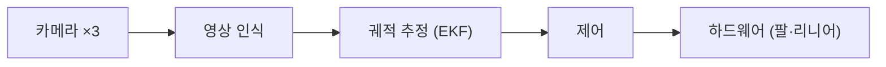
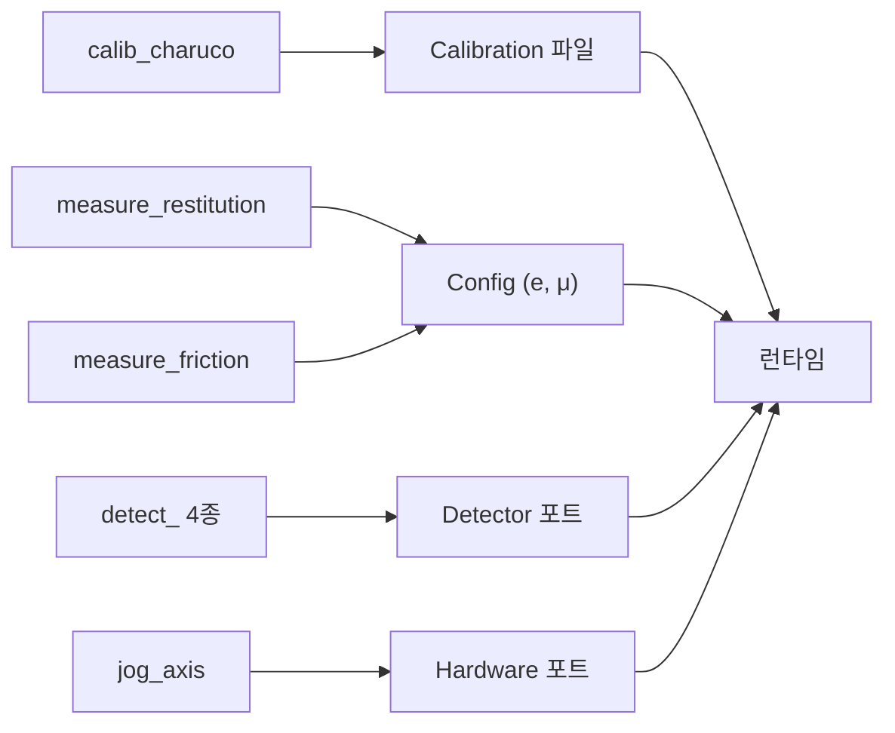
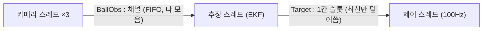
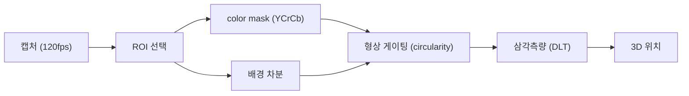
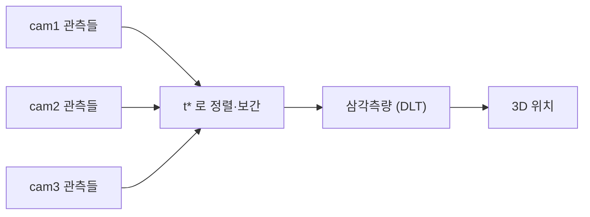
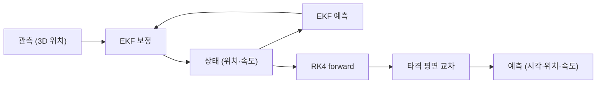
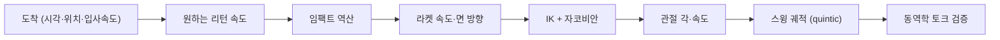
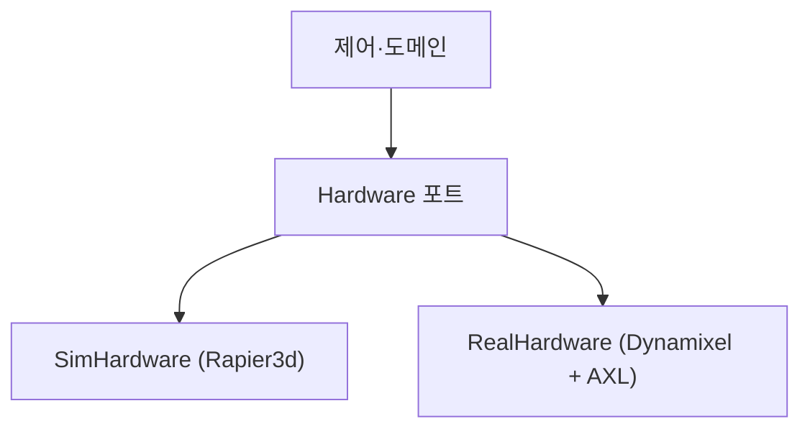
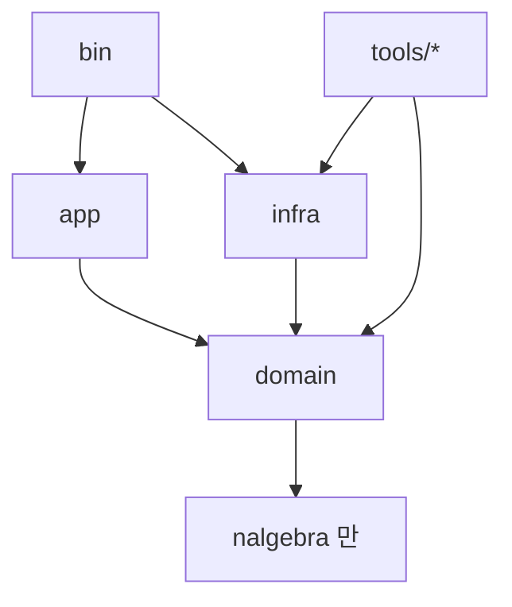

# 핑퐁 로봇 — 기술 마스터 플랜

> **트랙** GIST Robot AX 경진 · 트랙 1 · 팀 *Love all*
> **스택** Rust · OpenCV(인프라 한정) · Rapier3d · Rerun
> **목적** 사람과 최대한 오래 랠리를 이어간다 — 경쟁이 아니라 협력.

목표는 이기는 것이 아니라 **사람과 오래, 꾸준히 랠리를 주고받는 것**이다. 따라서 모든 결정은 일관성·신뢰성·지구력을 공격성·정밀 타격보다 우선한다. 구현은 직접 만들기보다 **검증된 라이브러리**(OpenCV, Rapier3d, Rerun, rustypot, nalgebra, ort)를 최대한 동원한다.

---

## 1. 목적과 성공지표

이 프로젝트의 목표는 **사람과 오래 협력 랠리를 이어가는 것**이다. 공을 받기 좋게 돌려주어 랠리를 길게 유지한다. 성공은 평균·최장 연속 랠리 길이, 리턴 성공률, 공을 놓친 뒤 다시 잡기까지의 시간, 긴 세션에서의 안정성(발열·드리프트)으로 잰다. 득점이나 공격적 배치는 목표가 아니다.

여기서 중요한 건, **한 번의 miss가 랠리를 끝낸다**는 점이다. 그래서 영리한 한 방보다 꾸준한 리턴이 중요하고, 변동성을 줄이는 것이 곧 성능이다. 덤으로, 낮은 페이스의 리턴은 모터가 쓰는 힘을 줄여 내구에도 유리하다.

---

## 2. 아키텍처



### 2.1 헥사고날 구조 (ports & adapters)

순수한 도메인 로직을 중심에 두고, 변하는 것(하드웨어·카메라·추정 방식·시각화)은 전부 **포트**(인터페이스, Rust에서는 trait) 뒤로 밀어낸다. 도메인은 OpenCV나 모터 SDK가 무엇인지 모른다. 모든 의존성은 코어를 향한다. 이렇게 하면 sim과 실물을 어댑터 교체만으로 바꿔 끼울 수 있고, 도메인은 하드웨어 없이도 테스트할 수 있다.

```rust
// 도메인이 정의하는 포트. infra가 이걸 구현한다.
pub trait Clock: Send { fn now(&self) -> Instant; }
pub trait CameraSource: Send { fn next(&mut self) -> Option<(CamId, FrameRef, Instant)>; }
pub trait Detector: Send { fn detect(&mut self, f: FrameRef, roi: Option<Roi>) -> Option<PixelPoint>; }
pub trait Estimator: Send { fn update(&mut self, obs: BallObs); fn predict_to(&self, p: HitPlane) -> Option<Prediction>; }
pub trait Hardware: Send { fn command(&mut self, t: &SwingTrajectory) -> Result<(), HwError>; fn read_joints(&mut self) -> Result<Joints, HwError>; }
pub trait Telemetry: Send { fn log(&self, ev: TelemetryEvent); }
```

### 2.2 crate 구성

작업공간을 네 crate로 쪼갠다. `domain`은 순수 코어(타입·물리·기구학·포트), `app`은 스레드와 채널 같은 오케스트레이션, `infra`는 어댑터(카메라·모터·sim·시각화), `bin`은 어댑터를 골라 주입하는 최종 런타임이다. `domain`의 의존성 목록에 OpenCV·Rapier·모터 SDK를 아예 넣지 않으면, 도메인이 그것들을 import하는 순간 컴파일이 깨진다. 즉 "도메인은 순수해야 한다"는 규칙을 컴파일러가 강제한다. 다루기 까다로운 부분(OpenCV의 `Mat`, 모터 SDK의 FFI)은 전부 `infra`에 가둔다.

최종 런타임은 바이너리 하나지만, 거기 도달하기까지 캘리브레이션·계수 측정·검출 비교 같은 **실험·검증 바이너리가 여럿** 필요하다. 이들은 `tools/` 아래 독립 실행 파일로 두되, 전부 `domain`/`infra`에 의존시켜 같은 타입·같은 포트를 공유한다(§3.4). 의존성 방향은 그대로다 — `tools/`는 코어에 의존하지만 코어는 `tools/`를 모른다.

```toml
# 루트 Cargo.toml
[workspace]
members = ["crates/*", "tools/*"]
```
```
pingpong/
├── crates/{domain, app, infra, bin}     # 코어 + 최종 런타임
└── tools/                               # 실험·검증·캘리브 바이너리 (각각 독립 실행)
    ├── calib_charuco/        measure_restitution/   measure_friction/
    ├── jog_axis/             capture_flying_ball/
    └── detect_{bgsub, colormask, contour, roi}/
```

### 2.3 상태는 한 곳에서만 관리한다

공의 상태(위치·속도 추정)는 `Estimator` 하나만 소유한다. 다른 곳은 그 사본(스냅샷)만 채널로 받지, 공유 참조를 갖지 않는다. 로봇 모델·카메라 캘리브레이션·튜닝 설정도 부팅 때 한 번 만들어 불변값으로 공유한다. 좌표계 혼동은 버그가 자주 나는 지점이라, 타입으로 막는다 — 월드 좌표와 카메라 좌표를 다른 타입으로 두면 둘을 섞는 코드가 컴파일되지 않는다.

```rust
struct Point3<F>(Vector3<f64>, PhantomData<F>);   // Point3<World> ≠ Point3<CamLeft>
```

### 2.4 trait냐 enum이냐

경우의 수가 정해져 있고 내가 다 관리하면 **enum**(예: 관절 종류, 상태 머신, 채널 메시지) — 빠짐없는 분기 처리가 보장된다. 구현을 갈아 끼우는 경계이고 테스트용 가짜 구현이 필요하면 **trait**(예: 위의 포트들). trait은 구현이 둘 이상이거나 가짜 구현이 있을 때만 쓴다. 하나뿐인데 trait으로 감싸는 건 군더더기다.

---

## 3. 플랫폼과 환경 설정

### 3.1 OpenCV를 빠르게 깔기 (ChArUco 포함)

OpenCV의 Rust 바인딩(`opencv` 크레이트)은 시스템에 OpenCV 본체와 libclang이 깔려 있어야 빌드된다(파이썬의 `pip install`처럼 받아지는 게 아니다). 알아둘 핵심: **카메라 보정용 ChArUco 보드 기능은 OpenCV 4.7부터 메인 모듈(`objdetect`)로 들어왔다.** 그래서 시간이 오래 걸리는 contrib 빌드 없이 기본 `opencv4`만으로 ChArUco를 쓸 수 있다.

**macOS** — Homebrew의 opencv는 contrib까지 포함한다.
```bash
brew install opencv
xcode-select --install     # libclang. 안 되면 brew install llvm
# brew opencv는 자동 인식되므로 OPENCV_LINK_* 는 건드리지 말 것
export DYLD_FALLBACK_LIBRARY_PATH="$(xcode-select --print-path)/Toolchains/XcodeDefault.xctoolchain/usr/lib/"
export LD_LIBRARY_PATH=${LD_LIBRARY_PATH}:/usr/local/lib
```

**Windows** — vcpkg로, contrib 없이 기본 패키지만.
```bat
git clone https://github.com/microsoft/vcpkg && .\vcpkg\bootstrap-vcpkg.bat
.\vcpkg\vcpkg install llvm opencv4:x64-windows    :: contrib 생략 → 빌드 빠름
setx VCPKGRS_DYNAMIC 1
:: 런타임 DLL 경로를 PATH에: ...\vcpkg\installed\x64-windows\bin
:: LIBCLANG_PATH 를 llvm bin 으로 지정
```

환경변수는 `.cargo/config.toml`에, OpenCV 버전과 crate 버전은 `Cargo.toml`에 핀으로 고정해 두 머신이 같은 환경을 갖게 한다. ChArUco는 `objdetect`의 `CharucoDetector`로 코너를 검출하고 `calib3d`의 `calibrate_camera`로 보정한다(둘 다 기본 모듈).

### 3.2 하드웨어 SDK — 팔과 리니어는 성격이 다르다

두 액추에이터의 SDK 성격이 정반대이고, 그 차이가 코드 구조를 결정한다.

**팔 — Dynamixel.** 시리얼 통신 규약이 공개돼 있다. 그래서 벤더 라이브러리에 묶이지 않고, Rust 크레이트 `rustypot`으로 mac·Windows 양쪽에서 그대로 제어된다(필요하면 같은 라이브러리의 파이썬 바인딩도 있다). 규약이 열려 있어 의존성이 가볍다.

**리니어 — Ajinextek AXL.** 반대로 닫혀 있다. PCI(e) 모션 보드에 Windows 전용 커널 드라이버가 붙고, 재구현할 공개 규약이 없어 벤더가 준 DLL을 반드시 거쳐야 한다. 함수가 C 인터페이스라 Rust에서 `libloading`으로 불러올 수 있지만, Windows에서만 존재한다.

이 차이를 `Hardware` 포트가 하나로 감싼다. `RealHardware` 어댑터 하나 안에서 팔은 `rustypot`으로 양쪽 OS에서 돌고, 리니어는 `#[cfg(all(windows, feature="real"))]`로 감싸 Windows에서만 컴파일·로드된다. DLL을 그냥 링크하면 mac 빌드가 깨지므로 이 cfg 격리가 필수다. 덕분에 mac에서는 sim으로, Windows에서는 실물로 같은 코드를 돌린다.

```rust
struct RealHardware {
    arm: rustypot::Controller,                 // Dynamixel, 양 OS
    #[cfg(all(windows, feature = "real"))]
    rail: AxlRail,                             // AXL, Windows 전용 (libloading)
}
impl Hardware for RealHardware { /* command / read_joints */ }
```

> 확정: 리니어는 시리얼이 아니라 폐쇄형 Ajinextek AXL이다. Windows 전용 `cfg` 격리와 `libloading` DLL 경로가 필수이며, 순수 Rust 시리얼 경로로 바꿀 여지는 없다.

### 3.3 OS와 라이브러리

배포 타겟은 제공되는 Windows 데스크탑이다(AXL 드라이버가 Windows 전용이라 선택지가 없다). 개발은 mac·Windows 어디서 해도 된다. 주요 라이브러리는 에러 처리 `thiserror`(라이브러리)·`anyhow`(앱), 로깅 `tracing`, 설정/캘리브레이션 직렬화 `serde`+`toml`, CPU 코어 고정 `core_affinity`, CLI `clap`, 선형대수 `nalgebra`, 채널 `crossbeam`, 물리 `rapier3d`, 시각화 `rerun`, 모터 `rustypot`, 추론 `ort`다.

### 3.4 실험 바이너리와 런타임 자산화



최종 파이프라인 하나만 만드는 게 아니다. 거기 도달하려면 카메라 보정, 물리 계수 측정, 검출 방식 비교, 하드웨어 구동 검증 같은 중간 단계 실험이 많이 필요하다. 핵심 원칙은 **실험을 버리는 코드로 두지 않는 것**이다 — 각 실험이 검증한 결과가 그대로 런타임의 자산(포트 구현·상수·캘리브 산출물)이 되도록 같은 crate를 공유시킨다.

각 도구는 입력과 출력(산출물)이 명확하고, 그 산출물이 런타임의 어느 부분으로 흘러가는지가 정해져 있다:

| 도구 | 하는 일 | 산출물 → 런타임 |
|---|---|---|
| `calib_charuco` | ChArUco 보드 촬영 → 코너 검출 → 내부 파라미터·왜곡·외부 변환 계산 | `Calibration`(serde) 파일 → §5.2가 불변값으로 로드 |
| `measure_restitution` | 공을 떨어뜨려 바운스 전후 속도비로 반발계수 측정 | `e` → §6.1 바운스 식, `Config`(TOML) |
| `measure_friction` | 접선 속도 변화로 마찰계수 측정 | `μ` → §6.1 바운스 식 |
| `jog_axis` | 계산 대신 사용자 입력대로 각 축을 수동 구동, 배선·방향·한계 검증 | `Hardware` 포트를 그대로 사용 → 런타임과 같은 코드 경로 |
| `capture_flying_ball` | 글로벌 셔터로 비행하는 공을 촬영·저장(데이터셋) | 검출·EKF 튜닝과 학습 데이터의 입력 |
| `detect_bgsub` | 배경 차분만으로 검출 | `Detector` 포트 구현 |
| `detect_colormask` | RGB·HSL·YCrCb + AWB 비교로 검출 | `Detector` 포트 구현 |
| `detect_contour` | contour + 형상 게이팅으로 검출 | `Detector` 포트 구현 |
| `detect_roi` | ROI 추적으로 속도 측정 | `Detector` 포트 구현 |

검출 실험 네 개가 전부 같은 `Detector` 포트를 구현하므로, 같은 입력으로 비교해보고 이긴 구현을 런타임 `infra`에 **그대로** 꽂는다(옮길 코드가 없다). `calib_charuco`가 저장하는 타입은 런타임이 읽는 타입과 동일하고, 계수 측정값은 `Config`로 흘러간다. 빠른 일회성 실험·시각화는 `tools/` 대신 `examples/`로 두어 `cargo run --example detect_roi`처럼 가볍게 돌릴 수도 있다.

---

## 4. 동시성



영상 인식·추정·제어가 각자 다른 주기로 돈다(카메라 120Hz, 제어 100Hz). 셋이 같은 메모리를 `Mutex`로 공유하면 락 순서가 꼬여 경쟁 상태(data race)나 교착(deadlock)에 빠지기 쉽다. 그래서 메모리를 공유하지 않고 **값의 소유권을 채널로 넘긴다.** Rust에서 채널에 값을 `send`하면 소유권이 이동(move)해 보낸 쪽은 그 값을 더 만질 수 없고, 받은 쪽만 소유한다. 공유 가변 상태가 없으니 data race가 **타입 수준에서 불가능**하다 — 어기는 코드는 컴파일되지 않는다.

채널은 두 종류다. **관측 스트림**은 순서가 중요하므로 일반 채널(FIFO), **제어가 읽는 최신 목표**는 한 칸짜리 덮어쓰기 슬롯이다. 슬롯은 한 칸이라 소비자가 느려도 막히지 않고 늘 최신 값만 남아, 밀린 옛 좌표로 헛스윙하지 않는다.

전체를 카메라(생산) → 추정 → 제어(소비)로 연결하고 스레드로 묶는다. 각 송신 끝(`obs_tx`)과 수신 끝(`obs_rx`)이 어디서 쓰이는지가 한눈에 보이게:

```rust
use crossbeam_channel::{bounded, Sender, Receiver};
use crossbeam::queue::ArrayQueue;
use std::sync::Arc;

fn run(cameras: Vec<Box<dyn CameraSource>>,
       mut ekf: Ekf,
       mut hw: Box<dyn Hardware>,
       hit_plane: HitPlane) {
    let (obs_tx, obs_rx) = bounded::<BallObs>(64);   // 관측 스트림(FIFO)
    let target = Arc::new(ArrayQueue::<Target>::new(1)); // 최신 목표(1칸)
    let mut handles = Vec::new();

    // ── 생산: 카메라 스레드(대당 1개). obs_tx 를 clone 해 각자 들고 send ──
    for mut cam in cameras {
        let tx = obs_tx.clone();
        handles.push(std::thread::spawn(move || {
            pin_to_p_core();
            let mut det = make_detector();
            while let Some((id, frame, t)) = cam.next() {
                if let Some(px) = det.detect(frame, roi_for(id)) {
                    if tx.send(BallObs { px, cam: id, t }).is_err() { break; } // move
                }
            }
        })); // 이 스레드가 끝나며 자기 tx clone 을 drop
    }
    drop(obs_tx); // 원본 송신 끝도 버려야, 카메라가 다 끝나면 obs_rx.recv() 가 Err 로 종료됨

    // ── 추정: obs_rx 로 관측을 받아 EKF 갱신, 최신 예측만 슬롯에 덮어씀 ──
    let slot = target.clone();
    handles.push(std::thread::spawn(move || {
        pin_to_p_core();
        while let Ok(obs) = obs_rx.recv() {           // 빌 때 블록, 송신자 다 끊기면 Err
            ekf.update(obs);
            if let Some(t) = ekf.predict_to(hit_plane) {
                let _ = slot.force_push(t);           // 가득 차도 옛 값을 밀어내고 최신으로
            }
        }
    }));

    // ── 소비: 제어 루프(100Hz). 막히지 않게 최신값만 집어 스윙 ──
    let slot = target.clone();
    handles.push(std::thread::spawn(move || {
        pin_to_p_core();
        loop {
            if let Some(t) = slot.pop() {
                if let Ok(traj) = plan_swing(t) { let _ = hw.command(&traj); }
            }
            spin_until_next_tick();                   // recv 로 블로킹하지 않음
        }
    }));

    for h in handles { let _ = h.join(); }
}
```

`obs_tx`는 카메라 스레드마다 `clone`해 들고 가 `send`하고(원본은 `drop`), `obs_rx`는 추정 스레드 하나가 받는다 — 즉 **다대일(MPSC)**이다. 카메라가 모두 끝나 모든 `tx`가 사라지면 `recv()`가 `Err`를 돌려주어 추정 스레드도 자연 종료된다. 각 스레드는 자기 상태(EKF 내부, 카메라 버퍼, 검출기)를 혼자 소유하므로 다른 스레드가 건드릴 수 없다.

스케줄링도 통제한다. 요즘 CPU는 성능 코어(P)와 효율 코어(E)가 섞여 있어, OS가 제어 루프를 E코어에 얹으면 주기가 흔들린다(jitter). 위 `pin_to_p_core()`는 `core_affinity`로 제어·추정·카메라 스레드를 P코어에 고정하는 것이고, 로깅·시각화 같은 비핵심은 E코어로 보낸다.

---

## 5. 비전



### 5.1 카메라

전역 셔터(global shutter) 컬러 카메라 세 대를 120fps로 쓴다. 롤링 셔터는 픽셀 행을 위에서 아래로 순차 노출해, 빠르게 나는 공이 비스듬히 늘어지는 왜곡(rolling shutter skew)을 만든다. 전역 셔터는 전체 화소를 같은 순간에 노출해 이 왜곡이 없어, 공의 윤곽(contour)이 원형을 유지한다 — 뒤의 circularity(원형도) 판정이 의미를 갖는 이유다.

노출과 화이트 밸런스(AWB)는 **수동 고정**한다. 자동으로 두면 프레임마다 노출·색온도가 흔들려, 같은 주황 공이 프레임마다 다른 색·밝기로 잡힌다. 셔터는 1ms 이하로 낮춰 모션 블러를 없앤다. 전송은 대역폭을 아끼려 카메라 칩이 압축하는 MJPEG로 받고, 세 대를 서로 다른 USB 컨트롤러(루트 허브)에 나눠 꽂아 대역폭 경쟁에 의한 프레임 드롭을 피한다.

### 5.2 캘리브레이션 (한 번만)

카메라마다 렌즈 왜곡과 위치·방향이 다르므로, 시작 전에 ChArUco 보드로 한 번 측정해 둔다. 이 값(내부 파라미터·왜곡·월드 좌표 변환)을 파일로 저장해 부팅 때 불변값으로 읽는다. 카메라는 단단히 고정돼 있어 매번 다시 잴 필요가 없다.

### 5.3 공 검출: 전체 탐색이 아니라 ROI 추적

전체 프레임을 매번 처리하면 주사율이 떨어지고, 단순 color mask는 피부색·다른 공 같은 비슷한 색을 다 잡는다. 그래서 한 번 공을 잡으면 직전 위치 둘레의 **ROI(Region of Interest, 관심 영역)** 안에서만 검출한다. 처리 화소가 수십 분의 1로 줄어 120Hz가 유지된다. 공을 놓치면 전체 프레임 탐색으로 돌아가 재획득한다.

색만으로는 부족해 세 가지를 함께 건다:

- **Color mask** — RGB나 HSL 임계값은 조명·날씨에 따라 휘도·색온도가 흔들려 마스크가 무너진다. 그래서 휘도(밝기)와 색차를 분리하는 YCrCb 공간으로 바꾸고, 밝기 채널(Y)은 버린 채 색차(Cr·Cb)만으로 임계 처리한다. 그림자가 져도 주황 공이 안정적으로 분리된다.
- **배경 차분(background subtraction)** — 공은 움직이고 배경·사람은 (거의) 가만히 있다. 프레임 간 차분이나 MOG2로 정지 영역을 지워 움직이는 것만 남긴다.
- **형상 게이팅** — 남은 후보의 윤곽에서 circularity(원형도)나 타원 피팅의 이심률(eccentricity)을 따져 둥글지 않은 것을 버린다. 전역 셔터라 빠른 공도 원형을 유지하므로 이 판정이 신뢰할 만하다.

나중에 학습 기반 검출기를 붙이더라도 같은 `Detector` 포트의 다른 구현으로 갈아 끼우면 된다.

### 5.4 3D 위치 복원

여러 카메라가 각자 2D로 본 공을 하나의 3D 좌표로 합친다. 카메라 위치를 알면 각 카메라의 픽셀은 "3D 공간의 어떤 직선 위"라는 제약을 주고, 그 직선들의 교점을 푸는 것이 삼각측량(이 선형 풀이를 DLT, Direct Linear Transform이라 한다). OpenCV는 카메라 어댑터 안에서만 쓰고, 결과는 도메인 타입으로 바꿔 내보낸다.

**타임스탬프 동기화.** 공이 시속 30~50km로 날면 120fps에서도 프레임 사이 7~12cm를 이동한다. 세 카메라가 같은 순간을 찍지 않으면, 삼각측량은 *서로 다른 시점의 위치 세 개*를 한 점이라 우기는 꼴이라 3D 좌표가 통째로 틀어진다 — 카메라당 1ms만 어긋나도 cm급 오차다. 그런데 이 카메라들(UVC 모듈)은 하드웨어 트리거 동기를 지원하지 않아 각자 자유 구동(free-running)으로 프레임이 어긋난다. 그래서 소프트웨어로 맞춘다.

각 프레임에 캡처 시각을 붙이고(관측 `BallObs`의 `t: Instant`), 같은 프레임 번호끼리가 아니라 **같은 시각으로 정렬**해 삼각측량한다. 기준 시각 `t*`를 잡고, 다른 카메라의 검출 위치를 그 앞뒤 두 프레임으로 `t*`에 선형 보간한 뒤 합친다.

```rust
// cam 의 관측들 중 t* 앞뒤를 찾아 그 시점 픽셀 위치로 보간
fn sample_at(obs: &[BallObs], t_star: Instant) -> Option<PixelPoint> {
    let (a, b) = bracket(obs, t_star)?;            // a.t <= t* <= b.t
    let w = (t_star - a.t).as_secs_f64() / (b.t - a.t).as_secs_f64();
    Some(a.px.lerp(b.px, w))                        // 선형 보간
}
// 세 카메라를 같은 t* 로 정렬한 뒤 삼각측량
fn triangulate_synced(cams: [&[BallObs]; 3], t_star: Instant, cal: &Calibration)
    -> Option<Point3<World>> {
    let pts = [sample_at(cams[0], t_star)?, sample_at(cams[1], t_star)?, sample_at(cams[2], t_star)?];
    Some(dlt(&pts, cal))
}
```



타임스탬프는 우리 코드에서 `Instant::now()`로 찍지 말고 **드라이버가 주는 캡처 시각**(노출 시점에 가까움)을 받는 게 정확하다 — 우리가 찍으면 USB 전송·디코드 지연(수 ms, 게다가 들쭉날쭉)이 섞인다. 보간은 그 구간을 직선으로 가정하므로 카메라 간 시차가 클수록 오차가 남는다. 그래서 셔터를 짧게(§5.1) 해 프레임의 모션 블러를 줄이고 캡처 시각을 정확히 받는 것이 함께 가야 한다. (B0385가 external trigger를 지원하면 그게 최선 — 확인 항목.)

---

## 6. 궤적 추정과 예측



카메라로는 공의 위치만, 그것도 노이즈 섞여 보인다. 여기서 위치와 속도를 추정하고 미래를 내다보는 도구가 **칼만 필터**다. 보통의 칼만 필터는 선형 모델을 가정하는데, 공은 공기저항(속도 제곱에 비례)과 바운스 때문에 비선형으로 움직인다. 그래서 비선형 운동 모델을 매 스텝 야코비안으로 선형화하는 **EKF(Extended Kalman Filter, 확장 칼만 필터)**를 쓴다.

### 6.1 운동 모델

상태는 위치와 속도 6차원이다. $\mathbf{x} = [\,\mathbf{p}\;\; \mathbf{v}\,]^\top \in \mathbb{R}^6$.

비행 중 가속도는 중력 + 공기저항(2차 항력)의 합이다:

$$\dot{\mathbf{p}} = \mathbf{v}, \qquad \dot{\mathbf{v}} = \mathbf{g} - k\,\lVert \mathbf{v}\rVert\,\mathbf{v}, \qquad k = \frac{\rho\,C_d\,A}{2m}$$

여기서 $\mathbf{g}=[0,0,-9.81]^\top$, $\rho$는 공기 밀도, $C_d$는 항력계수, $A$는 단면적, $m$은 질량이다. 항력은 속도 제곱($\lVert\mathbf v\rVert\,\mathbf v$)에 비례하고 진행 반대 방향으로 작용한다. $k$는 이론값을 그대로 쓰지 않고 실제 궤적 로그에서 최소제곱으로 맞춘다.

테이블 바운스는 충돌 순간 법선 속도를 반발계수 $e$로 뒤집고 접선 속도는 마찰계수 $\mu$로 줄인다:

$$v_n' = -e\,v_n, \qquad v_t' = (1-\mu)\,v_t \qquad (0<e<1)$$

### 6.2 EKF 예측·보정

연속 모델 $\dot{\mathbf x}=f(\mathbf x)$를 시간 $\Delta t$로 적분하고, 그 야코비안 $F=\partial f/\partial \mathbf x$로 공분산을 전파한다(예측 단계):

$$\mathbf{x}_{k}^- = \mathbf{x}_{k-1} + \int f(\mathbf x)\,dt, \qquad P_k^- = F P_{k-1} F^\top + Q$$

측정은 삼각측량으로 얻은 3D 위치뿐이라 관측 행렬은 위치만 고른다. 칼만 이득으로 보정한다(보정 단계):

$$H = [\,I_3 \;\; 0_3\,], \qquad K = P_k^- H^\top (H P_k^- H^\top + R)^{-1}$$
$$\mathbf{x}_k = \mathbf{x}_k^- + K(\mathbf{z}_k - H\mathbf{x}_k^-), \qquad P_k = (I - KH)P_k^-$$

$Q$는 모델 불확실성, $R$은 측정 노이즈 공분산(삼각측량 오차)이다.

### 6.3 궤적 예측 (수치적분)

미래 궤적은 현재 추정 상태에서 위 가속도 식을 **RK4(4차 Runge–Kutta)로 수치적분**해 굴린다. 상태 $\mathbf{x}=[\mathbf p\;\mathbf v]^\top$, 미분 $f(\mathbf x)=[\mathbf v\;\;\mathbf g - k\lVert\mathbf v\rVert\mathbf v]^\top$에 대해 스텝 $h$의 한 스텝은:

$$
\mathbf{k}_1 = f(\mathbf{x}_n),\quad
\mathbf{k}_2 = f(\mathbf{x}_n + \tfrac{h}{2}\mathbf{k}_1),\quad
\mathbf{k}_3 = f(\mathbf{x}_n + \tfrac{h}{2}\mathbf{k}_2),\quad
\mathbf{k}_4 = f(\mathbf{x}_n + h\,\mathbf{k}_3)
$$
$$
\mathbf{x}_{n+1} = \mathbf{x}_n + \tfrac{h}{6}\,(\mathbf{k}_1 + 2\mathbf{k}_2 + 2\mathbf{k}_3 + \mathbf{k}_4)
$$

타격 평면 $y = y_{hit}$을 지나는 스텝에서 부호가 바뀌므로($y_n < y_{hit} \le y_{n+1}$), 그 구간을 선형 보간해 도착 시각 $t_c$, 위치 $\mathbf p_c$, 입사 속도 $\mathbf v_{in}$을 얻는다. 바운스 평면($z=0$)을 지나면 §6.1의 반발·마찰 식을 적용하고 적분을 잇는다.

**적분 방법은 용도에 따라 둘로 나눈다.** RK4는 한 스텝에 미분 $f$를 네 번 부르고, 오일러는 한 번이라 네 배 싸다. 다만 단순 전진 오일러는 정확도가 낮아 드리프트한다. 비용과 안정성의 절충은:

- **EKF 내부 상태 전파**(매 프레임, $\Delta t \approx 8.3$ms): **세미-임플리싯(심플렉틱) 오일러**를 쓴다 — 속도를 먼저 갱신하고 *그 새 속도로* 위치를 갱신($\mathbf v \mathrel{+}= \mathbf a\,\Delta t;\ \mathbf p \mathrel{+}= \mathbf v\,\Delta t$). 전진 오일러와 비용이 같은데 에너지 보존이 좋아 안정적이고, dt가 작고 매 프레임 측정으로 보정되니 드리프트가 안 쌓인다(Rapier도 이 방식이다).
- **미래 궤적 예측**(타격 평면까지 ~0.3s를 보정 없이 한 번에): 멀리 가므로 정확도가 중요해 **RK4**(또는 절충으로 RK2 midpoint, $f$ 두 번)를 쓴다.

즉 짧은 전파는 싸게(세미-임플리싯 오일러), 긴 예측은 정확하게(RK4). 위 RK4 4스텝 식은 후자에 적용한다.

```rust
struct EkfState { p: Vector3<f64>, v: Vector3<f64> }          // x = [p, v]
struct Prediction { t_c: f64, p_c: Point3<World>, v_in: Vector3<f64> }

fn accel(v: Vector3<f64>, k: f64) -> Vector3<f64> {          // g - k|v|v
    G - k * v.norm() * v
}
fn predict_to(&self, plane: HitPlane) -> Option<Prediction>; // RK4 적분 후 평면 교차
```

스윙에는 시간이 걸리므로 공이 도착하길 다 보고 칠 수는 없다. $t_c$에서 스윙 소요시간을 뺀 시점에 예측만으로 스윙을 시작하고, 이후 추정이 정밀해지면 살짝 보정한다(commit-then-refine). 협력 랠리에는 사람이 읽기 쉬운 저스핀 리턴이 좋으므로 스핀(마그누스 항)은 모델에서 뺀다 — 필요해지면 가속도 식에 $+\,k_m(\boldsymbol\omega\times\mathbf v)$를 더하고 상태를 확장하면 된다.

---

## 7. 제어: 공을 "쳐서" 돌려보내기

라켓을 도착 지점에 갖다 놓기만 하면 접촉 순간 속도가 0이라 공에 힘이 안 실린다. **"도달"과 "타격"은 다른 문제다.** 세 층으로 나눠 푼다.

### 7.1 임팩트 모델 — 무엇을 만들어야 하는가

라켓-공 충돌은 거의 순간(impulse)이라, 라켓 면 법선 $\mathbf n$ 방향 속도만 반발계수 $e$로 교환된다. 라켓 속도 $\mathbf v_r$, 입사 $\mathbf v_{in}$, 출사 $\mathbf v_{out}$에 대해 법선 성분은:

$$(\mathbf v_{out}-\mathbf v_r)\cdot\mathbf n = -\,e\,(\mathbf v_{in}-\mathbf v_r)\cdot\mathbf n$$

$$\Rightarrow\quad \mathbf v_{out}\cdot\mathbf n = (1+e)\,(\mathbf v_r\cdot\mathbf n) - e\,(\mathbf v_{in}\cdot\mathbf n)$$

원하는 리턴($\mathbf v_{out}$)에서 거꾸로 풀면 **필요한 라켓 속도와 면 법선**이 나온다. 접선 성분은 거의 보존되므로 조종 핸들은 사실상 $\mathbf v_r$과 $\mathbf n$ 두 개다(스핀을 안 주는 협력 랠리 가정).

### 7.2 IK — 어디에 둘 것인가

**IK(역기구학, Inverse Kinematics)**는 라켓 끝을 목표 위치 $\mathbf p_c$에 두는 관절각 $\mathbf q$를 푼다. 리니어 1축이 공의 가로 위치 $x$를 따라가면 나머지는 2D 평면(전진 $y$·높이 $z$) 문제로 줄어, 링크 길이 $l_1,l_2$의 2링크 역기구학을 코사인 법칙으로 닫힌 형태로 푼다:

$$\cos\theta_2 = \frac{y^2+z^2-l_1^2-l_2^2}{2 l_1 l_2},\qquad
\theta_1 = \operatorname{atan2}(z,y) - \operatorname{atan2}\!\big(l_2\sin\theta_2,\; l_1+l_2\cos\theta_2\big)$$

IK는 "어디에"만 답하고 "어떤 속도로"는 모른다.

### 7.3 자코비안 — 어떤 속도로 지나갈 것인가

타격은 속도의 문제다. 자코비안 $J(\mathbf q)=\partial \mathbf x_{ee}/\partial \mathbf q$는 관절 속도와 라켓(엔드이펙터) 속도를 잇는다:

$$\dot{\mathbf x}_{ee} = J(\mathbf q)\,\dot{\mathbf q}$$

7.1에서 구한 라켓 속도 $\mathbf v_r$를 내려면 필요한 관절 속도는 역으로:

$$\dot{\mathbf q} = J(\mathbf q)^{+}\,\mathbf v_r \quad(\text{여유자유도 시 의사역행렬 } J^{+}=J^\top(JJ^\top)^{-1})$$

### 7.4 동역학 — 그 궤적을 실제로 낼 수 있는가

관절을 어떤 가속 $\ddot{\mathbf q}$로 움직이려면 모터가 얼마의 토크를 써야 하는지는 팔의 질량·관성이 결정한다(매니퓰레이터 동역학):

$$\boldsymbol\tau = M(\mathbf q)\,\ddot{\mathbf q} + C(\mathbf q,\dot{\mathbf q})\,\dot{\mathbf q} + \mathbf g(\mathbf q)$$

$M$은 관성행렬, $C$는 원심·코리올리 항, $\mathbf g$는 중력 보상이다. 두 가지를 해준다:

- **① 실행 가능성** — 스윙 궤적의 $\ddot{\mathbf q}$를 넣어 나온 $\boldsymbol\tau$가 모터 한계를 넘으면($|\tau_i| > \tau_{i,\max}$) 그 스윙은 불가능하다. 무거운 라켓($M$ 큼)을 빠르게 휘두르면($\ddot{\mathbf q}$ 큼) 토크가 한계를 넘어 모터가 상하니, 답은 소프트웨어가 아니라 라켓 경량화(§8)다.
- **② 정확한 타격** — 위 $\boldsymbol\tau$를 토크 피드포워드로 미리 넣어주면 관성을 거슬러 원하는 $t_c$·$\mathbf p_c$·속도로 라켓을 통과시킨다(위치 PD만 쓰면 빠른 스윙에서 관성 때문에 뒤처진다).

### 7.5 전체 흐름 (거꾸로 푼다)



$$
(t_c,\mathbf p_c,\mathbf v_{in})\ \xrightarrow{\text{원하는 리턴}}\ \mathbf v_{out}
\ \xrightarrow{\text{7.1 역산}}\ (\mathbf v_r,\mathbf n)
\ \xrightarrow{\text{7.2/7.3}}\ (\mathbf q^*,\dot{\mathbf q}^*)
\ \rightarrow\ \text{스윙 궤적}\ \xrightarrow{\text{7.4}}\ \boldsymbol\tau\ \text{검증}
$$

스윙 궤적은 끝점에서 $(\mathbf q^*,\dot{\mathbf q}^*)$를 동시에 만족해야 하므로, 위치·속도 경계조건을 거는 5차 다항식(quintic)으로 잇는다.

```rust
fn racket_for_return(v_in: Velocity, v_out: Velocity, e: f64) -> (Velocity, Normal); // 7.1
fn ik(model: &Arm, p: Point3<World>) -> Option<Joints>;                              // 7.2
fn joint_vel(model: &Arm, q: Joints, v_r: Velocity) -> JointVels;                    // q̇ = J⁺ v_r
fn required_torque(traj: &SwingTrajectory) -> Torques;                               // τ = Mq̈+Cq̇+g
fn is_feasible(tau: &Torques, lim: &MotorLimits) -> bool;
```

협력 랠리는 세게 칠 필요가 없어 $\boldsymbol\tau$에 늘 여유가 있고, 그만큼 모터에도 무리가 덜 간다.

---

## 8. 기구

모터를 추가로 달 수 없으므로 기구 설계로 푼다. 라켓 쪽을 가볍게 만들고, 무게를 손목에서 베이스 쪽으로 옮기고, 카운터밸런스를 둔다. 빠른 스윙 속도는 힘센 안쪽 관절이 만들고 손목은 방향만 잡게 한다. 긴 세션을 버티려면 발열과 내구가 중요하다. 매니퓰레이터는 3축 이상, 라켓은 네트 70cm 안으로 들어갈 수 없고, 잡지 않고 치기만 한다(규정).

---

## 9. 디지털 트윈과 시각화



`Hardware` 포트 뒤에 sim 구현(Rapier3d 물리 엔진)과 실물 구현을 둔다. 작고 빠른 공이 라켓·테이블을 그냥 뚫고 지나가지 않도록 연속 충돌 감지를 켠다. 시계도 포트로 빼서, sim에서는 시간을 직접 굴려 결과를 재현 가능하게 한다. 장비를 한 시간씩 교대로 쓰므로, IK·스윙·예측을 sim에서 검증한 뒤 실물 시간을 아낀다.

시각화는 `Telemetry` 포트로 두고 기본 구현으로 **Rerun**을 쓴다. 카메라 영상, 추적 영역, 복원한 3D 점, 예측 궤적, 단계별 지연을 하나의 타임라인에 겹쳐 놓고 시간을 되감아 가며 디버깅할 수 있다. 직접 만드는 것보다 코드가 훨씬 적게 든다. 실패한 실행을 기록해 두면 같은 파이프라인에 다시 흘려(리플레이) 오프라인에서 원인을 찾을 수 있다.

---

## 10. 머신러닝(ML) 적용

ML은 항상 포트 뒤의 한 구현으로 들어온다. 안 되면 고전 방식으로 즉시 되돌릴 수 있어 위험이 없다. 학습 데이터는 디지털 트윈에서 공을 던져 자동으로 라벨을 만들어 쓴다. 우선순위는 ① 조명·배경에 강한 공 검출기, ② 라켓-공 충돌의 오차만 보정하는 작은 모델, ③ EKF를 보강하는 잔차·스핀 추정, ④ sim 안에서 "랠리를 길게"를 목표로 탐색하는 정책 순이다. 연구실 GPU의 쓸모는 실행이 아니라 학습 속도에 있고, 실제 추론은 RTX 3060 한 대로 충분하다.

---

## 11. 최적화와 지구력

목표는 초당 프레임 수가 아니라 **지연·흔들림(jitter)·프레임 누락을 줄이고 긴 세션을 안정적으로 버티는 것**이다. 핵심 관점 하나: 이 시스템의 병목은 *연산량*이 아니라 **큰 프레임 행렬을 복사하고 옮기는 비용**이다. 1MP × 3캠 × 120fps면 초당 약 1.1GB의 픽셀이 흐른다. 그러니 최적화의 제1원칙은 **"큰 데이터를 옮기지 않는다"**이다.

### 11.1 프레임은 경계를 넘지 않는다

§4에서 "값을 채널로 move 한다"가 race를 없앤다고 했지만, **프레임 행렬에는 그 원칙을 적용하면 안 된다.** `BallObs`(픽셀 좌표 + 시각)는 수십 바이트라 move가 공짜지만, `Mat` 한 장은 약 1.2MB라 채널로 흘리면 복사·할당 폭탄이 된다.

원칙: **프레임은 잡은 카메라 스레드 안에서 살고 죽고, 채널엔 추출 결과만 넘긴다.** §4 코드가 이미 이렇게 돼 있는데(`cam.next()` → `detect()` → `tx.send(BallObs)`), 이건 우연이 아니라 성능상 필수다. §2.3의 "`Mat`은 `infra` 경계 안에" 규칙과도 정확히 일치한다 — 같은 규칙이 안전성과 성능을 동시에 지킨다.

```rust
// 나쁨: 프레임을 채널로 — 매 프레임 1.2MB 복사/할당
let (tx, rx) = bounded::<Mat>(8);          // 절대 금지
tx.send(frame.clone())?;

// 좋음: 추출 결과만 — 수십 바이트 move
tx.send(BallObs { px, cam: id, t })?;      // 프레임은 스레드 안에 남음
```

### 11.2 프레임을 들고 노는 비용 줄이기

프레임이 한 스레드 안에 있어도, 매 프레임 새 `Mat`을 할당하면 힙 단편화로 지터가 생긴다. 세 가지로 줄인다.

**버퍼 재사용** — 루프 밖에서 버퍼를 한 번 잡고, OpenCV 연산의 *출력 인자*로 같은 버퍼를 계속 덮어쓴다. 매 프레임 `malloc/free`가 0이 된다.

```rust
struct Detector { ycrcb: Mat, mask: Mat }   // 버퍼를 구조체가 소유(재사용)

impl Detector {
    fn detect(&mut self, frame: &Mat, roi: Rect) -> Option<PixelPoint> {
        let view = Mat::roi(frame, roi)?;                 // ① 복사 아님: 헤더만 만드는 뷰 O(1)
        imgproc::cvt_color(&view, &mut self.ycrcb, COLOR_BGR2YCrCb, 0)?; // ② ROI에만 변환
        core::in_range(&self.ycrcb, &LO, &HI, &mut self.mask)?;          // 같은 버퍼 재사용
        centroid(&self.mask).map(|c| c + roi.tl())        // ROI 오프셋 보정
    }
}
```

**ROI는 복사가 아니라 뷰로** (①) — `Mat::roi`는 원본을 가리키는 헤더만 만드는 참조 뷰라 O(1)이다. 전체를 처리하지 말고 이 100×100 뷰에만 연산을 건다(§5.3).

**색공간 변환은 ROI에만** (②) — 전체 프레임을 BGR→YCrCb로 바꾸면 307,200픽셀이지만, ROI에만 하면 10,000픽셀로 **30분의 1**이다. circularity 계산, 배경 차분도 같은 원리로 ROI 안에서만.

**MJPEG 디코드는 숨은 비용** — 카메라가 MJPEG로 보내면 받는 쪽 CPU가 디코드해야 한다(프레임당 의외로 큰 몫). 줄이기 어려우니 측정에 반드시 포함해 어디에 시간이 쓰이는지 정확히 본다.

### 11.3 짐작하지 말고 측정한다

"큰 데이터라 느릴 것"은 맞지만 *어디가* 느린지는 재봐야 안다. photon(노출) → 캡처 → 디코드 → 검출 → 삼각측량 → 모터까지 단계마다 타임스탬프를 찍어 §9의 Rerun 타임라인에 올리고, 프레임당 예산 8.3ms를 어디서 쓰는지 *보고* 나서 제일 뚱뚱한 단계만 깎는다. 측정 인프라는 `tracing`의 span으로 처음부터 깐다.

```rust
use tracing::info_span;
let _g = info_span!("detect").entered();   // 이 구간 소요시간이 자동 기록 → Rerun/로그로
```

### 11.4 병렬·코어·GPU

카메라 1대당 스레드 1개로 두면(§4) 세 카메라의 디코드+검출이 코어 셋에 흩어진다. `core_affinity`로 이들을 성능(P)코어에 고정해 효율(E)코어로 밀려 생기는 지터를 막는다(§4.3). GPU는 핫패스에서 뺀다 — 100×100 ROI를 CUDA로 보내면 PCIe 전송이 연산보다 비싸다. GPU는 학습 검출기(§10) 전용이다.

### 11.5 지구력

긴 랠리를 버티려면 모터 발열·duty cycle을 모니터링하고, 누적 오차(드리프트)를 주기적으로 재보정한다. §7.4에서 본 대로 협력 랠리는 토크 여유가 커서 발열에도 유리하다 — 목표 자체가 지구력에 우호적이다.

---

## 12. 위험과 대비

학습 모델이 덜 되면 고전 방식으로 폴백한다(포트 교체). 리니어는 폐쇄형 AXL이므로 Windows `cfg`로 격리하고 DLL 로드 실패·보드 미장착에 대비한다. 카메라 동기가 부족하면 타임스탬프 보간을 강화한다. Windows OpenCV 빌드는 contrib를 빼서 시간을 줄이고 환경을 미리 고정해 둔다. 긴 세션 발열·드리프트는 모니터링과 재보정, 페이스 낮추기로 대비한다. sim과 실물의 차이는 물리 엔진 보정과 실측 맞춤, 미리 시작해 보정하는 방식으로 좁힌다.

---

## 부록. crate 의존성 방향


> 화살표는 "의존한다"는 뜻 — 모든 의존성이 `domain`을 향한다.

```
bin    → app, infra        (어댑터 선택·주입)
app    → domain            (스레드·채널·제어 루프)
infra  → domain            (포트 구현; opencv·rapier·dynamixel·axl·rerun은 여기에만)
domain → nalgebra 만        (인프라 의존 0 — 컴파일러가 강제)
```
