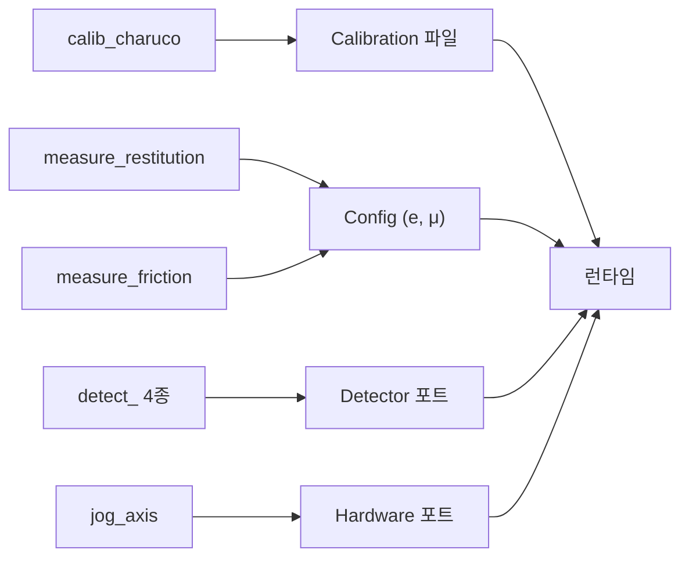
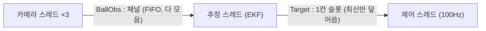
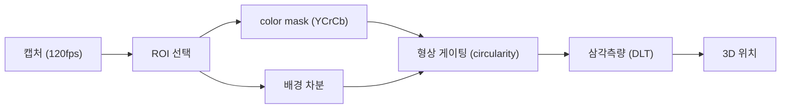
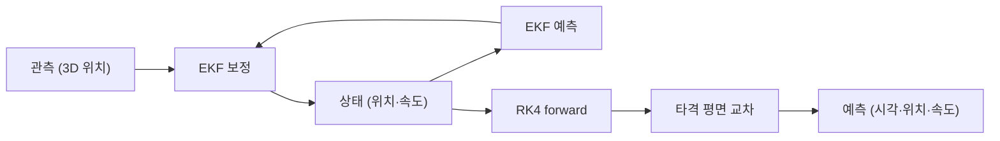
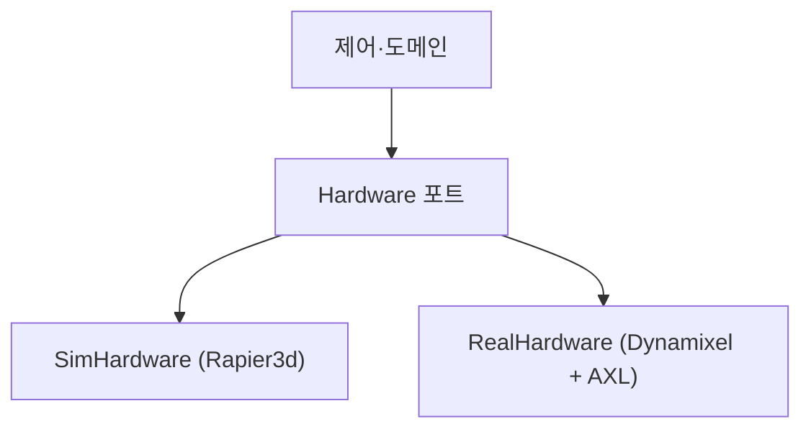
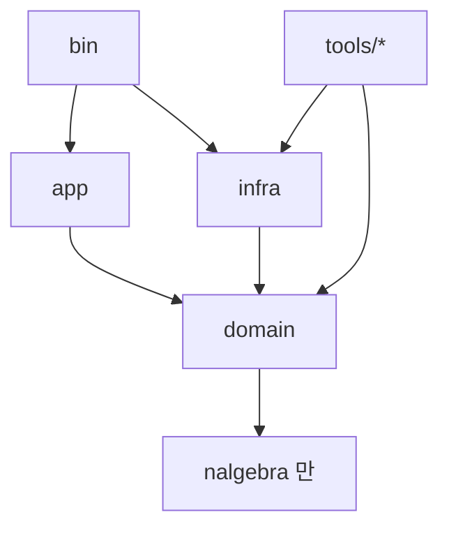

# 핑퐁 로봇 — 기술 마스터 플랜 (Rust 입문자용 주석 버전)

> **트랙** GIST Robot AX 경진 · 트랙 1 · 팀 *Love all*
> **스택** Rust · OpenCV(인프라 한정) · Rapier3d · Rerun
> **목적** 사람과 최대한 오래 랠리를 이어간다 — 경쟁이 아니라 협력.

> **이 문서를 읽기 전에 — Rust를 처음 보는 분을 위한 용어 미리 보기**
>
> | Rust 키워드 | 한 줄 요약 |
> |---|---|
> | `struct` | 데이터를 묶는 **구조체** (다른 언어의 class와 비슷, 단 메서드는 따로 붙임) |
> | `impl` | 구조체나 trait에 **메서드를 붙이는** 블록 |
> | `trait` | Java의 interface, Python의 ABC와 같은 **기능 계약서** |
> | `fn` | **함수** 선언 |
> | `pub` | **공개(public)** — 붙이지 않으면 모듈 안에서만 쓸 수 있음 |
> | `Option<T>` | 값이 있으면 `Some(값)`, 없으면 `None` — **null 대신** |
> | `Result<T, E>` | 성공하면 `Ok(값)`, 실패하면 `Err(에러)` — **예외 대신** |
> | `Box<dyn Trait>` | 어떤 trait을 구현하는 타입이든 담는 **힙 상자** (동적 디스패치) |
> | `Arc<T>` | 여러 스레드가 **안전하게 공유**하는 참조 카운터 포인터 |
> | `Send` | "이 값을 다른 스레드로 넘겨도 안전하다"는 컴파일러 **보증 표시** |
> | `move` | 클로저가 외부 변수의 **소유권**을 가져감 |
> | `&T` / `&mut T` | 값을 빌려 쓰는 **참조** / 변경 가능 참조 |
> | `#[cfg(...)]` | 특정 조건일 때만 **컴파일에 포함**시키는 속성 |

목표는 이기는 것이 아니라 **사람과 오래, 꾸준히 랠리를 주고받는 것**이다. 따라서 모든 결정은 일관성·신뢰성·지구력을 공격성·정밀 타격보다 우선한다. 구현은 직접 만들기보다 **검증된 라이브러리**(OpenCV, Rapier3d, Rerun, rustypot, nalgebra, ort)를 최대한 동원한다.

---

## 1. 목적과 성공지표

이 프로젝트의 목표는 **사람과 오래 협력 랠리를 이어가는 것**이다. 공을 받기 좋게 돌려주어 랠리를 길게 유지한다. 성공은 평균·최장 연속 랠리 길이, 리턴 성공률, 공을 놓친 뒤 다시 잡기까지의 시간, 긴 세션에서의 안정성(발열·드리프트)으로 잰다. 득점이나 공격적 배치는 목표가 아니다.

여기서 중요한 건, **한 번의 miss가 랠리를 끝낸다**는 점이다. 그래서 영리한 한 방보다 꾸준한 리턴이 중요하고, 변동성을 줄이는 것이 곧 성능이다. 덤으로, 낮은 페이스의 리턴은 모터가 쓰는 힘을 줄여 내구에도 유리하다.

---

## 2. 아키텍처


### 2.1 헥사고날 구조 (ports & adapters)

순수한 도메인 로직을 중심에 두고, 변하는 것(하드웨어·카메라·추정 방식·시각화)은 전부 **포트**(인터페이스, Rust에서는 trait) 뒤로 밀어낸다. 도메인은 OpenCV나 모터 SDK가 무엇인지 모른다. 모든 의존성은 코어를 향한다. 이렇게 하면 sim과 실물을 어댑터 교체만으로 바꿔 끼울 수 있고, 도메인은 하드웨어 없이도 테스트할 수 있다.

```rust
// ┌─────────────────────────────────────────────────────────┐
// │  Rust의 trait는 Java의 interface와 거의 같습니다.          │
// │  "이 trait을 구현하는 타입은 이 메서드를 반드시 가져야 한다"  │
// │  는 계약입니다. 실제 구현은 infra 크레이트에서 합니다.       │
// └─────────────────────────────────────────────────────────┘

// `pub` = 다른 모듈에서도 쓸 수 있게 공개
// `trait Clock` = Clock 이라는 이름의 계약(인터페이스) 정의
// `: Send` = "이 trait을 구현하는 타입은 스레드 간 이동이 안전해야 한다"는 추가 조건
pub trait Clock: Send {
    // `fn` = 함수. `&self` = 자기 자신을 읽기 전용으로 빌려 씀.
    // `-> Instant` = 반환 타입이 Instant (표준 라이브러리의 시각 타입)
    fn now(&self) -> Instant;
}

pub trait CameraSource: Send {
    // `&mut self` = 자기 자신을 변경 가능하게 빌려 씀 (프레임을 읽으면 상태가 바뀌므로)
    // `Option<...>` = 값이 있으면 Some(...), 카메라가 끊기면 None
    // 괄호 안의 튜플 (CamId, FrameRef, Instant) = 카메라 ID·프레임·시각을 묶어 반환
    fn next(&mut self) -> Option<(CamId, FrameRef, Instant)>;
}

pub trait Detector: Send {
    // `Option<Roi>` = ROI가 있을 수도 없을 수도 있음 (처음엔 None, 공 잡으면 Some)
    // `Option<PixelPoint>` = 공을 찾으면 Some(픽셀 좌표), 못 찾으면 None
    fn detect(&mut self, f: FrameRef, roi: Option<Roi>) -> Option<PixelPoint>;
}

pub trait Estimator: Send {
    fn update(&mut self, obs: BallObs);
    // `predict_to` = 공이 타격 평면에 도착할 예측값. 예측 불가면 None
    fn predict_to(&self, p: HitPlane) -> Option<Prediction>;
}

pub trait Hardware: Send {
    // `Result<(), HwError>` = 성공하면 Ok(()), 하드웨어 오류면 Err(HwError)
    // Rust엔 try-catch가 없고 Result로 에러를 값처럼 다룹니다
    fn command(&mut self, t: &SwingTrajectory) -> Result<(), HwError>;
    fn read_joints(&mut self) -> Result<Joints, HwError>;
}

pub trait Telemetry: Send {
    fn log(&self, ev: TelemetryEvent);
}
```

### 2.2 crate 구성

작업공간을 네 crate로 쪼갠다. `domain`은 순수 코어(타입·물리·기구학·포트), `app`은 스레드와 채널 같은 오케스트레이션, `infra`는 어댑터(카메라·모터·sim·시각화), `bin`은 어댑터를 골라 주입하는 최종 런타임이다.

> **Rust crate란?** 다른 언어의 "패키지" 또는 "라이브러리"에 해당합니다. 이 프로젝트는 하나의 작업공간(workspace) 안에 여러 crate를 두는 모노레포 구조를 씁니다.

`domain`의 의존성 목록에 OpenCV·Rapier·모터 SDK를 아예 넣지 않으면, 도메인이 그것들을 import하는 순간 컴파일이 깨진다. 즉 "도메인은 순수해야 한다"는 규칙을 컴파일러가 강제한다.

```toml
# Cargo.toml = Rust의 패키지 관리 파일 (Node.js의 package.json, Python의 pyproject.toml과 유사)
# [workspace] 섹션은 이 디렉터리가 여러 crate를 묶는 워크스페이스임을 선언합니다
[workspace]
members = ["crates/*", "tools/*"]
```

```
pingpong/
├── crates/{domain, app, infra, bin}     # 코어 + 최종 런타임
└── tools/                               # 실험·검증·캘리브 바이너리 (각각 독립 실행)
    ├── calib_charuco/        measure_restitution/   measure_friction/
    ├── jog_axis/             capture_flying_ball/
    └── detect_{bgsub, colormask, contour, roi}/
```

### 2.3 상태는 한 곳에서만 관리한다

공의 상태(위치·속도 추정)는 `Estimator` 하나만 소유한다. 다른 곳은 그 사본(스냅샷)만 채널로 받지, 공유 참조를 갖지 않는다.

좌표계 혼동은 버그가 자주 나는 지점이라, **타입으로 막는다**. 월드 좌표와 카메라 좌표를 다른 타입으로 두면 둘을 섞는 코드가 컴파일되지 않는다.

```rust
// ┌─────────────────────────────────────────────────────────────┐
// │  PhantomData — "유령 데이터"                                  │
// │  실제 메모리는 차지하지 않지만 컴파일러에게                        │
// │  "이 구조체는 F 타입과 관계 있어"라고 알려주는 제로 사이즈 마커.    │
// │  F에 World를 넣으면 Point3<World>, CamLeft를 넣으면            │
// │  Point3<CamLeft> — 두 타입은 서로 대입 불가능.                  │
// └─────────────────────────────────────────────────────────────┘

// Vector3<f64> = nalgebra 라이브러리의 3D 벡터 (f64 = 64비트 부동소수점)
// PhantomData<F> = 컴파일 타임 타입 마커 (F는 World, CamLeft 같은 좌표계 태그)
struct Point3<F>(Vector3<f64>, PhantomData<F>);   // Point3<World> ≠ Point3<CamLeft>
```

### 2.4 trait냐 enum이냐

경우의 수가 정해져 있고 내가 다 관리하면 **enum**(예: 관절 종류, 상태 머신, 채널 메시지) — 빠짐없는 분기 처리가 보장된다. 구현을 갈아 끼우는 경계이고 테스트용 가짜 구현이 필요하면 **trait**(예: 위의 포트들). trait은 구현이 둘 이상이거나 가짜 구현이 있을 때만 쓴다.

> **Rust의 enum은 특별합니다.** 단순한 상수 집합이 아니라 각 변종이 다른 데이터를 가질 수 있습니다. `Option<T>`도 사실 `enum { Some(T), None }`이고, `Result<T,E>`도 `enum { Ok(T), Err(E) }`입니다.

---

## 3. 플랫폼과 환경 설정

### 3.1 OpenCV를 빠르게 깔기 (ChArUco 포함)

OpenCV의 Rust 바인딩(`opencv` 크레이트)은 시스템에 OpenCV 본체와 libclang이 깔려 있어야 빌드된다(파이썬의 `pip install`처럼 받아지는 게 아니다). 알아둘 핵심: **카메라 보정용 ChArUco 보드 기능은 OpenCV 4.7부터 메인 모듈(`objdetect`)로 들어왔다.** 그래서 시간이 오래 걸리는 contrib 빌드 없이 기본 `opencv4`만으로 ChArUco를 쓸 수 있다.

**macOS** — Homebrew의 opencv는 contrib까지 포함한다.
```bash
brew install opencv
xcode-select --install     # libclang. 안 되면 brew install llvm
# brew opencv는 자동 인식되므로 OPENCV_LINK_* 는 건드리지 말 것
export DYLD_FALLBACK_LIBRARY_PATH="$(xcode-select --print-path)/Toolchains/XcodeDefault.xctoolchain/usr/lib/"
export LD_LIBRARY_PATH=${LD_LIBRARY_PATH}:/usr/local/lib
```

**Windows** — vcpkg로, contrib 없이 기본 패키지만.
```bat
git clone https://github.com/microsoft/vcpkg && .\vcpkg\bootstrap-vcpkg.bat
.\vcpkg\vcpkg install llvm opencv4:x64-windows    :: contrib 생략 → 빌드 빠름
setx VCPKGRS_DYNAMIC 1
:: 런타임 DLL 경로를 PATH에: ...\vcpkg\installed\x64-windows\bin
:: LIBCLANG_PATH 를 llvm bin 으로 지정
```

환경변수는 `.cargo/config.toml`에, OpenCV 버전과 crate 버전은 `Cargo.toml`에 핀으로 고정해 두 머신이 같은 환경을 갖게 한다.

### 3.2 하드웨어 SDK — 팔과 리니어는 성격이 다르다

두 액추에이터의 SDK 성격이 정반대이고, 그 차이가 코드 구조를 결정한다.

**팔 — Dynamixel.** 시리얼 통신 규약이 공개돼 있다. Rust 크레이트 `rustypot`으로 mac·Windows 양쪽에서 제어된다.

**리니어 — Ajinextek AXL.** 닫혀 있다. PCI(e) 모션 보드에 Windows 전용 커널 드라이버가 붙고, 벤더가 준 DLL을 반드시 거쳐야 한다.

```rust
// ┌──────────────────────────────────────────────────────────────┐
// │  #[cfg(all(windows, feature="real"))]                         │
// │  이것이 Rust의 조건부 컴파일입니다.                              │
// │  "windows OS 이고 'real' 기능 플래그가 켜져 있을 때만            │
// │   이 필드를 컴파일에 포함시켜라"는 뜻입니다.                      │
// │  Mac에서 빌드하면 rail 필드 자체가 존재하지 않아                   │
// │  링크 에러가 생기지 않습니다.                                     │
// └──────────────────────────────────────────────────────────────┘

struct RealHardware {
    arm: rustypot::Controller,    // Dynamixel 팔 제어기 — 양 OS에서 컴파일됨

    // Windows이고 "real" 기능 플래그가 있을 때만 이 필드를 컴파일에 포함
    #[cfg(all(windows, feature = "real"))]
    rail: AxlRail,                // AXL 리니어 레일 — Windows 전용 (libloading으로 DLL 로드)
}

// `impl Hardware for RealHardware` =
//   "RealHardware 구조체가 Hardware trait의 계약을 이행한다"는 선언
impl Hardware for RealHardware { /* command / read_joints 구현 */ }
```

### 3.3 OS와 라이브러리

배포 타겟은 제공되는 Windows 데스크탑이다. 개발은 mac·Windows 어디서 해도 된다. 주요 라이브러리는 에러 처리 `thiserror`(라이브러리)·`anyhow`(앱), 로깅 `tracing`, 설정/캘리브레이션 직렬화 `serde`+`toml`, CPU 코어 고정 `core_affinity`, CLI `clap`, 선형대수 `nalgebra`, 채널 `crossbeam`, 물리 `rapier3d`, 시각화 `rerun`, 모터 `rustypot`, 추론 `ort`다.

### 3.4 실험 바이너리와 런타임 자산화



각 도구는 입력과 출력(산출물)이 명확하고, 그 산출물이 런타임의 어느 부분으로 흘러가는지가 정해져 있다:

| 도구 | 하는 일 | 산출물 → 런타임 |
|---|---|---|
| `calib_charuco` | ChArUco 보드 촬영 → 코너 검출 → 내부 파라미터·왜곡·외부 변환 계산 | `Calibration`(serde) 파일 → §5.2가 불변값으로 로드 |
| `measure_restitution` | 공을 떨어뜨려 바운스 전후 속도비로 반발계수 측정 | `e` → §6.1 바운스 식, `Config`(TOML) |
| `measure_friction` | 접선 속도 변화로 마찰계수 측정 | `μ` → §6.1 바운스 식 |
| `jog_axis` | 사용자 입력대로 각 축을 수동 구동, 배선·방향·한계 검증 | `Hardware` 포트를 그대로 사용 → 런타임과 같은 코드 경로 |
| `capture_flying_ball` | 글로벌 셔터로 비행하는 공을 촬영·저장(데이터셋) | 검출·EKF 튜닝과 학습 데이터의 입력 |
| `detect_bgsub` | 배경 차분만으로 검출 | `Detector` 포트 구현 |
| `detect_colormask` | RGB·HSL·YCrCb + AWB 비교로 검출 | `Detector` 포트 구현 |
| `detect_contour` | contour + 형상 게이팅으로 검출 | `Detector` 포트 구현 |
| `detect_roi` | ROI 추적으로 속도 측정 | `Detector` 포트 구현 |

---

## 4. 동시성



영상 인식·추정·제어가 각자 다른 주기로 돈다(카메라 120Hz, 제어 100Hz). 셋이 같은 메모리를 `Mutex`로 공유하면 락 순서가 꼬여 경쟁 상태(data race)나 교착(deadlock)에 빠지기 쉽다. 그래서 메모리를 공유하지 않고 **값의 소유권을 채널로 넘긴다.**

Rust에서 채널에 값을 `send`하면 소유권이 이동(move)해 보낸 쪽은 그 값을 더 만질 수 없고, 받은 쪽만 소유한다. 공유 가변 상태가 없으니 data race가 **타입 수준에서 불가능**하다 — 어기는 코드는 컴파일되지 않는다.

```rust
// ───────────────────────────────────────────────────────────────
// 라이브러리 가져오기
// use 키워드 = Python의 import / Java의 import 와 같습니다
// ───────────────────────────────────────────────────────────────
use crossbeam_channel::{bounded, Sender, Receiver};
// crossbeam의 ArrayQueue = 고정 크기 락-프리 큐
use crossbeam::queue::ArrayQueue;
// std::sync::Arc = 원자적 참조 카운터 (Atomic Reference Counter)
//   여러 스레드가 같은 데이터를 안전하게 공유할 때 씁니다
use std::sync::Arc;

// ───────────────────────────────────────────────────────────────
// 함수 시그니처 읽기
//   fn run(cameras: ...) = run 이라는 함수, cameras 인자를 받음
//   Vec<Box<dyn CameraSource>> = "CameraSource trait을 구현하는 값들의 벡터"
//     Vec = 동적 배열 (Python list, Java ArrayList)
//     Box<dyn CameraSource> = 어떤 CameraSource 구현체든 힙에 올려 담음
//     Box 없이 dyn Trait 단독으론 크기가 정해지지 않아 컴파일 불가
// ───────────────────────────────────────────────────────────────
fn run(cameras: Vec<Box<dyn CameraSource>>,
       mut ekf: Ekf,                      // `mut` = 이 변수는 수정할 것임을 선언
       mut hw: Box<dyn Hardware>,
       hit_plane: HitPlane) {

    // bounded::<BallObs>(64) = 최대 64개를 담는 유한 채널 생성
    // 반환값이 튜플 (obs_tx, obs_rx) → 각각 송신 끝과 수신 끝
    // Rust는 한 표현식에서 여러 변수를 동시에 선언할 수 있습니다 (구조 분해 할당)
    let (obs_tx, obs_rx) = bounded::<BallObs>(64);   // 관측 스트림(FIFO)

    // Arc::new(...) = 레퍼런스 카운팅 포인터로 감싸기
    // ArrayQueue::<Target>::new(1) = 1칸짜리 큐 생성
    // Arc로 감싸는 이유: 여러 스레드에서 같은 슬롯을 가리킬 수 있어야 하므로
    let target = Arc::new(ArrayQueue::<Target>::new(1)); // 최신 목표(1칸)

    let mut handles = Vec::new();  // 스레드 핸들 모음 (나중에 join하려고)

    // ── 생산: 카메라 스레드(대당 1개). obs_tx 를 clone 해 각자 들고 send ──
    // `for mut cam in cameras` = cameras 벡터의 소유권을 가져와 순회
    //   Python의 `for cam in cameras:` 와 같지만, 순회 후 cameras는 사용 불가
    for mut cam in cameras {
        // obs_tx.clone() = 채널 송신 끝을 하나 더 만듦 (클론 여러 개 가능)
        // 각 카메라 스레드가 자기 clone을 들고 독립적으로 send 함
        let tx = obs_tx.clone();

        // std::thread::spawn(move || { ... }) = 새 OS 스레드 시작
        //   `move` 클로저: tx와 cam의 소유권을 이 클로저로 이동시킴
        //   소유권이 이동했으므로 이 스레드 밖에서는 tx, cam에 접근 불가 → 안전
        handles.push(std::thread::spawn(move || {
            pin_to_p_core();        // 성능 코어에 고정
            let mut det = make_detector();

            // `while let Some((id, frame, t)) = cam.next()` =
            //   cam.next()가 Some을 반환하는 동안 계속 루프
            //   반환값이 None이면 (카메라 끊김) 루프 탈출
            //   Some 안의 튜플을 (id, frame, t)로 구조 분해
            while let Some((id, frame, t)) = cam.next() {
                // `if let Some(px) = det.detect(...)` =
                //   detect가 Some(픽셀좌표)를 반환할 때만 if 본문 실행
                //   None이면 이 프레임은 건너뜀
                if let Some(px) = det.detect(frame, roi_for(id)) {
                    // tx.send(BallObs { ... }) = 구조체를 채널로 보냄
                    //   소유권이 채널로 이동, tx 쪽은 더 이상 그 값에 접근 불가
                    // .is_err() = 수신 쪽이 이미 끊겼으면 true → break로 루프 탈출
                    if tx.send(BallObs { px, cam: id, t }).is_err() { break; }
                }
            }
        })); // 스레드가 끝나며 자기 tx clone을 자동으로 drop(해제)
    }

    // 원본 obs_tx도 버려야 "모든 송신자가 사라졌다"는 신호가 obs_rx에 전달됨
    // 이 drop이 없으면 카메라가 다 꺼져도 obs_rx.recv()가 영원히 대기함
    drop(obs_tx);

    // ── 추정: obs_rx 로 관측을 받아 EKF 갱신, 최신 예측만 슬롯에 덮어씀 ──
    let slot = target.clone();  // Arc를 clone = 참조 카운트만 +1, 데이터 복사 없음
    handles.push(std::thread::spawn(move || {
        pin_to_p_core();

        // obs_rx.recv() = 채널에 값이 올 때까지 블록(대기)
        // while let Ok(obs) = ... = 성공적으로 받는 동안 계속
        // 모든 tx가 drop되면 recv()가 Err 반환 → 루프 탈출 → 스레드 종료
        while let Ok(obs) = obs_rx.recv() {
            ekf.update(obs);
            if let Some(t) = ekf.predict_to(hit_plane) {
                // force_push = 슬롯이 가득 차도 (이미 값이 있어도)
                //   기존 값을 버리고 새 값으로 덮어씀
                //   제어 스레드가 느려도 밀린 옛 좌표가 아니라 최신 좌표만 남음
                let _ = slot.force_push(t);
            }
        }
    }));

    // ── 소비: 제어 루프(100Hz). 막히지 않게 최신값만 집어 스윙 ──
    let slot = target.clone();
    handles.push(std::thread::spawn(move || {
        pin_to_p_core();
        loop {  // Rust의 `loop` = 무한 루프 (while true와 같음)
            // slot.pop() = 값이 있으면 Some(값), 비었으면 None (블록하지 않음)
            if let Some(t) = slot.pop() {
                // plan_swing(t) = Result 반환
                // if let Ok(traj) = ... = 성공했을 때만 hw.command 호출
                if let Ok(traj) = plan_swing(t) { let _ = hw.command(&traj); }
            }
            spin_until_next_tick();  // 다음 100Hz 틱까지 대기
        }
    }));

    // 모든 스레드가 끝날 때까지 기다림
    // `for h in handles` 은 handles 소유권을 가져와 순회
    for h in handles { let _ = h.join(); }
}
```

> **소유권 흐름 요약:** `obs_tx`는 카메라 스레드마다 `clone`해 들고 가 `send`하고(원본은 `drop`), `obs_rx`는 추정 스레드 하나가 받는다 — 즉 **다대일(MPSC)**이다. 카메라가 모두 끝나 모든 `tx`가 사라지면 `recv()`가 `Err`를 돌려주어 추정 스레드도 자연 종료된다.

---

## 5. 비전



### 5.1 카메라

전역 셔터(global shutter) 컬러 카메라 세 대를 120fps로 쓴다. 롤링 셔터는 픽셀 행을 위에서 아래로 순차 노출해, 빠르게 나는 공이 비스듬히 늘어지는 왜곡(rolling shutter skew)을 만든다. 전역 셔터는 전체 화소를 같은 순간에 노출해 이 왜곡이 없어, 공의 윤곽(contour)이 원형을 유지한다.

노출과 화이트 밸런스(AWB)는 **수동 고정**한다. 전송은 대역폭을 아끼려 카메라 칩이 압축하는 MJPEG로 받고, 세 대를 서로 다른 USB 컨트롤러(루트 허브)에 나눠 꽂아 대역폭 경쟁에 의한 프레임 드롭을 피한다.

### 5.2 캘리브레이션 (한 번만)

카메라마다 렌즈 왜곡과 위치·방향이 다르므로, 시작 전에 ChArUco 보드로 한 번 측정해 둔다. 이 값(내부 파라미터·왜곡·월드 좌표 변환)을 파일로 저장해 부팅 때 불변값으로 읽는다.

### 5.3 공 검출: 전체 탐색이 아니라 ROI 추적

전체 프레임을 매번 처리하면 주사율이 떨어지고, 단순 color mask는 피부색·다른 공 같은 비슷한 색을 다 잡는다. 그래서 한 번 공을 잡으면 직전 위치 둘레의 **ROI(Region of Interest, 관심 영역)** 안에서만 검출한다.

색만으로는 부족해 세 가지를 함께 건다:

- **Color mask** — YCrCb 공간으로 바꾸고, 밝기 채널(Y)은 버린 채 색차(Cr·Cb)만으로 임계 처리.
- **배경 차분(background subtraction)** — 프레임 간 차분이나 MOG2로 정지 영역을 지워 움직이는 것만 남긴다.
- **형상 게이팅** — 남은 후보의 윤곽에서 circularity(원형도)나 타원 피팅의 이심률(eccentricity)을 따져 둥글지 않은 것을 버린다.

### 5.4 3D 위치 복원

```rust
// ───────────────────────────────────────────────────────────────
// Rust에서 함수는 fn 이름(인자들) -> 반환타입 { 본문 } 형태입니다.
// 반환 타입 앞에 `->` 가 붙고, 반환값은 `return` 없이
// 마지막 표현식의 값이 그대로 반환됩니다 (세미콜론 없음).
// ───────────────────────────────────────────────────────────────

// `obs: &[BallObs]` = BallObs 슬라이스 참조 (배열의 일부분을 빌림)
//   & = 소유권을 가져가지 않고 읽기만 함
// `t_star: Instant` = 기준 시각
// `-> Option<PixelPoint>` = 보간 성공하면 Some, 범위 밖이면 None
fn sample_at(obs: &[BallObs], t_star: Instant) -> Option<PixelPoint> {
    // `?` 연산자: bracket이 None을 반환하면 함수 전체가 None을 반환하고 즉시 종료
    //   다른 언어의 early-return과 같지만 타입 안전하게 작동합니다
    let (a, b) = bracket(obs, t_star)?;   // a.t <= t* <= b.t 인 앞뒤 프레임 찾기

    let w = (t_star - a.t).as_secs_f64() / (b.t - a.t).as_secs_f64();

    // `Some(...)` = 정상값을 Option에 감싸서 반환
    // 마지막 표현식이 반환값 (return 불필요, 세미콜론 없음)
    Some(a.px.lerp(b.px, w))  // 선형 보간 (lerp = linear interpolation)
}

// cams: [&[BallObs]; 3] = BallObs 슬라이스 참조 세 개를 담은 고정 크기 배열
// cal: &Calibration = 캘리브레이션 데이터를 빌려 씀
fn triangulate_synced(cams: [&[BallObs]; 3], t_star: Instant, cal: &Calibration)
    -> Option<Point3<World>> {

    // [expr0, expr1, expr2] = 세 요소짜리 배열 리터럴
    // sample_at(cams[0], t_star)? = None이면 함수 전체가 None 반환
    // 세 카메라 모두 t_star 근처에 관측이 없으면 삼각측량 불가 → None
    let pts = [
        sample_at(cams[0], t_star)?,
        sample_at(cams[1], t_star)?,
        sample_at(cams[2], t_star)?,
    ];
    Some(dlt(&pts, cal))  // DLT로 삼각측량 → 3D 월드 좌표 반환
}
```

---

## 6. 궤적 추정과 예측



카메라로는 공의 위치만, 그것도 노이즈 섞여 보인다. 위치와 속도를 추정하고 미래를 내다보는 도구가 **칼만 필터**다. 공은 공기저항(속도 제곱에 비례)과 바운스 때문에 비선형으로 움직여, 비선형 운동 모델을 매 스텝 야코비안으로 선형화하는 **EKF(Extended Kalman Filter, 확장 칼만 필터)**를 쓴다.

### 6.1 운동 모델

상태는 위치와 속도 6차원이다. $\mathbf{x} = [\,\mathbf{p}\;\; \mathbf{v}\,]^\top \in \mathbb{R}^6$.

비행 중 가속도는 중력 + 공기저항(2차 항력)의 합이다:

$$\dot{\mathbf{p}} = \mathbf{v}, \qquad \dot{\mathbf{v}} = \mathbf{g} - k\,\lVert \mathbf{v}\rVert\,\mathbf{v}, \qquad k = \frac{\rho\,C_d\,A}{2m}$$

테이블 바운스는 충돌 순간 법선 속도를 반발계수 $e$로 뒤집고 접선 속도는 마찰계수 $\mu$로 줄인다:

$$v_n' = -e\,v_n, \qquad v_t' = (1-\mu)\,v_t \qquad (0<e<1)$$

### 6.2 EKF 예측·보정

연속 모델 $\dot{\mathbf x}=f(\mathbf x)$를 시간 $\Delta t$로 적분하고, 그 야코비안 $F=\partial f/\partial \mathbf x$로 공분산을 전파한다(예측 단계):

$$\mathbf{x}_{k}^- = \mathbf{x}_{k-1} + \int f(\mathbf x)\,dt, \qquad P_k^- = F P_{k-1} F^\top + Q$$

$$H = [\,I_3 \;\; 0_3\,], \qquad K = P_k^- H^\top (H P_k^- H^\top + R)^{-1}$$
$$\mathbf{x}_k = \mathbf{x}_k^- + K(\mathbf{z}_k - H\mathbf{x}_k^-), \qquad P_k = (I - KH)P_k^-$$

### 6.3 궤적 예측 (수치적분)

미래 궤적은 현재 추정 상태에서 위 가속도 식을 **RK4(4차 Runge–Kutta)로 수치적분**해 굴린다.

$$
\mathbf{k}_1 = f(\mathbf{x}_n),\quad
\mathbf{k}_2 = f(\mathbf{x}_n + \tfrac{h}{2}\mathbf{k}_1),\quad
\mathbf{k}_3 = f(\mathbf{x}_n + \tfrac{h}{2}\mathbf{k}_2),\quad
\mathbf{k}_4 = f(\mathbf{x}_n + h\,\mathbf{k}_3)
$$
$$
\mathbf{x}_{n+1} = \mathbf{x}_n + \tfrac{h}{6}\,(\mathbf{k}_1 + 2\mathbf{k}_2 + 2\mathbf{k}_3 + \mathbf{k}_4)
$$

**적분 방법은 용도에 따라 둘로 나눈다:**

- **EKF 내부 상태 전파**(매 프레임, $\Delta t \approx 8.3$ms): **세미-임플리싯(심플렉틱) 오일러** — 속도를 먼저 갱신하고 *그 새 속도로* 위치를 갱신. 비용이 오일러와 같으면서 에너지 보존이 좋다.
- **미래 궤적 예측**(타격 평면까지 ~0.3s를 보정 없이 한 번에): 멀리 가므로 정확도가 중요해 **RK4**.

```rust
// ───────────────────────────────────────────────────────────────
// 구조체 두 개와 함수 시그니처
// ───────────────────────────────────────────────────────────────

// struct = 여러 필드를 묶는 데이터 타입
// p: Vector3<f64> = nalgebra의 3D 벡터 (x, y, z 각각 f64)
// v: Vector3<f64> = 속도 벡터
struct EkfState { p: Vector3<f64>, v: Vector3<f64> }

// t_c: f64 = 공이 타격 평면에 도착하는 시각 (초)
// p_c: Point3<World> = 도착 위치 (월드 좌표계)
// v_in: Vector3<f64> = 도착 순간 입사 속도
struct Prediction { t_c: f64, p_c: Point3<World>, v_in: Vector3<f64> }

// `v: Vector3<f64>` = 속도 벡터를 값으로 받음 (복사본)
// k: f64 = 항력 계수
// -> Vector3<f64> = 가속도 벡터 반환
fn accel(v: Vector3<f64>, k: f64) -> Vector3<f64> {
    // G = 중력 벡터 (전역 상수)
    // v.norm() = 벡터의 크기(magnitude, |v|)
    // 결과: 중력 - 항력 (항력은 속도 제곱에 비례, 반대 방향)
    G - k * v.norm() * v
}

// `&self` = 이 메서드는 EkfState 인스턴스를 읽기 전용으로 씀
// plane: HitPlane = 타격 평면 정보
// -> Option<Prediction> = 예측 가능하면 Some, 불가능하면 None
fn predict_to(&self, plane: HitPlane) -> Option<Prediction>;
// 실제 구현: RK4로 적분하면서 plane을 지나는 순간을 찾아 반환
```

---

## 7. 제어: 공을 "쳐서" 돌려보내기

라켓을 도착 지점에 갖다 놓기만 하면 접촉 순간 속도가 0이라 공에 힘이 안 실린다. **"도달"과 "타격"은 다른 문제다.** 세 층으로 나눠 푼다.

### 7.1 임팩트 모델

라켓-공 충돌은 거의 순간(impulse)이라, 라켓 면 법선 $\mathbf n$ 방향 속도만 반발계수 $e$로 교환된다:

$$(\mathbf v_{out}-\mathbf v_r)\cdot\mathbf n = -\,e\,(\mathbf v_{in}-\mathbf v_r)\cdot\mathbf n$$

$$\Rightarrow\quad \mathbf v_{out}\cdot\mathbf n = (1+e)\,(\mathbf v_r\cdot\mathbf n) - e\,(\mathbf v_{in}\cdot\mathbf n)$$

### 7.2 IK — 어디에 둘 것인가

리니어 1축이 공의 가로 위치 $x$를 따라가면 나머지는 2D 평면 문제로 줄어, 코사인 법칙으로 닫힌 형태로 풀린다:

$$\cos\theta_2 = \frac{y^2+z^2-l_1^2-l_2^2}{2 l_1 l_2},\qquad
\theta_1 = \operatorname{atan2}(z,y) - \operatorname{atan2}\!\big(l_2\sin\theta_2,\; l_1+l_2\cos\theta_2\big)$$

### 7.3 자코비안 — 어떤 속도로 지나갈 것인가

자코비안 $J(\mathbf q)=\partial \mathbf x_{ee}/\partial \mathbf q$는 관절 속도와 라켓 속도를 잇는다:

$$\dot{\mathbf x}_{ee} = J(\mathbf q)\,\dot{\mathbf q} \quad\Rightarrow\quad \dot{\mathbf q} = J(\mathbf q)^{+}\,\mathbf v_r$$

### 7.4 동역학 — 그 궤적을 실제로 낼 수 있는가

$$\boldsymbol\tau = M(\mathbf q)\,\ddot{\mathbf q} + C(\mathbf q,\dot{\mathbf q})\,\dot{\mathbf q} + \mathbf g(\mathbf q)$$

### 7.5 전체 흐름


$$
(t_c,\mathbf p_c,\mathbf v_{in})\ \xrightarrow{\text{원하는 리턴}}\ \mathbf v_{out}
\ \xrightarrow{\text{7.1 역산}}\ (\mathbf v_r,\mathbf n)
\ \xrightarrow{\text{7.2/7.3}}\ (\mathbf q^*,\dot{\mathbf q}^*)
\ \rightarrow\ \text{스윙 궤적}\ \xrightarrow{\text{7.4}}\ \boldsymbol\tau\ \text{검증}
$$

```rust
// ───────────────────────────────────────────────────────────────
// 함수 시그니처 모음 — "어떤 함수들이 있는지" 계획하는 단계
// 세미콜론 없는 마지막 줄이 반환값 (fn 본문에서)
// ───────────────────────────────────────────────────────────────

// v_in, v_out: Velocity = 입사·출사 속도 (Velocity는 우리가 정의한 타입)
// e: f64 = 반발계수
// -> (Velocity, Normal) = 튜플: 필요한 라켓 속도와 면 법선을 함께 반환
fn racket_for_return(v_in: Velocity, v_out: Velocity, e: f64) -> (Velocity, Normal);

// model: &Arm = 팔 기구학 모델을 읽기 전용으로 빌림
// p: Point3<World> = 목표 위치 (월드 좌표)
// -> Option<Joints> = IK 해가 있으면 Some(관절각), 닿지 않으면 None
fn ik(model: &Arm, p: Point3<World>) -> Option<Joints>;

// q: Joints = 현재 관절 각도, v_r: Velocity = 원하는 라켓 속도
// -> JointVels = 필요한 관절 속도 (q̇ = J⁺ v_r)
fn joint_vel(model: &Arm, q: Joints, v_r: Velocity) -> JointVels;

// traj: &SwingTrajectory = 스윙 궤적 (참조, 소유권 안 가져감)
// -> Torques = 각 관절에 필요한 토크 벡터
fn required_torque(traj: &SwingTrajectory) -> Torques;

// tau: &Torques = 계산된 토크, lim: &MotorLimits = 모터 한계
// -> bool = 실행 가능하면 true, 한계 초과면 false
fn is_feasible(tau: &Torques, lim: &MotorLimits) -> bool;
```

---

## 8. 기구

모터를 추가로 달 수 없으므로 기구 설계로 푼다. 라켓 쪽을 가볍게 만들고, 무게를 손목에서 베이스 쪽으로 옮기고, 카운터밸런스를 둔다. 빠른 스윙 속도는 힘센 안쪽 관절이 만들고 손목은 방향만 잡게 한다.

---

## 9. 디지털 트윈과 시각화



`Hardware` 포트 뒤에 sim 구현(Rapier3d 물리 엔진)과 실물 구현을 둔다. 시계도 포트로 빼서, sim에서는 시간을 직접 굴려 결과를 재현 가능하게 한다.

시각화는 `Telemetry` 포트로 두고 기본 구현으로 **Rerun**을 쓴다. 카메라 영상, 추적 영역, 복원한 3D 점, 예측 궤적, 단계별 지연을 하나의 타임라인에 겹쳐 놓고 시간을 되감아 가며 디버깅할 수 있다.

---

## 10. 머신러닝(ML) 적용

ML은 항상 포트 뒤의 한 구현으로 들어온다. 안 되면 고전 방식으로 즉시 되돌릴 수 있어 위험이 없다. 학습 데이터는 디지털 트윈에서 공을 던져 자동으로 라벨을 만들어 쓴다.

우선순위: ① 조명·배경에 강한 공 검출기 → ② 라켓-공 충돌 오차만 보정하는 작은 모델 → ③ EKF를 보강하는 잔차·스핀 추정 → ④ sim 안에서 랠리 최대화 정책.

---

## 11. 최적화와 지구력

목표는 초당 프레임 수가 아니라 **지연·흔들림(jitter)·프레임 누락을 줄이고 긴 세션을 안정적으로 버티는 것**이다. 핵심: 이 시스템의 병목은 *연산량*이 아니라 **큰 프레임 행렬을 복사하고 옮기는 비용**이다. 1MP × 3캠 × 120fps면 초당 약 1.1GB의 픽셀이 흐른다.

### 11.1 프레임은 경계를 넘지 않는다

프레임 행렬(`Mat` 한 장 ≈ 1.2MB)을 채널로 흘리면 복사·할당 폭탄이 된다. **프레임은 잡은 카메라 스레드 안에서 살고 죽고, 채널엔 추출 결과만 넘긴다.**

```rust
// ✗ 나쁨: 프레임을 채널로 보내면 매 프레임 1.2MB 복사/할당 발생
let (tx, rx) = bounded::<Mat>(8);   // Mat = OpenCV 이미지 행렬 (절대 금지!)
tx.send(frame.clone())?;            // .clone() = 전체 픽셀 데이터를 복사

// ✓ 좋음: 추출 결과(픽셀 좌표 2개 + 시각)만 이동 — 수십 바이트, 복사 없음
// BallObs는 작은 구조체라 move해도 사실상 스택 복사(수 나노초)
tx.send(BallObs { px, cam: id, t })?;  // 프레임은 스레드 안에 남아 있음
```

### 11.2 프레임을 들고 노는 비용 줄이기

```rust
// ───────────────────────────────────────────────────────────────
// 버퍼를 구조체가 소유하고 재사용하는 패턴
// ───────────────────────────────────────────────────────────────

// ycrcb, mask 두 Mat을 Detector 구조체가 소유
// → 매 프레임 새 Mat을 만들지 않고 같은 메모리를 계속 덮어씀
struct Detector { ycrcb: Mat, mask: Mat }

impl Detector {
    // &mut self = 자기 자신(ycrcb, mask 버퍼)을 변경할 것임
    // frame: &Mat = 원본 프레임을 읽기 전용으로 빌림 (복사 없음)
    // roi: Rect = 관심 영역 (x, y, width, height)
    fn detect(&mut self, frame: &Mat, roi: Rect) -> Option<PixelPoint> {

        // Mat::roi() = 원본 행렬의 부분 영역을 가리키는 헤더(뷰)만 만듦
        //   실제 픽셀 복사 없음 — O(1) 연산
        //   Python numpy의 frame[y:y+h, x:x+w] 와 같지만 복사가 아닌 뷰
        let view = Mat::roi(frame, roi)?;   // ? = None이면 함수 전체 None 반환

        // imgproc::cvt_color = OpenCV 색공간 변환
        //   &view = 입력 (뷰, ROI 영역만)
        //   &mut self.ycrcb = 출력 (기존 버퍼에 덮어씀, 새 할당 없음)
        //   COLOR_BGR2YCrCb = 변환 코드
        imgproc::cvt_color(&view, &mut self.ycrcb, COLOR_BGR2YCrCb, 0)?;

        // core::in_range = 색상 범위 필터링 (YCrCb 마스크 생성)
        //   LO, HI = 색상 하한·상한 (전역 상수)
        //   &mut self.mask = 결과 마스크 (같은 버퍼 재사용)
        core::in_range(&self.ycrcb, &LO, &HI, &mut self.mask)?;

        // centroid = 마스크에서 무게중심 계산 → 공의 픽셀 좌표
        // .map(|c| c + roi.tl()) = ROI 기준 좌표를 전체 프레임 기준으로 보정
        //   map은 Option 안의 값을 변환 (Some(c) → Some(c + offset), None → None)
        centroid(&self.mask).map(|c| c + roi.tl())
    }
}
```

### 11.3 짐작하지 말고 측정한다

```rust
// tracing 크레이트의 info_span! 매크로
// "detect" = 이 구간의 이름 (Rerun 타임라인에서 보임)
// _g 변수가 살아 있는 동안(스코프 끝까지) 이 span이 활성화됨
// _g가 drop될 때 자동으로 span 종료 시각 기록
// → 매번 타이머 시작/종료를 수동으로 안 해도 됨
use tracing::info_span;
let _g = info_span!("detect").entered();  // 이 구간 소요시간이 자동 기록 → Rerun/로그로
```

### 11.4 병렬·코어·GPU

카메라 1대당 스레드 1개로 두면(§4) 세 카메라의 디코드+검출이 코어 셋에 흩어진다. `core_affinity`로 이들을 성능(P)코어에 고정해 효율(E)코어로 밀려 생기는 지터를 막는다. GPU는 핫패스에서 뺀다 — 100×100 ROI를 CUDA로 보내면 PCIe 전송이 연산보다 비싸다.

### 11.5 지구력

긴 랠리를 버티려면 모터 발열·duty cycle을 모니터링하고, 누적 오차(드리프트)를 주기적으로 재보정한다. 협력 랠리는 토크 여유가 커서 발열에도 유리하다.

---

## 12. 위험과 대비

학습 모델이 덜 되면 고전 방식으로 폴백한다(포트 교체). 리니어가 폐쇄형 AXL이면 cfg로 격리하고, 시리얼 기반이면 그 부담이 사라진다. 카메라 동기가 부족하면 타임스탬프 보간을 강화한다. Windows OpenCV 빌드는 contrib를 빼서 시간을 줄이고 환경을 미리 고정해 둔다. 긴 세션 발열·드리프트는 모니터링과 재보정, 페이스 낮추기로 대비한다.

---

## 부록. crate 의존성 방향


> 화살표는 "의존한다"는 뜻 — 모든 의존성이 `domain`을 향한다.

```
bin    → app, infra        (어댑터 선택·주입)
app    → domain            (스레드·채널·제어 루프)
infra  → domain            (포트 구현; opencv·rapier·dynamixel·axl·rerun은 여기에만)
domain → nalgebra 만        (인프라 의존 0 — 컴파일러가 강제)
```

---

## 부록 B. Rust 입문자를 위한 추가 읽기 자료

이 플랜의 코드를 이해하는 데 도움이 되는 순서:

1. **[The Rust Book](https://doc.rust-lang.org/book/)** Ch.4 소유권, Ch.10 trait, Ch.16 동시성 — 무료 온라인
2. **[Rust by Example](https://doc.rust-lang.org/rust-by-example/)** — 코드 예제 중심
3. **nalgebra 문서** — 벡터·행렬 연산 (`Vector3`, `Matrix6` 등)
4. **crossbeam 문서** — `bounded` 채널, `ArrayQueue`

이 플랜에서 쓰는 핵심 패턴 세 가지만 익혀도 대부분의 코드가 읽힙니다:
- `Option<T>` + `?` 연산자 (null 없는 에러 처리)
- `trait` + `impl ... for ...` (인터페이스 구현)
- `move` 클로저 + 채널 (`send`/`recv`)
