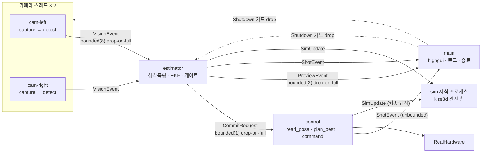
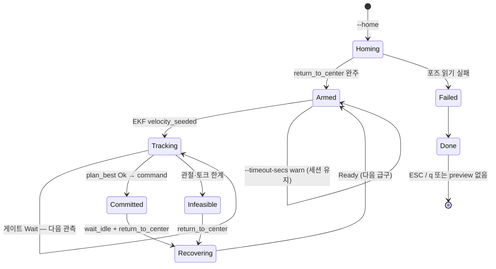
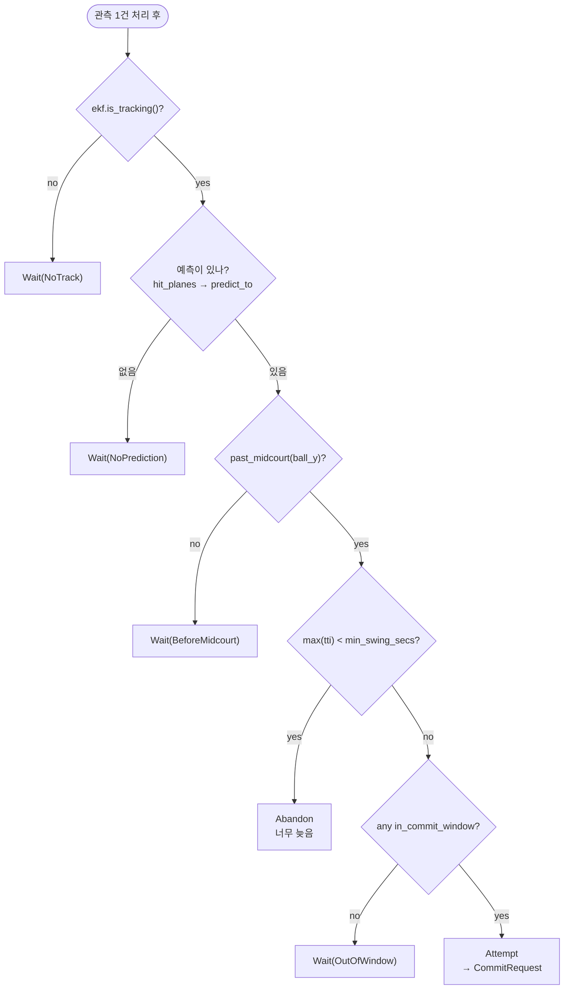
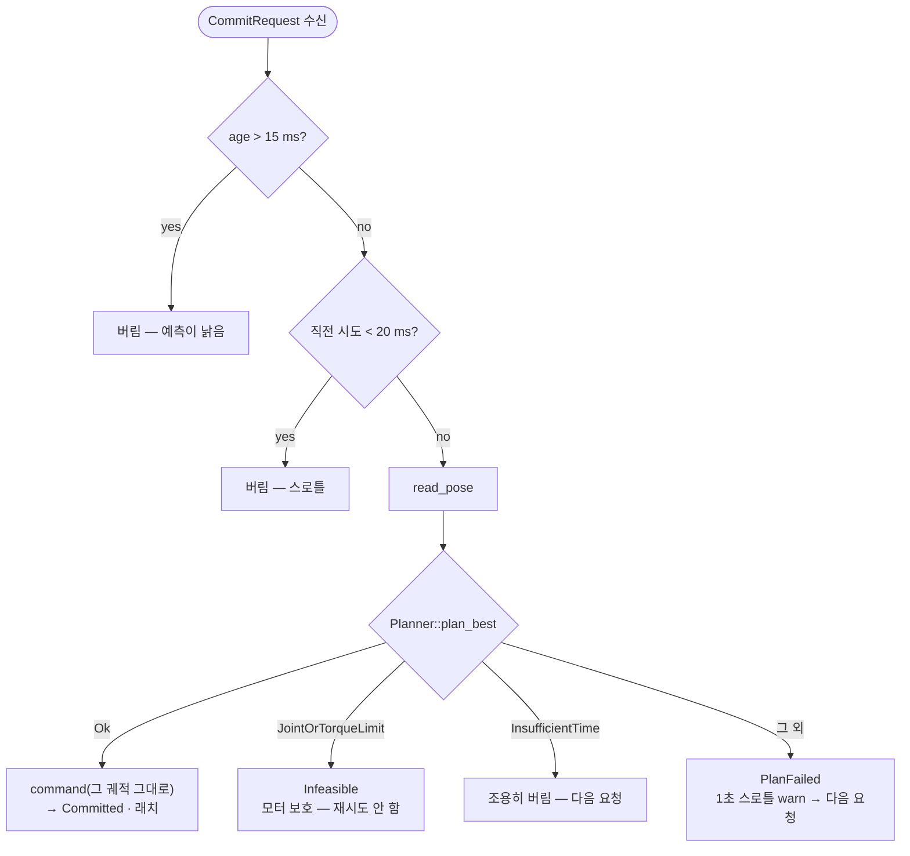

# `src/real` — 실기 연속 급구 (1·2차)

`--mode real` 런타임. 스윙 완주·센터 복귀 후 **다음 급구**를 반복한다. 결선(진짜 랠리)은
아직 아니다 — [`specs/2026-07-31-real-continuous-feed-design.md`](../../docs/superpowers/specs/2026-07-31-real-continuous-feed-design.md)
§Future.

bin 전용 모듈이라 `lib.rs`에 없다 ([`src/cli/`](../cli/)와 같은 방식). 도메인 로직은 전부
`camera` / `detector` / `estimator` / `robot::motion` / `hardware`에서 가져다 쓰고, 여기는
**오케스트레이션과 정책**만 담는다.

```bash
# 리허설 — 실캠·검출·EKF·플래너까지 다 돌리고 모터·레일만 안 움직인다 (macOS에서도 됨)
cargo run -p pingpong-bot -- --mode real --dry-run

# 실기 (Windows 벤치)
cargo run -p pingpong-bot -- --mode real --dxl-port COM8 --debug
```

| 플래그 | 기본 | 뜻 |
|--------|------|-----|
| `--dry-run` | off | `RealHardware::dry_run_with_arm` — 모터·레일 정지, 나머지 체인은 그대로 |
| `--preview` | on | 좌/우 검출 오버레이 창. ESC·`q`로 종료 |
| `--sim` | on | 관전용 3D 창 (테이블·로봇·예측 도달점·스윙 재생) |
| `--home` | on | 시작 시 센터(ready) 자세로 이동 |
| `--release-torque` | off | 종료 시 토크를 뺀다. 기본은 **켠 채로 둔다** (안 그러면 팔이 주저앉는다) |
| `--timeout-secs` | 60 | Ready(Armed) 이후 다음 공을 기다리는 최대 시간 — 초과해도 **세션은 유지**, Armed마다 재장전 |

**세션은 `Committed`/`Infeasible`로 끝나지 않는다.** 연속 급구가 기본이다. 종료는 ESC·`q`
(`--preview`) 또는 제어 워커 치명 실패(`Done`). `--preview=false`면 창이 없어 Ctrl+C / `Done`까지
루프한다.

**종료해도 토크는 유지된다.** `DynamixelBus::drop`이 토크를 끄면 프로그램이 끝나는 순간 팔이
중력으로 주저앉는다 (AXL 레일도 같은 이유로 서보를 켠 채 닫는다). 손으로 옮기려면
`--release-torque`를 쓰거나 전원을 내린다. 부작용으로 다음 실행의 EEPROM 설정(Operating Mode
11 · PWM Limit 36 · Current Limit 38)이 토크 ON 상태에서 거부될 수 있어,
`configure_position_mode_max_effort`가 **먼저 읽어보고 이미 맞으면 아무것도 쓰지 않는다** —
그래서 재실행할 때도 팔이 잠깐 늘어지지 않는다.

전제 파일: `data/calibration.json` (캠 2대) · `data/colormask.json`.

---

## 왜 채널인가 — jog에서 가져온 불변식

[`tools/jog`](../../tools/jog/)의 핵심은 **"동기화한 포즈 스냅샷 하나로 계획하고, 그 궤적을
그대로 보낸다"** 이다 (`sync → preview → apply` 단계 게이트). 계획과 전송 사이에 포즈가 바뀔
틈이 없어야 실기가 엉뚱한 데를 친다.

여기서는 같은 보장을 **단일 소유권 + 채널**로 강제한다. 공유 가변 상태가 없어서 race condition이
"안 생기게 조심하는" 게 아니라 **표현 불가능**하다.

| 상태 | 유일한 소유자 |
|------|--------------|
| `FrameSource` + `Detector` | `camera_worker` (캠당 1 스레드) |
| `Ekf` · `Calibration` · 게이트 | `estimator_worker` |
| `Hardware` (버스 · 레일 · 샷 루프) | `control_worker` |
| highgui 창 | 메인 스레드 (`PreviewWindow`) |
| kiss3d 관전 창 | **자식 프로세스** (`--sim-child`) |

`Arc<Mutex<Hardware>>`가 없다. **`read_pose → plan_best → command`가 전부 `control_worker`
안에서만** 일어나고, 추정 스레드는 로봇 포즈를 볼 방법 자체가 없다.

---

## 파이프라인

kiss3d(3D 창)와 OpenCV highgui(프리뷰)가 **둘 다 메인 스레드를 요구**해서 한 프로세스에 같이
못 띄운다. `tools/verify_stereo`와 같이 자기 자신을 `--sim-child`로 띄우고 stdin 한 줄
JSON(`SimUpdate`)으로 먹인다. 자식이 죽어도 본 파이프라인은 그대로 간다.



**드롭 정책** — 실시간 경로다. 채널이 차면 `try_send` 실패를 버리고 센다. 밀린 프레임·예측은
어차피 쓸모가 없다. 드롭 수는 종료 요약에 찍힌다.

**셧다운** — `AtomicBool` 대신 채널 파기 브로드캐스트 (`shutdown.rs`). 메인이 `ShutdownGuard`
하나를 들고 워커는 `Shutdown` 클론을 든다. 가드를 drop하면 모든 클론의 `try_recv`가
`Disconnected`가 되어 전원이 내려간다 — 공유 플래그가 없고 실수로 되켤 방법도 없다.

**프리뷰가 핫패스를 막지 않는다** — highgui는 macOS 제약상 메인 스레드여야 하는데,
`PreviewEvent`는 drop-on-full이라 창이 느려도 추정·제어는 그대로 돈다.

---

## 샷 라이프사이클

용어는 sim(`SimWorld::try_auto_swing`)과 맞춘다. 실기엔 슈터가 없어서 sim의 `launch` 대신
**`Tracking`**(EKF가 속도까지 시드한 시점)이 샷의 시작이다.



`ShotEvent`는 전부 메인으로 모여 한 곳에서만 로그된다 (워커가 중복으로 찍지 않는다).
`shot_seq`로 급구를 구분한다. `Committed`는 sim `"shot: swing commit"`과 **같은 필드**에
`shot`을 더한다.

`Infeasible`는 **이번 스윙만** 포기하고 Recovering → Ready로 다음 급구를 받는다.
`ControlStatus::Recovering` 동안 추정 워커는 `Attempt`를 보내지 않는다.
공 y가 로봇에서 멀어지면(증가, 히스테리시스) EKF를 리셋해 새 추정을 시작한다.

`Done`은 제어 워커가 루프를 빠져나올 때만 보낸다 (치명 실패·셧다운).

---

## 화면

**프리뷰 창** (`real shot`) — 좌/우 프레임을 가로로 붙인다.

- 초록 원 = 검출한 공
- 빨간 원 = **예측 도달 위치**를 그 카메라로 재투영한 자리 (`camera::Params::project_world`)
- 좌상단 노란 HUD = 게이트 상태 · 공 위치·속력 · 예측 도달점·tti · EKF 게이트 d²
- 우하단 = 최신 샷 결과 (커밋 요약 또는 포기 사유). 다음 샷이 오면 덮어쓴다

| 마커 | 뜻 |
|------|-----|
| 초록 (큰 원) | 이 프레임의 **2D 검출** |
| 흰색 (작은 원) | **생 삼각측량** 3D 점을 이 카메라로 되쏜 자리 — 필터를 안 거친 값 |
| 빨강 | **예측 도달 위치**. 마지막 값을 붙들어 계속 그린다 (안 그러면 몇 프레임 번쩍하고 사라진다). 화각 밖이면 가장자리로 끌어오고 HUD에 `[OFF-FRAME]` |

**초록과 흰색이 벌어진 거리가 재투영 오차다.** 벌어지면 3D 복원(동기·캘리브)이 나쁜 것이지
검출 탓이 아니고, 붙어 있는데 빨강이 엉뚱하면 그때부터 속도 추정·`r_meas`·ω=0을 의심한다.
캘리브 rmse가 3.7/3.3 px이니 `reproj_p50`가 5 px 안쪽이면 정상, 20 px를 넘으면 3D가 문제다.

좌상단 노란 HUD = 게이트 상태 · 공 위치·속력 · 예측 도달점·tti · EKF 게이트 d² · `reproj px`.
우하단 = 샷 결과 (커밋 요약 또는 포기 사유). 한 번 뜨면 창을 닫을 때까지 남는다.

**sim 창** (`real shot sim`) — 아무것도 조작하지 않는 관전 전용.

- **주황** 공 = EKF 추정 공 위치
- **하늘색** 공 = 예측 도달 위치
- 로봇 = 실기에서 읽은 포즈. 커밋하면 **그 궤적을 그대로 재생**한다

두 공의 구분은 **색**이다. `spawn_ghost`가 알파 0.38을 주지만 렌더러가 블렌딩하지 않아
둘 다 불투명하게 보인다 — 문서·주석에서 "반투명"이라고 부르지 말 것.

HUD 문자열은 ASCII만 쓴다 — Hershey 폰트가 유니코드를 못 그려 한글은 `??????`가 된다.
한글 사유는 로그로만 나간다.

## 커밋 결정 게이트

`decision.rs`의 순수 함수. sim `try_auto_swing`의 게이트 **순서를 그대로** 옮겼고,
상수는 전부 `defaults::ControlParams` / `robot::motion::Planner`에서 온다.
하드웨어 의존이 없어서 단위 테스트로 잠근다.



> **`max`이지 `min`이 아니다.** `min`으로 쓰면 아직 여유 있는 후보가 늦은 후보 하나에 끌려가
> 통째로 포기된다. sim에서 이 실수로 커밋률이 0%가 된 이력이 `world.rs` 주석에 남아 있다.
> `abandons_only_when_every_candidate_is_too_late` 테스트가 이걸 잠근다.

`Attempt`가 나오면 제어 워커가 이어받는다:



`plan_best`에 넘긴 예측으로 만든 궤적을 **그대로** 보낸다. 사이에 포즈를 다시 읽지 않는다.

---

## 튜닝 상수

| 상수 | 값 | 위치 | 왜 |
|------|-----|------|-----|
| `SERIES_CAPACITY` | 8 | `estimator_worker` | `Triangulate::synced`가 보간에 쓸 캠별 관측 수 |
| `MAX_REQUEST_AGE_SECS` | 15 ms | `control_worker` | 예측의 `tti`는 요청 시각 기준 — 이보다 낡으면 임팩트 시점이 어긋난다 |
| `PLAN_THROTTLE_SECS` | 20 ms | `control_worker` | sim `SWING_RETRY_THROTTLE_SECS`와 같은 값. 57600 baud `read_pose`는 sync_read 왕복이다 |
| `FINISH_GRACE` | 15 s | `run` | 커밋 후 제어 워커가 스윙 완주 + 센터 복귀할 여유 |
| 게이트 임계 | — | `defaults::ControlParams` | `min_swing_secs` 0.20 · `swing_commit_max_secs` 0.60 · `swing_commit_max_ball_y_frac` 0.55 |
| 접수 창 | — | `InterceptWindow::default()` | y 0.08 ~ 0.35, step 0.03 (10 평면) |

real 전용 튜닝 값을 새로 만들지 않는다 — sim과 갈리면 sim에서 튜닝한 결과가 실기에 안 옮겨진다.

---

## 파일

| 파일 | 주 타입 | 역할 |
|------|--------|------|
| `run.rs` | — | 조립 · 메인 루프 · 종료 요약 |
| `options.rs` | `Options` | CLI 플래그 |
| `shutdown.rs` | `Shutdown` / `ShutdownGuard` | 채널 파기 종료 브로드캐스트 |
| `camera_worker.rs` | `CameraStats` | 캡처 → (왜곡 보정) → 검출 |
| `estimator_worker.rs` | `EstimatorStats` | 삼각측량 → EKF → 예측 → 게이트 |
| `control_worker.rs` | — | 하드웨어 단독 소유 · 계획 · 연속 급구 루프 |
| `decision.rs` | `Decision` / `WaitReason` | 순수 게이트 + 단위 테스트 |
| `preview.rs` | `PreviewWindow` | 메인 스레드 highgui |
| `sim_child.rs` | — | `--sim-child` kiss3d 관전 창 (자식 프로세스) |
| `sim_host.rs` | — | 부모 쪽 자식 관리 — 띄우고 stdin으로 먹인다 |
| `sim_update.rs` | `SimUpdate` | 부모 → sim 자식 한 줄 JSON (공·도달점·포즈·스윙) |
| `throttle.rs` | `Throttle` | 주기 로그 스로틀 |
| `fmt.rs` | — | 로그 숫자 소수점 2자리 |
| `vision_event.rs` | `VisionEvent` | cam → estimator |
| `commit_request.rs` | `CommitRequest` | estimator → control |
| `preview_event.rs` | `PreviewEvent` | estimator → main |
| `shot_event.rs` | `ShotEvent` | 워커 → main |

---

## 로그

`--debug` 없이는 **샷 라이프사이클(info)과 오류(warn)만** 나온다. 붙였을 때 추가되는 것:

| 로그 | 스레드 | 언제 | 왜 보나 |
|------|--------|------|---------|
| `real shot: 포기 — …` | main | 포기할 때 (**info** — `--debug` 불필요) |
| `real shot: 게이트 전이` | estimator | `Decision`이 **바뀔 때만** | "왜 안 쳤나"를 로그만으로 되짚는다. `decision` · `candidates` · `tti_min/max` · 공 위치·속력 |
| `측정 거부` | estimator | EKF가 측정을 버리거나 리셋할 때 | 마할라노비스 `d2` · `reject_streak` · 그 3D 점 · `skew_ms` |
| `추정 진척` | estimator | 1초마다 | triangulated·accepted·rejected 누적, 현재 게이트 |
| `카메라 진척` | cam × 2 | 1초마다 | 실측 `fps` · 최근 1초 `detection_rate` · 드롭 |
| `스윙 계획 실패 — 재시도` | control | 시도마다 | 실패 원인 + 후보 수 + 그때의 시작 포즈 |
| `InsufficientTime` | control | 늦은 예측을 버릴 때 | `tti` vs `min_swing_secs` |
| `커밋 요청 소비` | control | 계획 직전 | `request_age_secs` — 예측이 얼마나 낡았나 |

포기·커밋 로그는 판정 근거 **수치를 같이 싣는다** — `latest_tti` · `min_swing_secs` ·
`shortfall` · `candidates` · `ball_y`. 문자열 사유만 남으면 "얼마나 늦었길래"를 못 되짚는다.
로그의 실수는 전부 소수점 2자리다 (`fmt::f2`).

per-tick 로그는 없다. 120 fps × 2캠이면 초당 수백 줄이라 쓸 수 없어서, **전이 시점**과
**1초 주기**로만 묶는다 (`throttle.rs`). tracing span이 붙어 있어 `cam{id=0}` · `estimator` ·
`control` 중 어느 스레드인지 바로 보인다.

```text
DEBUG cam{id=0}: 카메라 진척 fps=118.0 detection_rate=0.86 frames=354 dropped=0
DEBUG estimator: real shot: 게이트 전이 decision=Wait(BeforeMidcourt) candidates=7
                 tti_min=0.31 tti_max=0.58 ball_x=0.71 ball_y=1.44 ball_z=0.35 speed=4.8
DEBUG estimator: real shot: 게이트 전이 decision=Attempt candidates=9 tti_min=0.22 tti_max=0.55
INFO  real shot: swing commit duration_secs=0.34 rail_end=0.81 impact_x=0.68 … tti=0.28
```

## 종료 요약 읽는 법

```text
real shot: end — 카메라  cam=0 frames=91 detections=0 detection_rate=0.0 dropped=0
real shot: end — 추정    triangulated=0 accepted=0 rejected=0 seeded=0 reset=0
                         skew_p50_ms=… skew_p95_ms=… commit_dropped=0 preview_dropped=3
real shot: end           outcome="타임아웃 - 공이 오지 않음"
```

- `detection_rate`가 0에 가까우면 → colormask/ROI 문제. `tune-colormask` · `detect-full`로 진단
- `triangulated`은 0인데 `detections`는 많으면 → 두 캠이 동시각에 못 잡는다. `skew_p95` 확인
- `rejected`가 많으면 → EKF 마할라노비스 게이트가 측정을 버리는 중 (오검출 또는 캘리브 오차)
- `skew_p95_ms`가 프레임 간격(120 fps ≈ 8.3 ms)보다 크면 → 스테레오 동기가 삼각측량 오차의 주범

---

## 알려진 한계

1. **스테레오 하드웨어 동기 없음** — UVC 캠은 프레임이 서로 어긋난다 (실측 skew p50 1.7 ms,
   **p95 18.9 ms**; 5 m/s 공이면 p95에서 9.5 cm). `Triangulate::synced`로 캠별 관측을 공통
   시각에 보간해 그 편향을 **없앤다** (예전 `Triangulate::pixels`는 무시했다). 남는 건 보간
   자체의 오차와 지연 한 프레임이다.
2. **EKF에 스핀 상태 없음** — `Ekf::predict_to`는 ω=0으로 예측한다 (Magnus 0). sim GT 경로는
   진짜 ω를 쓴다. 실기 예측 오차의 알려진 하한.
3. **stale ready 포즈** — [`defaults/robot.rs`](../defaults/robot.rs)에 기록된 대로
   `READY_JOINTS_4DOF`·`mount_y`가 새 베이스 높이(0.935 m) 기준이 아니라 IK 도달률이
   118/240 → 91/240으로 떨어져 있다. `plan_best` 실패가 잦으면 여기부터 본다.
4. **레일은 단일 절대 이동** — 관절은 200 Hz 스트리밍인데 레일은
   `command_abs_in_secs(follow_through_rail_x, duration_secs)` 한 번이다. 임팩트 시점 레일
   위치가 궤적과 어긋날 수 있다.
5. **macOS는 실기 불가** — `AxlRail::open`이 Windows 전용. `--dry-run`은 `AxlRail::dry_run`을
   타므로 macOS에서도 전 체인 리허설은 된다.
6. **진짜 랠리 미지원** — 연속 급구(완주+센터 복귀 후 재무장)는 지원. 돌아오는 공을 이어서
   치는 결선 랠리는
   [spec §Future](../../docs/superpowers/specs/2026-07-31-real-continuous-feed-design.md)만
   기록. 재무장 조건은 `control_worker`의 NOTE(결선)가 분기점이다.
7. **죽은 카메라의 종료 지연** — `ThreadedCapture::next_frame`이 첫 프레임을 최대 8초 기다리는
   동안 카메라 워커는 셧다운 플래그를 못 본다. 장치 경합이나 device 인덱스 오류면 요약에
   `frames=0`으로 찍히고 `"프레임 소스 종료"` warn이 함께 나온다 — 그때는
   [`defaults::calib`](../defaults/calib.rs)의 `LEFT_DEVICE` / `RIGHT_DEVICE`를 의심한다
   (`cam-list`로 확인).

## 결선(진짜 랠리)로 넓힐 때

구현하지 않는다. 스펙 §Future 요약:

1. 풀 `return_to_center` 전에 다음 스윙 허용 가능 (재무장 조건 변경)
2. y-증가 외에 네트 통과 후 재접근 등 랠리 경계
3. out-of-play / lost-track
4. 스윙 직후 자기 팔·라켓 검출 게이트
5. sim `shot_seq` · `park_if_out_of_play` 정렬
