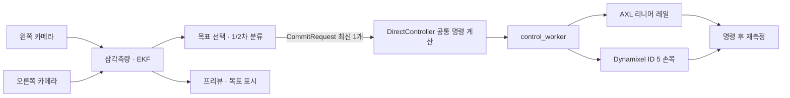

# `src/real` — 손목·리니어 레일 2단계 제어

`--mode real` 런타임은 카메라로 공을 추적하고, 예측한 목표의 x좌표로
AXL 리니어 레일을 이동한다. 정밀 예측 단계에서는 Dynamixel ID 5 손목축을
준비각에서 15° 움직인다.

현재 목적은 장비 응답 확인이다. 공을 되치는 전체 스윙 제어가 아니다.

## 실행 범위

- 시작할 때 `--home`이면 레일과 네 관절을 준비 자세로 이동한다.
- 공마다 `Provisional`과 `Refined` 명령을 최대 한 번씩 보낸다.
- 레일은 두 단계 모두 선택 목표의 x좌표를 따라간다.
- 손목은 `Provisional`에서 준비각을 유지하고 `Refined`에서 15° 전진한다.
- 나머지 Dynamixel 축에는 추적 중 Goal Position을 다시 보내지 않는다.
- IK, 전체 자세 계획, 타격 속도, 팔로스루, 자동 복귀는 실행하지 않는다.

## 데이터 흐름

카메라, 추정기, 하드웨어는 각 워커가 단독 소유한다. 채널이 가득 차면
오래된 프레임이나 요청을 버리고 최신 값만 남긴다.

## 제어 단계

`PredictionStability`가 선택 목표의 안정도를 분류한다.

- `Provisional`: EKF가 위치와 속도를 추정하고 목표를 선택할 수 있는 즉시
- `Refined`: 첫 정상 관측 후 0.25초 이상이며 최근 목표 3개가 최신 목표에서 10cm 이내

각 `CommitRequest`에는 `track_seq`가 들어간다. 추정기가 새 공을 발견하면 번호를
올리고, 제어 워커는 번호가 바뀌는 즉시 단계별 중복 방지 상태를 초기화한다.
따라서 이전 공이 `Refined`까지 가지 못했어도 다음 공의 `Provisional` 명령이 막히지 않는다.

## 제어 워커

`control_worker`는 다음 순서로 요청을 처리한다.

1. 50ms보다 오래된 요청을 버린다.
2. 직전 명령 후 20ms가 지나지 않았으면 버린다.
3. `y=0.08~0.35m` 구간에서 목표 하나를 선택한다.
4. 목표 x를 레일 범위로 제한한다.
5. 남은 시간을 `0.05~0.30초`로 제한해 레일 이동 시간을 정한다.
6. 레일 목표와 손목 목표를 함께 하드웨어에 보낸다.
7. 명령 시간 + 75ms 후 레일·손목을 다시 읽어 `commanded - measured`를 남긴다.

위 3~5번은 `robot::control::DirectController`에 있으며 GUI 시뮬레이션도
같은 계산을 사용한다. 실기는 명령 후 엔코더를 읽고, 시뮬레이션은
같은 명령을 `robot::State`의 레일·손목 목표에 적용한다.

### 제어 괴리 로그

- 레일: commanded, measured, commanded-minus-measured를 m 단위 소수점 4자리로 기록
- 손목: 같은 세 값을 rad·deg 둘 다 기록
- 레일 오차 20mm 또는 손목 오차 3° 초과: `WARN`
- 허용치 이내: `INFO`

## 하드웨어 경계

`Hardware::command_rail_and_racket`이 단순 제어 전용 명령이다.

- 레일 목표가 직전 명령과 1cm 이상 다를 때만 AXL 이동을 다시 시작한다.
- `DynamixelBus::write_joint(3, ...)`으로 논리 관절 3만 쓴다.
- 기본 모터 배열 `[1, 3, 4, 5]`에서 논리 관절 3은 실제 ID 5다.
- 모터 각도와 레일 위치는 기존 하드웨어 한계로 제한된다.

전체 궤적용 `Hardware::command`는 시작 시 홈 이동에만 사용한다.

## 런타임 이벤트

메인 스레드에는 실제로 발생하는 상태만 보낸다.

- `Ready`: 하드웨어 초기화와 선택적 홈 이동 완료
- `Tracking`: 새 공의 위치·속도 추정 시작
- `Commanded`: 레일·손목 명령 전송 완료
- `Failed`: 하드웨어 오류
- `Done`: 제어 워커 종료

구형 스윙 상태인 `Committed`, `Infeasible`, `PlanFailed`, `Recovering`은 사용하지 않는다.

## 프리뷰와 관전 창

- 초록 원: 현재 프레임의 2D 검출
- 흰 원: 생 삼각측량 점 재투영
- 빨간 원: 현재 선택한 제어 목표
- HUD: 추적 여부, `Provisional/Refined`, 목표 좌표와 남은 시간

관전 창 메시지는 공 위치, 선택 목표, 시작 포즈만 전달한다. 스윙 궤적은 전달하거나
재생하지 않는다.

## 주요 파일

| 파일 | 역할 |
|---|---|
| `run.rs` | 워커·채널 조립, 이벤트 로그, 종료 |
| `camera_worker.rs` | 캡처와 검출 |
| `estimator_worker.rs` | 삼각측량, EKF, 목표 선택, 단계 분류 |
| `commit_request.rs` | `track_seq + BallTrajectory + PredictionStage` |
| `control_worker.rs` | 단계별 중복 방지와 레일·손목 명령 |
| `runtime_event.rs` | 현재 런타임 이벤트 |
| `preview.rs` | 검출·목표 HUD |
| `sim_update.rs` | 관전 창용 공·목표·포즈 메시지 |

## 주의

실물 제어는 Windows와 AXL DLL이 필요하다. 종료 시 기본적으로 Dynamixel 토크를
유지하므로 손으로 축을 움직이려면 `--release-torque`를 사용하거나 전원을 내려야 한다.
